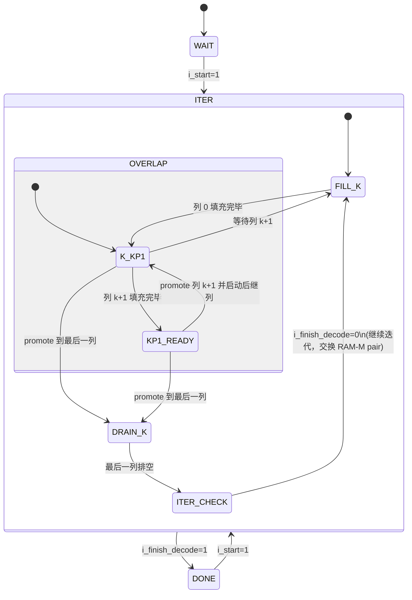

# BIKE Syndrome输入 Min-Sum 解码器

## 概述

本 RTL 实现了一个 BIKE 风格的syndrome解码器。校验矩阵为双循环矩阵：

- `H = [H0 | H1]`
- `H0` 和 `H1` 由各自的首列向量表示，存储在 `bike_pkg.H_BASE[h_sel][h_block_idx][one_idx]` 中
- `h_block_idx = 0` 对应 `H0`，`h_block_idx = 1` 对应 `H1`

解码器接受初始syndrome，根据静态首列向量填充各 circulant bank，并估计错误向量：

- 输入：`i_syndrome[R-1:0]`
- 错误估计读口：`i_e_read_col_idx` 选择列，`o_e_rdata` 返回该列的硬判决 bit
- 成功条件：`i_syndrome ^ H*e_hat == 0`

## 参数

`rtl/bike_pkg.sv` 是解码器核心的参数包。`rtl/decoder_top.sv` 内置同名参数包，便于 Vivado GUI 直接从顶层文件展开设计。

- 默认构建：BIKE-L1 规模参数（`R=12323`, `W=71`, `N=24646`），使用确定性的首列向量
- `BIKE_TOY_PARAMS` 构建：小型 BIKE 演示参数（`R=8`, `W=3`），用于快速 RTL 测试

其中 `W` 是每个 circulant block 的列权重，BIKE-L1 的总行重为 `N0 * W = 142`。

## 解码语义

解码器从全零错误估计开始。

- `ram_c` 存储运行中的错误估计（硬判决位）
- 顶层通过 `i_e_read_col_idx/o_e_rdata` 串行导出最终错误估计
- `CNU_A` 初始化输入使用 `{sign=0, mag=C_VAL}`
- `VNU` 先验值始终为 `+C_VAL`
- `CNU_A` 仅累积每个压缩 c2v 状态中传入的 `u` 符号
- `CNU_B` 计算每条输出边的符号：

```text
row_sign_xor ^ edge_u_sign ^ syndrome[row]
```

残差syndrome随 RAM C 中硬判决 bit 的变化增量更新。残差为零时解码成功，达到 `I_MAX` 次迭代后仍未清零则解码失败。

## 初始化

解码器需要知道 H 矩阵每个 circulant block 的首列中哪些位置为 1。由于 H 是双循环矩阵拼接，列 j 的拓扑等于首列循环移位 j 位，因此只需存储首列元数据，运行时由 `h_shift` 在线计算任意列的元数据。

### 离线生成 hex 文件

初始化数据由 `scripts/gen_qc_first_columns.py` 离线生成。该脚本解析 `rtl/bike_pkg.sv` 中的 `H_BASE` 数组，对每个 circulant block 的首列支撑集按 row group 分 lane，打包为 `{one_idx, row_idx_group}` 格式的 entry，输出 hex 文件到 `rtl/generated/`。

### 仿真启动加载

`ram_i.sv` 在 `initial` 块中通过 `$readmemh` 加载 hex 文件。模块参数 `INIT_HEX_STEM` 指定实例使用的文件前缀：

```systemverilog
ram_i #(.INIT_HEX_STEM("rtl/generated/ram_i0")) u_ram_i0 (...);
ram_i #(.INIT_HEX_STEM("rtl/generated/ram_i1")) u_ram_i1 (...);
```

`INIT_TAG` 与参数集匹配：BIKE-L1 使用 `"_l1"`，`BIKE_TOY_PARAMS` 使用 `"_test"`。复位期间记忆体阵列保持初始化内容，因此复位释放后 RAM-I 已包含完整的首列元数据，解码器进入 ITER 调度即可直接使用。

## 模块划分

- `decoder_ctrl` 负责解码控制、c2v/v2c 列上下文、RAM-M 乒乓 bank、列缓冲切换事件以及 done/success 状态管理。ITER 内部调度由固定 `SCHED_*` 状态表驱动，列 k 内部使用 `COL_K_STAGE_*` 表示 v2c 发射流水阶段。
- `decoder_top` 是解码器核心数据通路和结构互连。它实例化各编号 RAM 块、`decoder_ctrl`、`h_shift`、CNU/VNU 单元和消息编解码适配器；顶层逻辑覆盖 RAM 端口选择、RAM-I 行组 entry 处理、数据锁存和残差syndrome增量维护。
- `vnu` 以 2's-complement 格式消费 c2v 并生成未饱和的 2's-complement v2c。符号-幅值转换在 VNU 输入/输出边界的外部 `msg_codec` 适配器中完成；RAM-T 和 VNU 缩放数据通路保持在 2's-complement 域内。
- `ram_i`、`ram_m`、`ram_s`、`ram_t`、`ram_c` 均为论文风格的 RAM 原语。每个 RTL 文件对应一个编号 RAM 块。
- `decoder_top` 按论文命名显式实例化各 RAM 块：`I0/I1`、`M0/M1/M2/M3`、`S0/S1`、`T0/T1`、`C`。
- RAM-M 每个 numbered block 保存一个 row group 的压缩 c2v 状态和 1 bit epoch，深度为 `ROW_GROUP_DEPTH = ceil(R/L)`。顶层只向 RAM-M 发送 `row_idx_group`，绝对行号只用于 syndrome bit 选择和残差syndrome增量维护。
- lane 内逻辑 entry 深度为 `ENTRY_DEPTH=W`，计数和控制指针覆盖单列全部非零项。BIKE-L1 参数下 RAM-I 主区 `RAM_LANE_DEPTH=40`，溢出区 `RAM_OVERFLOW_DEPTH=31`；`BIKE_TOY_PARAMS` 参数下 RAM-I 主区 `RAM_LANE_DEPTH=2`，溢出区 `RAM_OVERFLOW_DEPTH=1`。
- RAM-S 每个 lane 以 `S_PACK_W` bit word 保存 v2c sign bit，按 `ENTRY_DEPTH` 为每列分配 sign bit slot，BIKE-L1 配置使用 8 bit 打包。顶层读写 shift buffer 在 entry bit 流和打包 word 之间转换；RAM-S 只提供 word 级读写。
- RAM-T 每个 lane 以按 entry slot 寻址的缓冲保存列 k+1 生成的 c2v 和 valid sideband，slot 数为 `ENTRY_DEPTH`。列 k+1 每个 entry slot 都写入，空 lane 写入 invalid slot；v2c 发射阶段按同一个 entry slot 读取，valid sideband 控制 VNU 的外信息相减。`ITER_CHECK` 清空 RAM-T slot 状态。
- RAM-C 保存 syndrome 输入译码器的错误估计 bit，是一份适配 syndrome 输入语义的 `N` bit 存储，并提供串行读口用于导出最终估计。
- 列 metadata 使用两个固定 slot：列 k 从 active slot 读取，列 k+1 从 RAM-I 单 entry 视图写入 fill slot。`o_col_k_meta_advance` 触发 active/fill slot 轮换，使列 k+1 成为新的列 k。
- `decoder_ctrl` 遵循论文的 Fig.8 式单端口调度：每次迭代先填充并累加列 0，然后进入列重叠流水线——c2v 侧重建并累加列 `k+1` 的同时 v2c 侧更新列 `k`，最后排空 v2c 的最后一列，进入 `ITER_CHECK`。复用的 RAM-M 行通过 RAM word epoch 实现 `COMP_C2V_INIT` 语义。`phase` 信号仅用于调试；数据通路时序由固定调度脉冲和 metadata slot 轮换驱动。
- RAM-I 在仿真启动时通过 `$readmemh` 从 hex 文件加载首列主区元数据，溢出区由 `decoder_top` 根据 `H_BASE` 初始化。解码期间，活跃列的行/局部行/边索引元数据来自 RAM-I 主区和溢出区组合出的单 entry 视图。`h_shift` 为每个 RAM-I 块设置一个 entry 输入，为每个 lane 设置一个移位后的 entry 输出，数据通路通过 RAM-I shift writer 将每个移位后的 entry 写入下一个 c2v 列。entry 位置小于 `RAM_LANE_DEPTH` 时写入 RAM-I 主区，其余 entry 写入溢出区。RAM-I shift writer 为每个目标 bank 保留 pending entry；多个移位 entry 指向同一 bank 时，writer 先写入一个 entry，并在后续周期写入 pending entry。列尾主区 count 和溢出 count 在 pending entry 清空后提交，`decoder_ctrl` 通过 `i_ram_i_shift_ready` 暂停下一次 c2v 读发射。v2c 元数据独立缓冲，使 c2v 侧的 RAM-I 可以领先一列。`decoder_top` 通过 RAM-I 的单 entry 功能视图输出访问 RAM-I。项目级 RTL 命名约定定义在 [`docs/naming_conventions.md`](/Users/z2901550610/Documents/Min_Sum/docs/naming_conventions.md) 中。行组方案基于奇偶：`row_group 0` 存储偶数行，`row_group 1` 存储奇数行，`row_local` 为紧凑的奇偶局部索引 `floor(row_global / 2)`。CNU/VNU 行地址调度由 RAM-I 元数据驱动。
- `decoder_edge_meta` 和 `qc_column_preprocess` 保留在 [`rtl/reference/`](/Users/z2901550610/Documents/Min_Sum/rtl/reference) 下作为参考辅助文件。核心解码器使用 RAM-I + `h_shift` 提供活跃边元数据。
- 静态首列元数据由 [`scripts/gen_qc_first_columns.py`](/Users/z2901550610/Documents/Min_Sum/scripts/gen_qc_first_columns.py) 离线生成，输出 hex 文件到 `rtl/generated/`。RAM-I 通过 `$readmemh` 在仿真启动时直接加载。
- c2v 侧在读取 RAM-I 单 entry 视图时同步填充列 k+1 metadata slot，使得下一列的单 entry 移位写入不会干扰列 k 的元数据视图。
- 设计边界：RTL 使用单级 VNU 缩放；灵活的消息存储选择、两级缩放、组大小重平衡属于扩展功能。

## 状态机详解

`decoder_ctrl` 使用 WAIT、ITER、DONE 三个宏状态加 ITER 内部调度状态，实现 Fig.8 式列重叠调度。RAM-I 的首列元数据通过 `$readmemh` 在仿真启动时从 hex 文件加载。

### 状态转移总览



### 宏状态

#### 1. CTRL_WAIT — 上电空闲

`i_rst_n` 复位后的初始状态。解码器在此等待首次 `i_start` 信号。当 `i_start` 置位时，复位所有内部计数器、子状态、列索引和 entry 位置指针，跳转到 **CTRL_ITER**。解码完成后再收到 `i_start` 时，状态机从 **CTRL_DONE** 跳回 **CTRL_ITER**。WAIT 仅存在于复位路径，为硬件上电提供一个确定的起点。

#### 2. CTRL_ITER — 迭代解码（核心）

`CTRL_ITER` 实现 **Fig.8 列重叠调度**：列 k+1 侧重建并累加后一列的 LLR，列 k 侧对当前列进行 v2c 更新。两列重叠运行，c2v 始终领先 v2c 一列。

##### 3a. SCHED_FILL_K — 填充一列 c2v

- 列 k+1 按 entry 顺序发起 c2v 读请求，列 k 处于列间等待。
- `o_c2v_read` 每拍发起一个 RAM-M / RAM-S 读请求；下一拍 `o_c2v_write_t` 将 CNU_B/编解码结果 push 到 RAM-T，并通过 `o_vnu_accum_t` 送入 VNU 累加。
- 每个 entry 发射后：非最后 entry 递增 `o_c2v_entry_pos`。最后 entry 触发 `o_col_k_meta_advance`，列 k 进入 `COL_K_STAGE_FIRST`。若 `o_c2v_col_idx == LAST_VAR`，调度进入 `SCHED_DRAIN_K`；否则调度进入 `SCHED_K_KP1` 并处理下一列，`o_c2v_v2c_overlap_seen` 置位。

##### 3b. SCHED_K_KP1 / SCHED_KP1_READY — 流水线并行

`SCHED_K_KP1` 中列 k+1 持续重建并累加下一列，列 k 从 RAM-T head 读取当前列 c2v 并发射 v2c 更新。下一列填充完毕时，调度进入 `SCHED_KP1_READY`，等待当前列 k 的列尾 issue 将列 k+1 promote 为活跃 v2c 列。

| 微步骤 | 信号 | 功能 |
|---|---|---|
| `COL_K_STAGE_FIRST` | `o_vnu_prep_write`, `o_vnu_cnu_a` | 写入 VNU 硬判决，并发射 entry 0 的 v2c/CNU_A 更新 |
| `COL_K_STAGE_ISSUE` | `o_vnu_cnu_a` | 连续读取 RAM-M、生成 v2c，并使能 CNU_A |

`COL_K_STAGE_FIRST` 和 `COL_K_STAGE_ISSUE` 每拍发射一个 v2c/CNU_A 更新。CNU_A 的输出延后一拍写入 RAM-M / RAM-S，因此稳定段可以在写回上一 entry 的同时发射下一 entry。列尾 issue 负责列切换，后一拍的 `o_vnu_write_next` 负责写回流水中的最后一个 CNU_A 结果。

列尾 issue 的固定调度分流：

- v2c 最后 entry 且 `o_v2c_col_idx == LAST_VAR`：等待写回 valid 后设置 `iter_check_pending = 1`，进入迭代检查。
- `SCHED_KP1_READY`：触发 `o_col_k_meta_advance`，列 k 进入下一列的 `COL_K_STAGE_FIRST`。
- `SCHED_K_KP1` 且列 k+1 同拍完成：触发 `o_col_k_meta_advance`，列 k 直接进入下一列。
- `SCHED_K_KP1` 且列 k+1 正在填充：调度进入 `SCHED_FILL_K`，等待列 k+1 完成。
- 其他 entry：递增 `o_v2c_entry_pos`，保持 `COL_K_STAGE_ISSUE` 连续发射。

##### 3c. SCHED_DRAIN_K — 排空最后一列

最后一列完成填充后，调度进入 `SCHED_DRAIN_K`。此阶段列 k 处理最后一列的 v2c 更新，列尾写回 valid 后设置 `iter_check_pending = 1`。

##### 3d. ITER_CHECK — 迭代检查

`iter_check_pending` 置位后的下一个时钟周期执行。迭代计数器 `o_iter_count` 递增。

- `i_finish_decode = 1`（残差为零或达到最大迭代次数）：跳转到 **CTRL_DONE**，输出 `o_done = 1`，锁存 `o_success = i_decode_success`。
- `i_finish_decode = 0`：交换 RAM-M pair（`o_m_read_pair` 翻转），复位所有子状态和列指针，进入 `SCHED_FILL_K` 开始下一轮迭代。

#### 3. CTRL_DONE — 解码完成

输出 `o_done = 1`，锁存 `o_success` 和 `o_iter_count`。等待新一轮 `i_start`，收到后回到 **CTRL_ITER** 开始新的解码。

### ITER 内部流水线时空示意

```
时间 →
       列0              列1              列2        ...    最后一列
PROD  [R][W+A]...      [R][W+A]...      [R][W+A]...      (停用)
CONS                   [V2C]            [V2C]        ... [V2C]
                       └─ overlap ─┘
        ◀── prime ──▶ ◀─────────── 流水线并行 ───────────▶◀─ drain ─▶
```

- `[R]` = c2v 读请求
- `[W+A]` = 列 k+1 c2v emit，同拍 push RAM-T、送入 VNU 累加
- `[V2C]` = `COL_K_STAGE_FIRST/ISSUE`，PREP 同拍发射 entry 0，随后连续 CNU_A 发射，写回 valid 与后续 issue 重叠

### 资源与性能特征

- **状态寄存器**：3 位宏状态 + 2 位 ITER 固定调度状态、发射有效位、列尾标记、列 k stage 和 `iter_check_pending`。
- **关键路径**：控制逻辑为纯组合译码，不产生时序收敛瓶颈。时序关键路径位于 CNU/VNU 数据通路。
- **流水线效率**：稳定重叠阶段中，每个时钟周期同时进行一个 c2v 操作和一个 v2c 操作，实现接近 2 entry/周期的吞吐。

## 验证

常规 RTL 回归使用小型 BIKE 演示参数：

```sh
make test
```

BIKE-L1 黄金模型在 BIKE-L1 规模的双循环矩阵上使用相同的syndrome输入 min-sum 公式：

```sh
make bike-golden-self-test
make bike-golden-once BIKE_SEED=1
make bike-golden-batch BIKE_BASE_SEED=1 BIKE_TRIALS=8
```

本仓库实现的是面向 BIKE 输入的 min-sum 解码器，并非官方的 BIKE bit-flipping 解码器系列。
