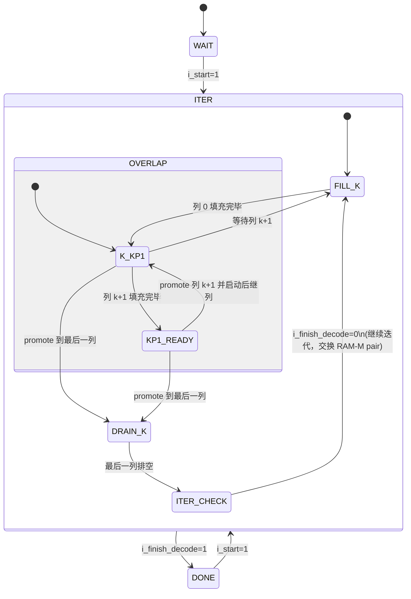

# 解码调度

## 调度摘要

`decoder_ctrl` 使用 WAIT、ITER、DONE 三个宏状态加嵌套调度状态，实现 Fig.8 式列重叠调度。

- `CTRL_WAIT` 等待 `i_start` 并初始化迭代上下文。
- `CTRL_ITER` 是核心解码状态，内部使用固定 `SCHED_*` 状态表。
- 每次迭代先填充并累加列 0，为 v2c 侧建立第一列 metadata。
- 稳定阶段中，c2v 侧重建并累加列 `k+1`，v2c 侧更新列 `k`。
- c2v 通过 RAM-I 读取首列 metadata，写入 fill slot；v2c 通过 active slot 消费列 k metadata。
- 列尾 issue 触发 `o_col_k_meta_advance`，active/fill slot 轮换。
- 最后一列填充完成后进入 drain 阶段，只保留 v2c 侧排空。
- 迭代末尾进入 `ITER_CHECK`，根据 `i_finish_decode` 决定进入 DONE 或启动下一轮。
- RAM-M 读写 pair 在迭代之间切换，RAM word epoch 实现 `COMP_C2V_INIT` 语义。

第一次迭代的 c2v 压缩状态由 `FIRST_ITER_C2V_COMP` 提供。数据通路时序由固定调度脉冲和 metadata slot 轮换驱动。

## 状态转移总览



## 宏状态

### 1. CTRL_WAIT

`i_rst_n` 复位后的初始状态。解码器在此等待首次 `i_start` 信号。当 `i_start` 置位时，复位所有内部计数器、子状态、列索引和 entry 位置指针，跳转到 **CTRL_ITER**。解码完成后再收到 `i_start` 时，状态机从 **CTRL_DONE** 直接跳回 **CTRL_ITER**。WAIT 为硬件上电提供一个确定的起点。

### 2. CTRL_ITER

`CTRL_ITER` 实现 **Fig.8 列重叠调度**：列 k+1 侧重建并累加后一列的 LLR，列 k 侧对当前列进行 v2c 更新。两列重叠运行，c2v 始终领先 v2c 一列。

#### SCHED_FILL_K

- 列 k+1 按 entry 顺序发起 c2v 读请求，列 k 处于列间等待。
- `o_c2v_read` 每拍发起一个 RAM-M / RAM-S 读请求；下一拍 `o_c2v_write_t` 将 CNU_B/编解码结果 push 到 RAM-T，并通过 `o_vnu_accum_t` 送入 VNU 累加。
- 每个 entry 发射后：非最后 entry 递增 `o_c2v_entry_pos`。最后 entry 触发 `o_col_k_meta_advance`，列 k 进入 `COL_K_STAGE_FIRST`。若 `o_c2v_col_idx == LAST_VAR`，调度进入 `SCHED_DRAIN_K`；否则调度进入 `SCHED_K_KP1` 并处理下一列，`o_c2v_v2c_overlap_seen` 置位。

#### SCHED_K_KP1 / SCHED_KP1_READY

`SCHED_K_KP1` 中列 k+1 持续重建并累加下一列，列 k 从 RAM-T head 读取当前列 c2v 并发射 v2c 更新。下一列填充完毕时，调度进入 `SCHED_KP1_READY`，等待当前列 k 的列尾 issue 将列 k+1 promote 为活跃 v2c 列。

| 微步骤 | 信号 | 功能 |
|---|---|---|
| `COL_K_STAGE_FIRST` | `o_decision_write`, `o_v2c_emit_to_cnu_a` | 写入 VNU 硬判决，并发射 entry 0 的 v2c/CNU_A 更新 |
| `COL_K_STAGE_ISSUE` | `o_v2c_emit_to_cnu_a` | 连续读取 RAM-M、生成 v2c，并使能 CNU_A |

`COL_K_STAGE_FIRST` 和 `COL_K_STAGE_ISSUE` 每拍发射一个 v2c/CNU_A 更新。CNU_A 的输出延后一拍写入 RAM-M / RAM-S，因此稳定段可以在写回上一 entry 的同时发射下一 entry。列尾 issue 负责列切换，后一拍的 `o_cnu_a_writeback` 负责写回流水中的最后一个 CNU_A 结果。

列尾 issue 的固定调度分流：

- v2c 最后 entry 且 `o_v2c_col_idx == LAST_VAR`：等待写回 valid 后设置 `iter_check_pending = 1`，进入迭代检查。
- `SCHED_KP1_READY`：触发 `o_col_k_meta_advance`，列 k 进入下一列的 `COL_K_STAGE_FIRST`。
- `SCHED_K_KP1` 且列 k+1 同拍完成：触发 `o_col_k_meta_advance`，列 k 直接进入下一列。
- `SCHED_K_KP1` 且列 k+1 正在填充：调度进入 `SCHED_FILL_K`，等待列 k+1 完成。
- 其他 entry：递增 `o_v2c_entry_pos`，保持 `COL_K_STAGE_ISSUE` 连续发射。

#### SCHED_DRAIN_K

最后一列完成填充后，调度进入 `SCHED_DRAIN_K`。此阶段列 k 处理最后一列的 v2c 更新，列尾写回 valid 后设置 `iter_check_pending = 1`。

#### ITER_CHECK

`iter_check_pending` 置位后的下一个时钟周期执行。迭代计数器 `o_iter_count` 递增。

- `i_finish_decode = 1`：跳转到 **CTRL_DONE**，输出 `o_done = 1`。
- `i_finish_decode = 0`：交换 RAM-M pair（`o_ram_m_read_pair_sel` 翻转），复位所有子状态和列指针，进入 `SCHED_FILL_K` 开始下一轮迭代。

### 3. CTRL_DONE

输出 `o_done = 1`，保持 `o_iter_count`。等待新一轮 `i_start`，收到后回到 **CTRL_ITER** 开始新的解码。

## ITER 内部流水线时空示意

```text
时间 →
       列0              列1              列2        ...    最后一列
PROD  [R][W+A]...      [R][W+A]...      [R][W+A]...      (停用)
CONS                   [V2C]            [V2C]        ... [V2C]
                       └─ overlap ─┘
        ◀── prime ──▶ ◀─────────── 流水线并行 ───────────▶◀─ drain ─▶
```

- `[R]` = c2v 读请求
- `[W+A]` = 列 k+1 c2v emit，同拍 push RAM-T、送入 VNU 累加
- `[V2C]` = `COL_K_STAGE_FIRST/ISSUE`，PREP 同拍发射 entry 0，随后连续 CNU_A 发射，写回 valid 与后续 issue 重叠

## 资源与性能特征

- **状态寄存器**：3 位宏状态 + 2 位 ITER 固定调度状态、发射有效位、列尾标记、列 k stage 和 `iter_check_pending`。
- **关键路径**：控制逻辑为纯组合译码，不产生时序收敛瓶颈。时序关键路径位于 CNU/VNU 数据通路。
- **流水线效率**：稳定重叠阶段中，每个时钟周期同时进行一个 c2v 操作和一个 v2c 操作，实现接近 2 entry/周期的吞吐。
