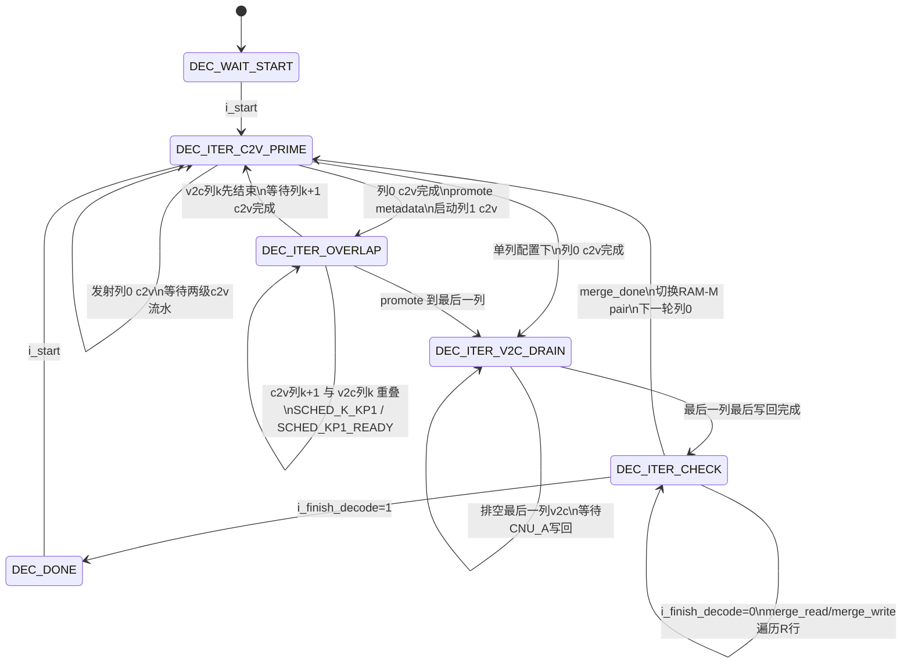

# 解码调度

## 调度摘要

`decoder_ctrl` 使用 `CTRL_WAIT`、`CTRL_ITER`、`CTRL_DONE` 三个控制状态驱动列重叠 min-sum 调度。对外可见的 `o_state` 使用 `DEC_*` 状态编码描述流水阶段：等待启动、c2v 预填充、c2v/v2c 重叠、v2c 排空、迭代检查和完成。

- `DEC_WAIT_START` 等待 `i_start`，启动时清空列指针、entry 指针、流水 valid、迭代计数和 RAM-M pair 选择。
- `DEC_ITER_C2V_PRIME` 只发射 c2v 侧工作，用列 0 建立 RAM-T 数据和 active/fill metadata。
- `DEC_ITER_OVERLAP` 同时运行 c2v 与 v2c，c2v 侧处理列 `k+1`，v2c 侧处理列 `k`。
- `DEC_ITER_V2C_DRAIN` 在最后一列 c2v 填充后只保留 v2c 侧发射和写回。
- `DEC_ITER_CHECK` 在一轮列调度完成后执行迭代收尾。达到 `I_MAX` 时进入完成状态；继续迭代时执行 RAM-M 行合并，然后切换读写 pair 并启动下一轮。
- `DEC_DONE` 输出 `o_done = 1`，等待新的 `i_start`。

内部调度使用 `SCHED_FILL_K`、`SCHED_K_KP1`、`SCHED_KP1_READY`、`SCHED_DRAIN_K`。列 k 的 v2c 发射阶段使用 `COL_K_STAGE_FIRST` 和 `COL_K_STAGE_ISSUE`。c2v 侧有两级 valid 延迟，v2c/CNU_A 侧也有两级 valid 延迟；控制脉冲围绕这些 fixed-latency pipeline 生成。

第一次迭代的 CNU_B 输入压缩状态由 `FIRST_ITER_C2V_COMP` 提供。后续迭代从 RAM-M 读 pair 读取上一轮合并后的压缩 c2v 状态，写 pair 接收 CNU_A 更新。

## 状态机图



## 控制状态

### DEC_WAIT_START

复位后的可见状态为 `DEC_WAIT_START`。控制器等待 `i_start`。启动时执行以下初始化：

- `sched_state = SCHED_FILL_K`
- `col_k_stage = COL_K_STAGE_FIRST`
- `c2v_col_idx = 0`，`v2c_col_idx = 0`
- `c2v_entry_pos = 0`，`v2c_entry_pos = 0`
- `ram_m_read_pair_sel = 0`，`ram_m_write_pair_sel = 1`
- 流水 valid、列尾标记、`iter_check_pending`、`merge_active`、`o_done` 和 `o_iter_count` 清零

### DEC_ITER_C2V_PRIME

`DEC_ITER_C2V_PRIME` 对应列 0 的预填充阶段。此时 `schedule_has_col_kp1=1`，`schedule_has_col_k=0`，控制器只发出 c2v 侧工作。

c2v 每拍处理一个 lane-local entry slot：

1. `o_c2v_read` 发起 RAM-I、RAM-M、RAM-S 相关读窗口。
2. 下一拍 `decoder_top` 解码 RAM-I entry，计算 `row_idx_global = base_row_idx_global + col_idx_local mod R`，并把列 metadata 写入 fill slot。
3. 再下一拍 `o_c2v_write_t` 有效，CNU_B 生成的 c2v 写入 RAM-T，二补码 c2v 同拍送入 VNU 累加。

列 0 最后一个 entry 的 `o_c2v_write_t` 到达后，控制器置位 `vnu_finalize_pending`。`o_vnu_finalize` 给 VNU 一个列结束脉冲，用于完成硬判决和 v2c 计算准备。列 metadata 通过 `o_col_k_meta_advance` 从 fill slot promote 到 active slot，v2c 侧开始消费列 0。

### DEC_ITER_OVERLAP

`DEC_ITER_OVERLAP` 是主要吞吐阶段。c2v 侧处理列 `k+1`，v2c 侧处理列 `k`。在 `SCHED_K_KP1` 中两侧可以同拍发射；在 `SCHED_KP1_READY` 中列 `k+1` 的 c2v 数据已经完整，控制器等待列 `k` 的列尾 promote。

重叠阶段的每拍工作如下：

| 脉冲 | 流水阶段 | 数据动作 |
| --- | --- | --- |
| `o_c2v_read` | c2v issue | 按 `c2v_col_idx/c2v_entry_pos` 读取 RAM-I，读取 RAM-M read pair 和 RAM-S sign |
| `o_c2v_write_t` | c2v d2 | CNU_B 结果写 RAM-T，VNU 累加当前列 c2v |
| `o_v2c_read` | v2c issue | 按 active metadata 读取 RAM-T、RAM-M write pair 和 v2c sign 写回地址 |
| `o_decision_write` | v2c first | 每列第一个 entry 发射时写 RAM-C 硬判决 |
| `o_v2c_emit_to_cnu_a` | v2c d1 | VNU 输出 v2c，经符号幅值编码后送 CNU_A |
| `o_cnu_a_writeback` | v2c d2 | CNU_A 更新后的压缩状态写 RAM-M write pair，sign 写 RAM-S |
| `o_vnu_finalize` | c2v 列尾后 | 结束当前 c2v 列的 VNU 累加窗口 |

列 k 的 v2c 阶段分两种 entry stage：

- `COL_K_STAGE_FIRST`：列的第一个 entry，发射 v2c，同时写 RAM-C 硬判决。
- `COL_K_STAGE_ISSUE`：后续 entry，连续发射 v2c/CNU_A 更新。

列尾调度规则：

- v2c 列尾且下一列 c2v 已完成：触发 `o_col_k_meta_advance`，active/fill metadata slot 交换，v2c 推进到下一列。
- v2c 列尾且下一列 c2v 正在填充：进入 `SCHED_FILL_K`，等待 c2v 列尾。
- c2v 列尾且 v2c 同拍列尾：同拍完成 metadata promote。
- promote 后的 v2c 列是最后一列：进入 `SCHED_DRAIN_K`。

### DEC_ITER_V2C_DRAIN

`DEC_ITER_V2C_DRAIN` 处理最后一列的 v2c 更新。此阶段 `schedule_has_col_k=1`，`schedule_has_col_kp1=0`，c2v 侧停止发射。最后一列最后一个 CNU_A 写回到达时，控制器置位 `iter_check_pending`，下一周期进入 `DEC_ITER_CHECK`。

### DEC_ITER_CHECK

`DEC_ITER_CHECK` 使用 `iter_check_pending` 表示迭代收尾窗口。顶层的 `finish_decode` 由 `next_iter_count_ext >= I_MAX` 生成，因此第 `I_MAX` 轮列调度完成后结束解码。

当 `i_finish_decode = 1`：

- `o_iter_count` 加 1
- `o_done` 置 1
- 状态进入 `DEC_DONE`

当 `i_finish_decode = 0`：

1. 第一拍启动 `merge_active`。
2. `merge_read` 遍历 `merge_row_idx = 0 .. R-1`，从 RAM-M write pair 的所有 lane bank 读取同一全局行。
3. `merge_write` 在下一拍把这些 lane 的压缩 c2v 状态用 `merge_comp_pair` 合并，并写回 write pair 的每个 lane bank。
4. `merge_done` 有效后，`o_iter_count` 加 1，`ram_m_read_pair_sel` 切到写 pair，列指针和 entry 指针清零，`sched_state` 回到 `SCHED_FILL_K`。

RAM-M pair 切换后，下一轮 c2v 从合并后的 pair 读取压缩状态，CNU_A 写回另一个 pair。`merge_done` 还会翻转被释放 pair 的 epoch，使该 pair 后续 stale row 读为 `COMP_C2V_INIT`。

### DEC_DONE

`DEC_DONE` 保持 `o_done = 1` 和最终 `o_iter_count`。收到新的 `i_start` 时，控制器清空上下文并从列 0 重新开始。

## 译码流程

### 1. 输入准备

外部通过 `i_syndrome_we/i_syndrome_addr/i_syndrome_wdata` 写入 syndrome RAM。RAM-I 保存每个 circulant block 首列的 `{one_idx, row_idx_global}` 元数据，可以来自 `$readmemh` 初始镜像，也可以通过 `ram_i_idx_loader` 运行时加载。

### 2. 列地址展开

c2v 侧按 `c2v_col_idx` 计算 `h_block_idx = c2v_col_idx / R` 和 `col_idx_local = c2v_col_idx % R`。每个 lane 从 RAM-I 读取同一 `entry_pos` 的首列 entry，并执行一次模 R 加法得到该列对应的校验行地址。`entry_pos < ram_i_count[lane]` 的 lane 参与本拍运算，其余 lane 作为 invalid slot 传递。

### 3. c2v 重建与 VNU 累加

c2v 侧用行地址读取 RAM-M read pair 中的压缩 c2v 状态，并读取 RAM-S 保存的 v2c sign。第一次迭代使用 `FIRST_ITER_C2V_COMP` 作为 CNU_B 输入。CNU_B 根据压缩状态、边 sign、syndrome bit 和列号重建 c2v 消息：

```text
c2v_sign = row_sign_xor ^ edge_u_sign ^ syndrome[row]
```

重建后的 c2v 转为二补码并写入 RAM-T，同时送入 VNU。VNU 对一列内所有 valid c2v 做累加，并在列尾 `o_vnu_finalize` 后输出硬判决和每条边的 v2c 外信息。

### 4. v2c 更新与 CNU_A 写回

v2c 侧按 active metadata 读取列 k 的行地址，从 RAM-T 取回该边上一阶段保存的 c2v，并从 RAM-M write pair 读取正在累积的压缩状态。VNU 输出的 v2c 转为符号幅值后送入 CNU_A。CNU_A 更新该行的 `min1/min2/min_id/sign_xor` 压缩状态，并输出 edge sign。控制器在两拍后发出 `o_cnu_a_writeback`，把压缩状态写 RAM-M write pair，把 sign 写 RAM-S。

列的第一个 v2c entry 同拍写 RAM-C 硬判决。解码完成后，外部通过 `i_e_read_col_idx/o_e_rdata` 读出错误估计。

### 5. 列重叠推进

metadata 使用两个 slot：c2v 写 fill slot，v2c 读 active slot。每当下一列 c2v 数据完整且当前 v2c 列结束，`o_col_k_meta_advance` 交换 active/fill slot。稳定阶段中，c2v 和 v2c 的列号保持一列间距，`o_c2v_v2c_overlap_seen` 记录重叠阶段已经出现。

### 6. 迭代收尾与下一轮

最后一列 v2c 写回完成后进入 `DEC_ITER_CHECK`。达到最大迭代次数时输出完成。继续迭代时，控制器把 RAM-M write pair 中每个全局行的 L 个 lane 压缩状态合并成一个行级压缩状态，并复制回该 pair 的各 lane bank。合并完成后读写 pair 对调，下一轮从列 0 开始。

## ITER 内部流水线时空示意

```text
时间 →
        列0                 列1                 列2          ...   最后一列
c2v   [R][W+A]...         [R][W+A]...         [R][W+A]...          停止
v2c                       [V][E][B]...        [V][E][B]...         [V][E][B]...
        prime              overlap             overlap             drain

R   = c2v read issue
W+A = RAM-T write + VNU accumulate
V   = v2c read / decision window
E   = emit v2c to CNU_A
B   = CNU_A writeback
```

## 资源与性能特征

- **控制寄存器**：3 位 `ctrl_state`、2 位 `sched_state`、2 位 `col_k_stage`、两侧两级 valid/last pipeline、列/entry 指针、merge 行计数器和迭代计数器。
- **RAM-M 组织**：`ram_m_read_pair_sel` 提供 c2v 读取源，`ram_m_write_pair_sel = ~ram_m_read_pair_sel` 接收 CNU_A 写回；行合并阶段独占 RAM-M 端口。
- **流水线吞吐**：稳定重叠阶段每拍可同时发射一个 c2v entry slot 和一个 v2c entry slot。
- **迭代开销**：每轮列调度结束后，继续迭代需要遍历 `R` 个全局行执行 RAM-M merge。
