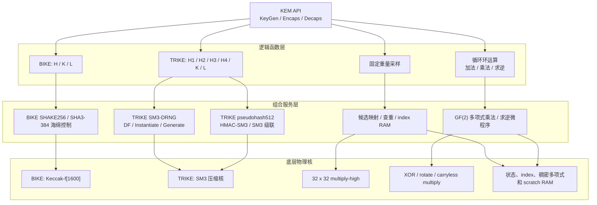
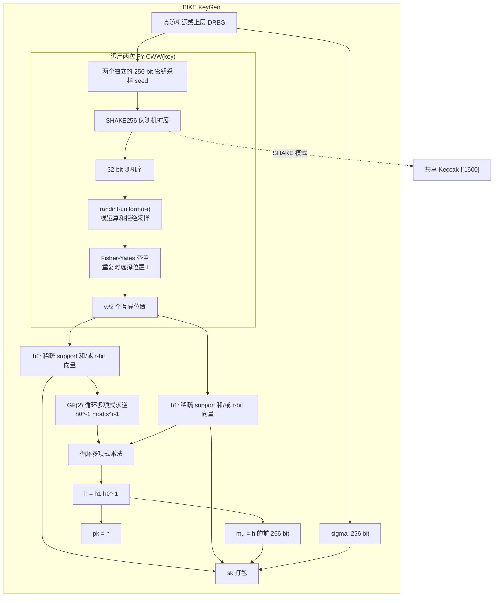
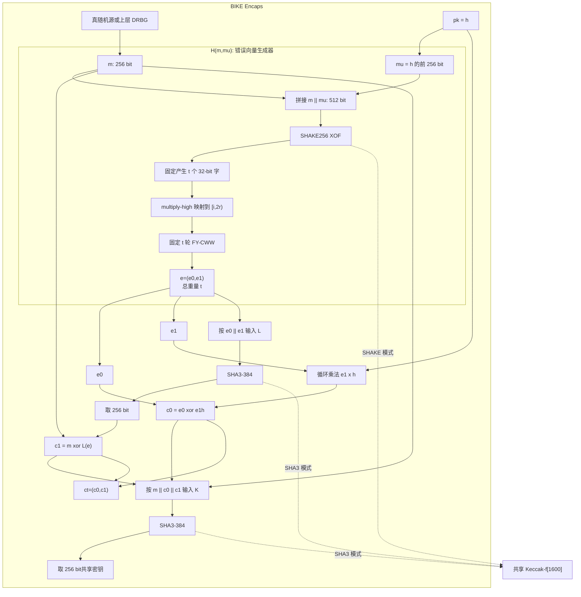
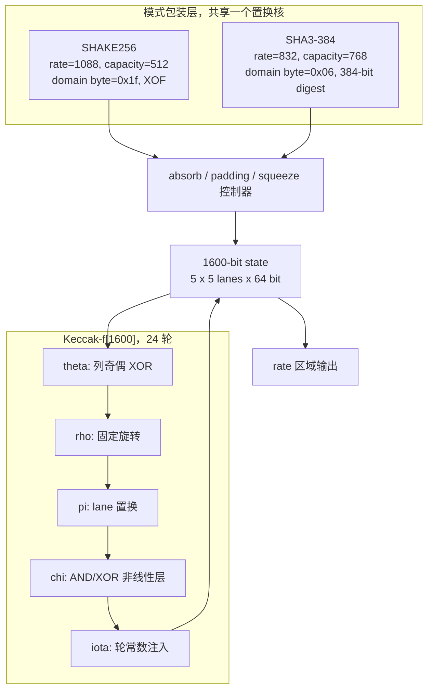
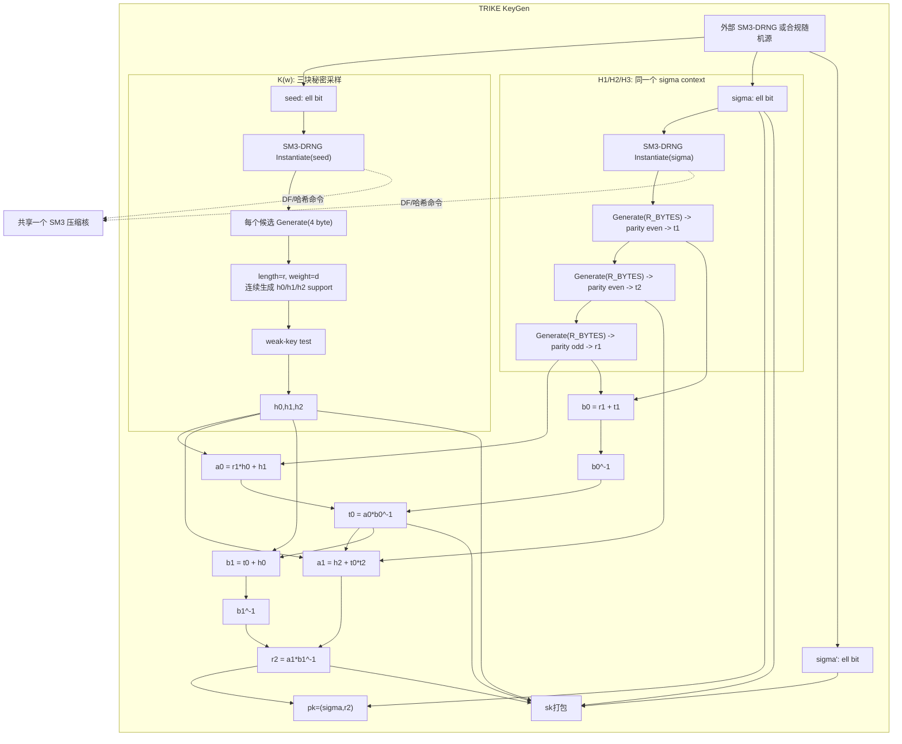
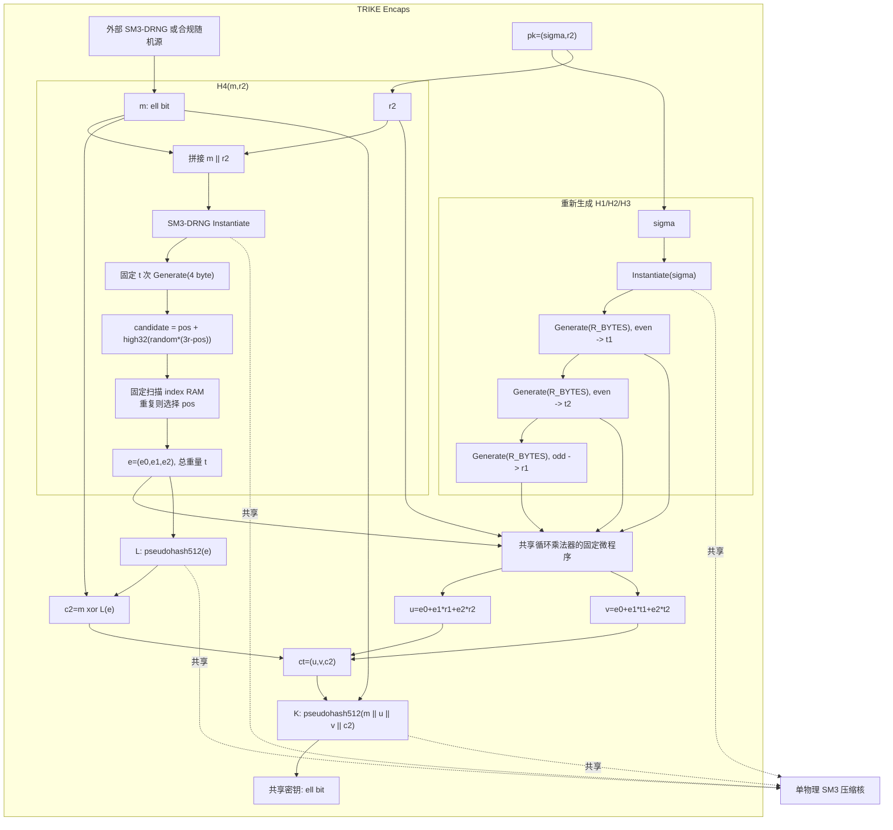
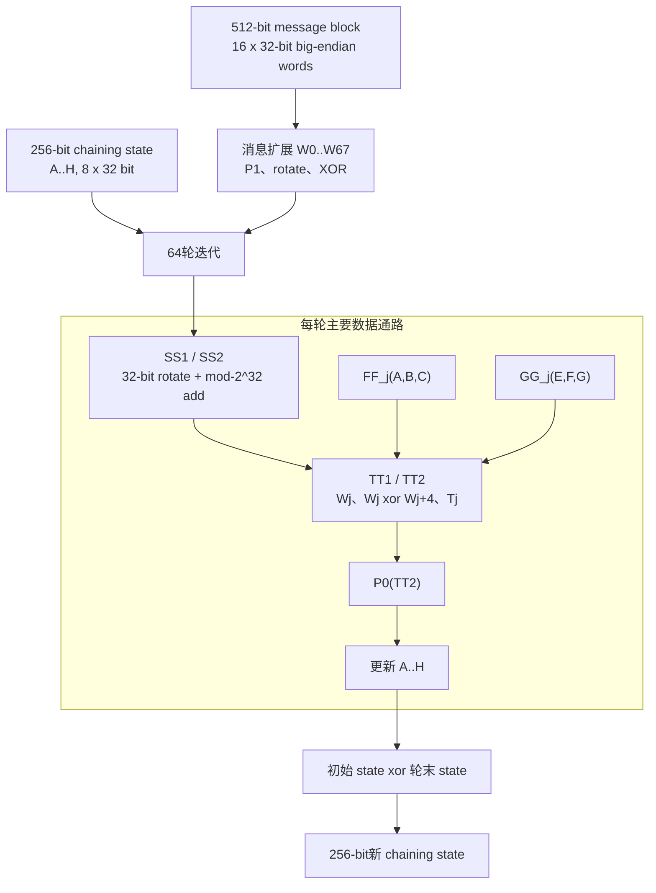

# BIKE 与 TRIKE KEM 机制及硬件核分层指南

本文从 KEM 顶层接口一直展开到随机数发生器、哈希组合、底层密码压缩/置换核、固定重量采样、循环多项式运算和 RAM 生命周期。目标是回答两个问题：

1. KeyGen 和 Encaps 每一步在数学上计算什么；
2. 这些逻辑函数在硬件中应落到哪些可共享物理核。

文中的“逻辑函数”表示规范中的 `H/K/L/H1...H4` 等语义边界，“物理核”表示 FPGA 中实际实例化的数据通路。多个逻辑函数可以按公开微程序顺序共享一个物理核。

## 1. 依据与互操作边界

主要依据如下：

- BIKE：`/Users/z2901550610/Documents/JiuCuoMa/BIKE/BIKE_Spec.2024.10.10.1.pdf`；
- BIKE 配套代码：`/Users/z2901550610/Documents/JiuCuoMa/BIKE/Reference_Implementation/`；
- TRIKE 算法文档：`/Users/z2901550610/Documents/JiuCuoMa/TRIKE/trike-电子版材料0629/TRIKE算法文档.pdf`；
- TRIKE Reference C、Optimized C 和 TRIKE-2/5/7/9 KAT：`/Users/z2901550610/Documents/JiuCuoMa/TRIKE/trike-电子版材料0629/TRIKE代码和测试向量/`；
- 本仓库 TRIKE 公共核实现：[trike_kem_common_cores.md](trike_kem_common_cores.md)。

字节序、非 byte 对齐多项式的 padding bit、哈希截断方向、DRNG 调用粒度和序列化顺序都属于互操作语义。硬件实现以匹配目标软件包的 KAT 为最终边界，不能只凭数学公式判断。

BIKE 材料存在一处需要显式管理的兼容差异：规范第 2.5 节写作 `SHA384`，第 4.3.8--4.3.9 节描述 `SHA3-384` 和单一 Keccak 海绵；本地 `Reference_Implementation/hash_wrapper.c` 调用 `EVP_sha3_384()`，另一份 `bike-kem` 代码可以选择 SHA-384 或 SHA3-384。本文的 BIKE 嵌套图按本地 `Reference_Implementation` 的 SHA3-384 路径展开。若目标 KAT 来自另一代码分支，必须先锁定 K/L 的具体哈希族。

## 2. 总体核层次



BIKE 和 TRIKE 都使用二元循环环

$$
R=\mathbb F_2[x]/(x^r-1),
$$

因此环加法是逐 bit XOR，乘法是带 $x^r-1$ 回卷的 carryless 循环卷积。两者的环算术框架可以共用；对称密码核分别是 Keccak 和 SM3，不能把二者当作同一个压缩数据通路。

# 第一部分：BIKE

## 3. BIKE 参数和对象

对所有建议参数，消息和共享密钥长度均为 $\ell=256$ bit。

| 安全级别 | $r$ | $w$ | 每个秘密块重量 $w/2$ | 错误总重量 $t$ |
| --- | ---: | ---: | ---: | ---: |
| Level 1 | 12,323 | 142 | 71 | 134 |
| Level 3 | 24,659 | 206 | 103 | 199 |
| Level 5 | 40,973 | 274 | 137 | 264 |

对象定义：

- 私钥稀疏多项式：$h_0,h_1\in R$，且 $|h_0|=|h_1|=w/2$；
- 公钥：$h=h_1h_0^{-1}\in R$；
- 错误：$e=(e_0,e_1)$，总长度 $2r$，总重量 $t$；
- 密文：$c=(c_0,c_1)\in R\times\{0,1\}^{256}$。

## 4. BIKE KeyGen

规范计算：

$$
\begin{aligned}
(h_0,h_1)&\leftarrow H_w,\\
h&=h_1h_0^{-1}\pmod{x^r-1},\\
\mu&=\pi_{256}(h),\\
\sigma&\leftarrow\{0,1\}^{256}.
\end{aligned}
$$

输出为公钥 $pk=h$ 和私钥 $sk=(h_0,h_1,\mu,\sigma)$。$\mu$ 是公钥的前 256 bit，不是哈希值。



### 4.1 KeyGen 的硬件核

1. **熵/DRBG接口**：提供秘密采样 seed 和 $\sigma$；
2. **SHAKE256服务**：把 seed 展开成连续 32-bit 字；
3. **FY-CWW采样器**：生成两个固定重量 support；
4. **多项式求逆核**：计算 $h_0^{-1}$；
5. **循环乘法核**：计算 $h_1h_0^{-1}$；
6. **密钥打包控制器**：输出 $h$，截取 $\mu$，保存 $h_0/h_1/\sigma$。

key 模式的 `randint-uniform` 使用拒绝采样，随机字消耗数量不固定。该行为在 BIKE 规范中被允许，但不满足“整个 KeyGen 固定总周期”的更强硬件要求。若系统要求 KeyGen 固定周期，需要独立定义保持目标分布的固定预算采样策略及预算耗尽行为。

## 5. BIKE Encaps

规范计算：

$$
\begin{aligned}
m&\leftarrow\{0,1\}^{256},\\
(e_0,e_1)&=H(m,\pi_{256}(h)),\\
c_0&=e_0+e_1h,\\
c_1&=m\oplus L(e_0,e_1),\\
K&=K(m,c_0,c_1).
\end{aligned}
$$



### 5.1 H 的本质

BIKE 的 $H$ 不是直接输出摘要的普通哈希：

$$
H(m,\mu)=\operatorname{FY\text{-}CWW}
\left(\operatorname{SHAKE256}(m\parallel\mu),2r,t\right).
$$

error 模式每轮使用

$$
y=\left\lfloor\frac{(2r-i)x}{2^{32}}\right\rfloor,
$$

不执行随机数拒绝，恰好消费 $t$ 个 32-bit 字。碰撞结果只决定写入 candidate 或位置 $i$，不改变循环数。

### 5.2 固定周期的 $e_1h$ 调度

$|e_0|+|e_1|=t$ 固定，但 $|e_1|$ 不是常数。若乘法器只遍历实际落在 $e_1$ 的位置，总周期会随 $m$ 和公钥变化。固定周期实现可遍历全部 $t$ 个错误位置：

- 位置属于 $e_1$：执行对应的 $h$ 循环移位 XOR；
- 位置属于 $e_0$：执行相同地址节拍，写入零贡献或 dummy 贡献。

这样乘法槽数固定为 $t$，控制和 RAM 访问数量不依赖错误在两个块之间的分布。

## 6. BIKE 对称密码最底层



逻辑上的 KeyGen SHAKE、$H$、$L$ 和 $K$ 保持独立 context；物理上可以按公开阶段串行共享一个 `Keccak-f[1600]`。每个 context 必须独立清零/初始化状态并使用正确 rate、域分离字节和输入顺序。

## 7. BIKE RAM 生命周期

| RAM/寄存器 | KeyGen | Encaps | 复用条件 |
| --- | --- | --- | --- |
| Keccak state | SHAKE 密钥采样 | H、L、K | 各函数完成后重置，同一时刻只运行一个 context |
| support/index RAM | $h_0/h_1$ 临时采样 | $e$ 的 $t$ 个位置 | support 写入持久 key/error RAM 后覆盖 |
| 稠密环 RAM | $h_0^{-1}$、$h$ | $h$、$c_0$ | 公钥 $h$ 在 Encaps 全程保持 |
| 消息 RAM | $\mu,\sigma$ | $m,c_1$ 和哈希重放 | $m$ 保持到最终 K 完成 |
| 多项式 scratch | 求逆和乘法中间值 | $e_1h$ 累加 | KeyGen 与 Encaps 不并发时静态复用 |

# 第二部分：TRIKE

## 8. TRIKE 参数和对象

提交材料提供 TRIKE-2/5/7/9 四档 KAT。

| 参数集 | $r$ | 每块秘密重量 $d=w/3$ | 总重量 $w$ | 错误总重量 $t$ | $\ell$ | 公钥 byte | 密文 byte | 共享密钥 byte |
| --- | ---: | ---: | ---: | ---: | ---: | ---: | ---: | ---: |
| TRIKE-2 | 15,581 | 35 | 105 | 263 | 256 | 1,980 | 3,928 | 32 |
| TRIKE-5 | 35,363 | 55 | 165 | 429 | 256 | 4,453 | 8,874 | 32 |
| TRIKE-7 | 69,691 | 83 | 249 | 659 | 512 | 8,776 | 17,488 | 64 |
| TRIKE-9 | 114,043 | 111 | 333 | 877 | 512 | 14,320 | 28,576 | 64 |

TRIKE 使用三个秘密块和三个错误块：

- $h_0,h_1,h_2\in R$，每块重量为 $d$；
- $t_1,t_2\in R_{even}$，$r_1,r_2\in R_{odd}$；
- $e=(e_0,e_1,e_2)$，总长度 $3r$，总重量 $t$；
- 公钥 $pk=(\sigma,r_2)$；
- 密文 $c=(u,v,c_2)$，包含两个环元素和一个 $\ell$-bit 消息掩码。

## 9. TRIKE 逻辑函数到具体实现的映射

算法文档把 $H_1,H_2,H_3,H_4,K,L$ 建模为独立随机预言机。Reference C 使用 SM3 组合实现这些函数。

| 逻辑函数 | 抽象输出 | Reference C 的具体实现 | 底层物理核 |
| --- | --- | --- | --- |
| $K(w)$ 秘密采样 | 三个重量为 $d$ 的 $h_i$ | seed 初始化 SM3-DRNG，连续生成三组 support，执行 weak-key test | SM3压缩 + DRNG状态 + CWW采样 + weak-key测试 |
| $H_1(\sigma)$ | 偶校验 $t_1$ | 同一 DRNG context 的第1次 `Generate(R_BYTES)`，最后逻辑 bit 做偶校验映射 | SM3压缩 + DRNG + parity mapper |
| $H_2(\sigma)$ | 偶校验 $t_2$ | 同一 context 的第2次 `Generate(R_BYTES)` | 同上 |
| $H_3(\sigma)$ | 奇校验 $r_1$ | 同一 context 的第3次 `Generate(R_BYTES)` | 同上 |
| $H_4(m,r_2)$ | 长度 $3r$、重量 $t$ 的错误 | `m || r2` 初始化 DRNG；每个候选单独调用一次 `Generate(4 byte)`；固定重量采样 | SM3压缩 + DRNG + 32x32乘法 + index RAM |
| $L(e)$ | $\ell$-bit消息掩码 | `pseudohash512(e)` 后取 $\ell$ bit | HMAC-SM3/SM3级联，共享SM3压缩核 |
| $K(m,c)$ | $\ell$-bit共享密钥 | `pseudohash512(m || u || v || c2)` 后取 $\ell$ bit | 同上 |

三次 $H_1/H_2/H_3$ Generate 以及 $H_4$ 的每次 4-byte Generate 都会更新 DRNG 的 $V$、$C$ 和 reseed counter。把多次调用合并成一次更长的 Generate 会改变 KAT 输出。

Reference C 的 $L$ 输入使用三个 `ceil(r/512)*64` byte 块拼接，每块包含对齐 padding；这与紧凑的 `ceil(r/8)` byte 表示不同。硬件错误 RAM 的读出长度必须匹配这一路径。

## 10. TRIKE KeyGen

数学计算为：

$$
\begin{aligned}
h_0,h_1,h_2&\leftarrow K(w),\\
\sigma,\sigma'&\leftarrow\{0,1\}^{\ell},\\
t_1,t_2,r_1&=H_1(\sigma),H_2(\sigma),H_3(\sigma),\\
t_0&=(r_1h_0+h_1)(r_1+t_1)^{-1},\\
r_2&=(h_2+t_0t_2)(t_0+h_0)^{-1}.
\end{aligned}
$$

输出 $pk=(\sigma,r_2)$，抽象私钥为 $(\sigma,\sigma',h_0,h_1,h_2)$。Reference C 的序列化私钥保存 $h_i$ support、稠密 $h_0$、$t_0$、$r_2$、$\sigma$ 和 $\sigma'$，以便 Decaps 直接使用。



### 10.1 KeyGen 环运算次数

面积优先的串行调度包含：

- 两次稠密多项式求逆：$(r_1+t_1)^{-1}$、$(t_0+h_0)^{-1}$；
- 四次主要循环乘法：$r_1h_0$、$a_0b_0^{-1}$、$t_0t_2$、$a_1b_1^{-1}$；
- $r_1h_0$ 可由 $h_0$ support 驱动固定 $d$ 槽稀疏乘法；$h_1/h_2$ 通过固定长度 XOR 注入；
- 其余公钥派生乘法按稠密模式执行。

本仓库 [trike_poly_inv_core.sv](../../rtl/trike_poly_inv_core.sv) 使用公开 $r$ 决定的 Frobenius/addition-chain 调度，链长、乘法次数和 RAM 地址数不依赖输入系数。TRIKE-2使用18次置换和17次乘法；`WORD_W=64`、一层Karatsuba-Comba与原地交叉项扫描时，官方 KAT 的求逆 reference 对拍周期为1,432,796拍。该数字是 RTL 固定周期，不是端到端 KeyGen 周期。

### 10.2 weak-key test 与固定周期

Reference C 在 weak-key test 失败后从同一 DRNG context 继续生成三组候选，候选批次数由秘密 seed 决定。因此 Reference KeyGen 的总周期不是固定值。

严格固定周期硬件需要定义：

1. 公开常数 $B$ 组候选预算；
2. $B$ 组候选全部生成并全部测试；
3. 用全宽 mask 选择第一个合格候选，不提前停止；
4. 固定预算内无合格候选时的公开 API 行为；
5. 该策略对应的失败概率、分布影响和 KAT/扩展测试边界。

这不是单纯的控制器改写，而是需要单独安全论证的 KeyGen 采样策略。

## 11. TRIKE Encaps

数学计算为：

$$
\begin{aligned}
m&\leftarrow\{0,1\}^{\ell},\\
(e_0,e_1,e_2)&=H_4(m,r_2),\\
t_1,t_2,r_1&=H_1(\sigma),H_2(\sigma),H_3(\sigma),\\
u&=e_0+e_1r_1+e_2r_2,\\
v&=e_0+e_1t_1+e_2t_2,\\
c_2&=m\oplus L(e_0,e_1,e_2),\\
K&=K(m,u,v,c_2).
\end{aligned}
$$



### 11.1 H4 的固定调用粒度

`generate_random_idx` 对每个位置只取一个 32-bit 随机字，并用 multiply-high 映射：

$$
candidate=pos+\operatorname{high}_{32}
\left(random\cdot(length-pos)\right).
$$

Reference C 对每个 candidate 单独调用 `Generate(4 byte)`。一次 `Generate(4t byte)` 的 DRNG 状态更新次数不同，不能作为等价优化。

采样器可固定执行 $t$ 个候选，并为每个候选读取固定数量的 index RAM 槽。碰撞比较结果只控制最终写入 `pos` 或 `candidate`，不控制循环次数、随机数调用次数或 RAM 扫描次数。

### 11.2 Encaps 的多项式调度

Encaps 需要四次稀疏错误块乘稠密环元素：

1. $e_1r_1$；
2. $e_2r_2$；
3. $e_1t_1$；
4. $e_2t_2$。

错误总重量为 $t$，但 $|e_1|$ 和 $|e_2|$ 变化。固定周期实现保留 $t$ 个全局错误位置槽：每个槽按块号决定向 $u$、$v$ 累加真实或零贡献，四条乘法微程序都使用公开固定上界。

## 12. TRIKE SM3-DRNG 展开到底层

TRIKE 使用 55-byte，即 440-bit 的 DRNG 状态 $V$、常量 $C$ 和 reseed counter。

Instantiate(seed) 依次执行：

```text
V = SM3_df(seed)
C = SM3_df(0x00 || V)
reseed_counter = 1
```

### 12.1 SM3_df

`SM3_df(input)` 为了生成 440 bit，执行两个 SM3 pass：

```text
digest1 = SM3(0x01 || 0x000001b8 || input)
digest2 = SM3(0x02 || 0x000001b8 || input)
output  = digest1 || first_184_bits(digest2)
```

`0x000001b8` 是大端的 440。

### 12.2 DRNG Generate

对公开请求长度 $N$：

1. 从 `data=V` 开始，连续计算 `SM3(data)`；
2. 每输出一个 32-byte 块，将 55-byte 大端 `data` 加一；
3. 计算 `SM3(0x03 || V)`；
4. 更新 440-bit $V$、$C$ 和 reseed counter。

`Generate(4 byte)` 仍执行输出哈希和状态更新哈希，只截取首 4 byte。输出长度短不等于省略状态更新。

DF、Instantiate、Generate 的哈希命令都汇入同一个物理 SM3 压缩服务；RTL 服务结构、两遍可重放输入接口和固定周期数（DF 314、Instantiate 916、64-byte Generate 708 拍）见 [trike_kem_common_cores.md](trike_kem_common_cores.md) 的 SM3_df 与 SM3-DRNG 小节。

## 13. TRIKE K/L 的 pseudohash512

TRIKE 的 $K$ 和 $L$ 不是一次 SM3。Reference C 使用固定 64-byte ICCS key 构造 512-bit pseudohash：

```text
k1 = HMAC-SM3(ICCS_KEY, 0x02 || 0x00 || message)
h1 = SM3(message || 0x02 || 0x00)
h2 = SM3(k1 || h1)
pseudohash512(message) = h1 || h2
```

其中 HMAC-SM3 继续展开为：

```text
inner = SM3((key xor 0x36) || message)
outer = SM3((key xor 0x5c) || inner)
```

因此一次 pseudohash512 包含四个逻辑 SM3 hash context：HMAC inner、HMAC outer、$h_1$ 和 $h_2$。它们按固定顺序共享一个物理 SM3 压缩核；消息 RAM 需要支持两遍重放。RTL 流式接口、两遍重放命令和 32-byte 消息固定 1,128 拍见 [trike_kem_common_cores.md](trike_kem_common_cores.md) 的 pseudohash512 小节。

## 14. SM3 压缩核最底层



本仓库 [sm3_compress.sv](../../rtl/sm3_compress.sv) 实现这一数据通路，接口字节序、启动/完成握手和每 block 固定 116 拍的约定见 [trike_kem_common_cores.md](trike_kem_common_cores.md) 的 SM3 压缩核小节。

“一个 SM3 压缩核”不等于只有一个逻辑 hash context。HMAC inner/outer、DF 两个 pass、DRNG 输出/更新和 pseudohash 的 $h_1/h_2$ 都需要各自的小型状态机和 chaining context，但它们不并发占用压缩轮数据通路。

## 15. TRIKE RAM 生命周期

| 存储类 | 内容 | 生命周期和覆盖规则 |
| --- | --- | --- |
| 持久公钥 RAM | $\sigma,r_2$ | Encaps 全程保持；$r_2$ 同时供 H4 seed 和环乘法使用 |
| 持久私钥 RAM | $h_i$ support、$h_0,t_0,r_2,\sigma,\sigma'$ | Decaps 结束前不可覆盖 |
| DRNG context | $V,C,reseed\_counter$ | 每个逻辑函数 Instantiate 后独占；函数完成即可重载 |
| index RAM | 当前 $h_i$ 或 $e$ support | support 写入目标 key/error RAM 后供下一组采样覆盖 |
| parity vector RAM | $t_1,t_2,r_1$ | KeyGen/Encaps 环运算结束后释放；三个向量按固定顺序生成 |
| 多项式 scratch | 求逆 $f/g/t$、乘法 product/result、$t_0,u,v$ | 由公开微程序静态分配，最后一次读取后换名覆盖 |
| 错误 RAM | $e_0,e_1,e_2$ 及全局 $t$ 个 index | 保持到 $L(e)$、$u/v$ 和 K 输入构造完成 |
| 消息/hash RAM | $m,c_2$、pseudohash重放输入 | $m$ 保持到最终 $K(m,c)$ 完成 |

面积优先基线可以配置：一个 SM3 compression lane、一组 DRNG context 寄存器、一个 fixed-weight sampler 及 index RAM、一个循环多项式乘法服务和一个求逆服务。各阶段由公开参数驱动的微程序串行调用这些资源。

## 16. TRIKE 固定周期边界

| 阶段 | 固定工作量 | 固定周期结论 |
| --- | --- | --- |
| SM3 block压缩 | 52拍扩展 + 64拍压缩 | 每 block 固定116拍 |
| SM3 hash/HMAC/DF | block 数由公开输入长度决定 | 连续输入时固定 |
| DRNG Instantiate | 两次公开 DF | 连续输入时固定；仓库32-byte seed配置为916 busy拍，64-byte配置需单独计数/验证 |
| DRNG Generate | 输出 block 数和一次状态更新由公开长度决定 | 对每个公开 `OUTPUT_BYTES` 固定 |
| H1/H2/H3 | 三次公开长度 Generate + 偶/偶/奇映射 | 固定，三次调用不能合并 |
| H4 | $t$ 次 Generate(4B) + $t$ 个候选 + 固定查重扫描 | 固定，不能按碰撞提前结束 |
| Encaps 环运算 | 四组公开上界的稀疏槽扫描 | 可固定 |
| L/K pseudohash | 消息长度由参数和密文格式决定 | 连续重放时固定 |
| KeyGen 求逆 | 公开 $r$ 的 addition-chain | 固定 |
| KeyGen weak-key重采样 | 候选是否通过取决于秘密 seed | Reference 流程总周期可变 |

外部 `valid/ready` 空拍会延长模块观察到的 busy 时间。完整 KEM 顶层应由 RAM 连续供数，或把固定数量的接口等待拍写入公开周期预算。`valid`、`ready`、函数选择、RAM bank数和访问次数不能由秘密值、哈希结果、采样碰撞或译码收敛决定。

# 第三部分：BIKE 与 TRIKE 的硬件关系

## 17. 顶层比较

| 项目 | BIKE | TRIKE | 硬件含义 |
| --- | --- | --- | --- |
| QC块数 | 2 | 3 | TRIKE 多一个错误/秘密块和对应RAM通道 |
| 公钥 | 稠密 $h$ | $(\sigma,r_2)$ | 都需要一个稠密 $r$-bit环元素RAM |
| 密文 | $(c_0,c_1)$ | $(u,v,c_2)$ | TRIKE 多一个稠密环元素输出 |
| KeyGen求逆 | 一次 | 两次 | TRIKE KeyGen 环算术工作量更大 |
| 错误采样输入 | $m\parallel\mu$ | $m\parallel r_2$ | TRIKE seed 长度随 $r$ 增长 |
| 错误块 | $e_0,e_1$ | $e_0,e_1,e_2$ | 固定重量采样器框架可共用 |
| 对称密码底核 | Keccak-f[1600] | SM3 compression | 物理压缩/置换数据通路不同 |
| K/L组合 | SHA3-384并截断，本地目标包 | pseudohash512 | TRIKE需要HMAC、消息重放和多个SM3 context |
| 固定周期难点 | KeyGen均匀拒绝采样 | KeyGen weak-key重采样 | Encaps均可按公开参数固定调度 |

## 18. 可共享与不可共享的物理资源

可共享框架：

- GF(2) 循环多项式加法、稀疏乘稠密、稠密乘稠密和求逆服务接口；
- `length/weight` 为公开命令字段的 fixed-weight sampler；
- 32x32 multiply-high 候选映射；
- support/index RAM、稠密多项式 RAM 和静态 scratch 生命周期分配框架；
- KEM 顶层 command/status、固定微程序、流式比较和 constant-time mask选择框架。

分别实现：

- BIKE 的 Keccak-f[1600]、SHAKE/SHA3 海绵控制；
- TRIKE 的 SM3 compression、HMAC-SM3、SM3_df、SM3-DRNG 和 pseudohash512；
- BIKE 两块译码与 TRIKE 三块译码的内部 RAM 几何及 DFR 验证。

## 19. 本仓库实现映射和证据边界

| 功能 | RTL入口 | 已有证据 |
| --- | --- | --- |
| SM3 block压缩 | [sm3_compress.sv](../../rtl/sm3_compress.sv) | 标准向量，固定116 busy拍 |
| 单物理SM3服务 | [trike_sm3_service.sv](../../rtl/trike_sm3_service.sv) | Yosys层次检查每个复合top含一个 `sm3_compress` |
| SM3_df | [sm3_df_stream.sv](../../rtl/sm3_df_stream.sv) | Reference C 对拍，32-byte seed固定314 busy拍 |
| DRNG Instantiate | [trike_sm3_drng_instantiate_stream.sv](../../rtl/trike_sm3_drng_instantiate_stream.sv) | 32-byte seed配置的 $V/C/counter$ 对拍，固定916 busy拍；64-byte配置待验证 |
| DRNG Generate | [trike_sm3_drng_generate_stream.sv](../../rtl/trike_sm3_drng_generate_stream.sv) | 64-byte配置对拍，固定708 busy拍 |
| pseudohash512 | [trike_pseudohash512_stream.sv](../../rtl/trike_pseudohash512_stream.sv) | 32-byte消息对拍，固定1,128 busy拍 |
| parity mapper | [trike_parity_map_stream.sv](../../rtl/trike_parity_map_stream.sv) | 偶/奇映射、padding清零和固定周期toy测试 |
| fixed-weight采样 | [trike_fixed_weight_sampler.sv](../../rtl/trike_fixed_weight_sampler.sv) | 碰撞/无碰撞结果与相同周期测试 |
| 环乘法 | [trike_poly_mul_core.sv](../../rtl/trike_poly_mul_core.sv) | toy与TRIKE-2 KAT派生fixture对拍 |
| 环求逆 | [trike_poly_inv_core.sv](../../rtl/trike_poly_inv_core.sv) | toy 272拍；TRIKE-2 KAT 4,635,018拍 |

这些结果证明 RTL 功能、固定控制边界和层次实例收敛。LUT、FF、Slice、Block RAM Tile、DSP、setup WNS/TNS、hold WHS、Fmax 和 `cycles/Fmax` 需要目标 Vivado 在同一器件、XDC、参数和报告阶段给出，不能由逻辑 bit 数或 Yosys 实例数推断。

## 20. 完整硬件实现检查清单

1. 用目标 KAT 锁定 BIKE K/L 的 SHA-384 或 SHA3-384 兼容路径；
2. 用四档 TRIKE KAT 锁定 DRNG 调用粒度、little-endian随机字、padding和 pseudohash 截断；
3. 为 KeyGen、Encaps、Decaps 分别写公开固定微程序表；
4. 对每个阶段列出输入RAM、输出RAM、最后一次读取和允许覆盖的时刻；
5. 保证秘密数据不控制循环数、RAM bank数、地址数量、`valid/ready`和提前结束；
6. 对 KeyGen 变长采样单独定义固定预算方案及失败概率；
7. 端到端报告功能、固定周期、LUT/FF/BRAM/DSP、WNS/Fmax和 `cycles/Fmax`；
8. 分开陈述 RTL/KAT 结果与 Vivado 物理实现结果。
