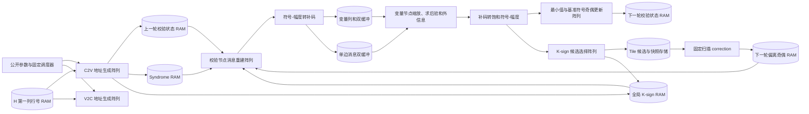

# TRIKE K-sign Min-Sum 译码器硬件设计说明

## 1. 文档目的与适用范围

本文从数字集成电路实现的角度说明仓库中的 TRIKE K-sign Min-Sum 译码器。阅读对象是假设已经学过
组合逻辑、时序逻辑、有限状态机、定点数和片上 RAM，但尚未接触过纠错码译码器硬件的本科生。

文中先说明译码器解决什么问题、接收什么输入、产生什么输出，再沿一次译码的数据流依次解释：

1. 公开参数和输入数据如何装载；
2. 稀疏循环校验矩阵如何变成逐拍地址；
3. 校验节点如何产生 C2V 消息；
4. 变量节点如何累加消息并产生 V2C 消息；
5. 下一轮校验节点状态如何更新；
6. K-sign 如何压缩符号、如何修正校验行符号奇偶；
7. 双缓冲、双迭代存储和旁路如何解决流水相关；
8. 控制器如何保证固定译码周期。

默认实现基线是统一 TRIKE 参数族、32 路并行、每个 tile 最多 1152 个变量列、4 个 K-sign
偏离位置和 5 bit 符号-幅度消息。参数配置来自
[bike_pkg.sv](../../rtl/bike_pkg.sv)，顶层连接关系来自
[decoder_top.sv](../../rtl/decoder_top.sv)。

---

## 2. 译码器的任务和工作场景

### 2.1 它解决什么问题

TRIKE/BIKE 一类基于 QC-MDPC 码的密码系统在解密时，需要根据收到的 syndrome（校验子）和本地
校验矩阵 $H$，估计一个二进制错误向量 $\hat e$。理想结果满足：

$$
s = H\hat e^{T}
$$

其中所有矩阵运算都在二元域上进行，即加法等价于异或。译码器的输入不是带噪声的模拟采样，而是：

- 一个二进制 syndrome $s$；
- 以稀疏形式给出的 QC 校验矩阵 $H$；
- 一个公开的参数等级。

译码器的输出是错误位置估计 $\hat e$。输出位为 1 表示对应变量位置被判断为错误，为 0
表示没有错误。

### 2.2 为什么要使用迭代 Min-Sum

校验矩阵可以看成一张二部图：

- 一侧是 $R$ 个校验节点；
- 另一侧是 $N=N_0R$ 个变量节点；
- 矩阵中的一个 1 对应一条边。

Min-Sum 译码在两类节点之间反复交换定点消息：

- C2V（check-to-variable）：校验节点发给变量节点的建议；
- V2C（variable-to-check）：变量节点排除当前边后发回校验节点的判断。

一轮迭代先用上一轮校验状态重建所有 C2V 消息，再对每个变量列求和并生成新的 V2C
消息，最后形成下一轮校验状态。硬件固定执行 $I_{\max}=7$ 轮，不根据中途是否已经满足
syndrome 提前结束。

### 2.3 硬件设计目标

译码器同时追求以下目标：

- **固定执行时间**：给定公开参数等级后，迭代数、扫描窗口、地址请求数和 RAM 访问数固定。
- **硬件可实现性**：不保存稠密的 $R\times N$ 校验矩阵，利用 QC 结构实时生成边地址。
- **受控的并行度**：每拍处理 $L$ 条边，默认 $L=32$，以 banked RAM 支持并行访问。
- **片上存储复用**：按 tile 处理变量列，以双缓冲覆盖 C2V 和 V2C 的工作集。
- **定点化**：消息总宽度为 5 bit，其中 1 bit 符号、4 bit 幅值；缩放使用移位加法。
- **符号压缩**：TRIKE 配置使用 K-sign，每个变量只长期保存一个基准符号和 $K$ 个偏离位置。
- **便于时序收敛**：同步 BRAM、寄存器对齐、固定旁路和分层选择网络共同限制组合路径长度。

“固定周期”与“每拍功耗完全相同”不是同一个概念。本设计保证调度深度和访问次数不随 syndrome、
错误模式或校验矩阵内容变化；数据翻转活动仍可能随数值变化。

---

## 3. 顶层接口：数据怎样进入和离开译码器

### 3.1 时钟、复位和公开配置

| 信号 | 硬件含义 |
| --- | --- |
| `i_clk` | 所有译码数据通路和 RAM 共用的主时钟 |
| `i_rst_n` | 低有效外部复位；内部使用异步置位、同步释放的复位链 |
| `i_param_level` | 公开参数等级选择，决定 $R$、$W$、tile 数、常数 $C$ 和缩放系数 $\alpha$ |

统一参数硬件按照参数族中最大等级确定计数器位宽和物理存储容量，再由
`i_param_level` 选择本次译码实际使用的边界。配置在第一次有效的 $H$ 或 syndrome 写入时锁定，
避免装载过程中改变地址解释方式。

### 3.2 校验矩阵装载接口

QC 校验矩阵由 $N_0$ 个 $R\times R$ 循环块横向拼接。每个循环块只需提供第一列中
$W$ 个非零元素的行号。一次写事务由写使能、条目地址和行号数据组成；`i_h_we` 为高时，硬件在
时钟上升沿接收其余三个输入字段。

| 信号 | 含义 |
| --- | --- |
| `i_h_we` | H 第一列支撑集写使能 |
| `i_h_block_idx` | 循环块编号 $b$ |
| `i_h_diag_idx_local` | 块内支撑项编号 $k$；与 $b$ 共同形成写地址 $bW+k$ |
| `i_h_base_row_idx` | 写入数据，即该支撑项在第一列中的行号 $p_{b,k}$ |
| `o_h_loaded` | 规定数量的条目已经接收并完成合法性检查 |
| `o_h_error` | 存在越界、重复写入或同一块内重复行号 |

硬件并不装载整张 $H$。它只保存 $N_0W$ 个行号，每个行号代表一个循环对角线。

为了同时服务 C2V、V2C 和 K-sign correction 三条地址链，第一列行号存储复制为三份同步读 RAM I。
三份 RAM 写入相同数据，但拥有独立读地址。复制只增加这类小型支撑集存储，不需要三份完整校验矩阵。

条目装载完成后，校验逻辑在每个循环块内逐对比较行号，确认不存在两个相同的第一列位置。
这个检查发生在启动译码之前，其周期不计入主译码固定周期。

### 3.3 Syndrome 装载接口

| 信号 | 含义 |
| --- | --- |
| `i_syndrome_we` | 写入一个 syndrome bit |
| `i_syndrome_addr` | syndrome 行号，要求从 0 到 $R-1$ 连续递增 |
| `i_syndrome_wdata` | 当前行的 syndrome bit |

syndrome RAM 按校验行低位分成 $L$ 个 bank。写地址 $r$ 被拆成：

$$
\text{bank}=r\bmod L,\qquad
\text{bank\_addr}=\left\lfloor\frac{r}{L}\right\rfloor
$$

只有完整写入地址 $0\ldots R-1$ 后，启动请求才会被接受。每次译码启动会消费这份
syndrome；下一次译码需要重新装载 syndrome。

### 3.4 启动和结果接口

译码启动条件为：

$$
\text{start\_accept}
=i\_start\land H\_\text{ready}\land \neg H\_\text{error}
\land syndrome\_\text{ready}\land controller\_\text{idle}
$$

结果接口包含：

| 信号 | 含义 |
| --- | --- |
| `o_done` | 固定轮数和所有流水排空完成 |
| `o_iter_count` | 完成时等于 $I_{\max}$ |
| `i_e_read_col_idx` | 要读取的错误向量列号 |
| `o_e_rdata` | 对应列的错误估计 bit |

K-sign 配置把最终后验符号保存在每列全局 K-sign 记录的 `base_sign` 位中。译码完成后，主 C2V
读口空闲，外部列地址借用该读口，经过一次同步 RAM 读取后得到 `o_e_rdata`。

---

## 4. 从算法图到硬件数据通路

下面的图表示一次迭代中的主要数据流。矩形表示运算阵列，圆柱表示物理存储。



硬件中有 $L$ 条并行 lane。每条 lane 都包含一套 CNU-B、消息格式转换和 CNU-A 组合逻辑；
VNU 也以 $L$ 路向量形式工作。大容量状态按 $L$ 个 bank 分散，保证同一拍的有效边分别落到
不同 bank。

---

## 5. 从 QC 矩阵到地址和循环路由

译码器每拍并行处理 $L$ 条边。为了让 $L$ 条边能够同时访问存储器，校验行状态、变量列状态和
tile 工作数据都拆成 $L$ 个 bank。地址生成的任务不仅是算出行号和列号，还要保证本拍送往每个
bank 的请求至多一条。

理解这一结构时，需要区分两种编号：

- **逻辑 lane**：一组连续变量列中的第几条边；
- **物理槽位**：连接到某个校验行 bank 的固定硬件通道。

地址生成器的输出按物理槽位排列，槽位 $x$ 直接连接校验行 bank $x$。变量列和 tile 存储采用另一种
bank 排列，因此两种排列之间需要一层路由。

### 5.1 QC 几何为什么适合并行分 bank

一个 QC 块只需存储第一列中 $W$ 个非零位置。第 $b$ 个块的第 $k$ 个非零位置记为
$p_{b,k}$。由于后续列是第一列的循环移位，块内变量列 $j$ 所连接的校验行为：

$$
r=(p_{b,k}+j)\bmod R
$$

一拍处理从 $j_0$ 开始的 $L$ 个连续变量列时，第 $l$ 条逻辑 lane 对应：

$$
j_l=j_0+l,\qquad
r_l=(p_{b,k}+j_0+l)\bmod R
$$

若这一组没有跨过模 $R$ 的回绕点，其校验行 bank 为：

$$
\operatorname{row\_bank}(l)=(s+l)\bmod L
$$

其中：

$$
s=(p_{b,k}+j_0)\bmod L
$$

因此，$L$ 条边会依次落入 $L$ 个不同的校验行 bank，顺序只是整体循环平移了 $s$ 个位置。QC
结构在这里提供了两个重要条件：同一拍没有 bank 冲突，lane 与 bank 的关系也不是任意置换。

地址生成器据此反向计算每个物理 bank 应接收哪条逻辑 lane：

$$
l=(x-s)\bmod L
$$

其中 $x$ 是物理校验行 bank 编号。这样，输出槽位 $x$ 可以直接访问 bank $x$，校验行状态路径
不需要跨 bank 交换网络。

### 5.2 为什么还需要循环路由

校验行路径按 `row mod L` 排列，tile 工作存储按 `tile offset mod L` 排列，全局变量状态按
`column mod L` 排列。同一组边在这些存储器中的 bank 编号不同，但它们都来自连续的列号，所以
两种排列之间仍然只差一个循环平移。

以 $L=4$ 为例，一组 tile 偏移为 4、5、6、7，它们应分别进入 tile bank 0、1、2、3。假设
QC 行关系使地址生成器按校验行 bank 输出后，四个物理槽位中携带的偏移为：

| 物理槽位，也就是 row bank | 0 | 1 | 2 | 3 |
|---|---:|---:|---:|---:|
| 槽位中携带的 tile 偏移 | 6 | 7 | 4 | 5 |
| 目标 tile bank | 2 | 3 | 0 | 1 |

这里需要的连接关系是“整体旋转 2 位”。硬件从槽位 0 所携带地址的低位得到旋转量 2，把四个请求
同时旋转到对应的 tile bank。RAM 返回数据后，再按相反方向旋转，使数据回到发起请求的物理槽位。

因此，一次读访问经过：

$$
\text{物理计算槽位}
\rightarrow
\text{正向循环路由}
\rightarrow
\text{目标 RAM bank}
\rightarrow
\text{反向循环路由}
\rightarrow
\text{原物理计算槽位}
$$

写访问只需要正向路由。随请求旋转的内容包括有效位、写数据以及确实随 bank 变化的地址字段。能够
证明本组公共的字段直接送到所有 bank，例如 `ram_t` 中同一组请求共享对角线编号和 bank 内地址，
无须把这些字段也送入多路器网络。

### 5.3 循环路由为什么比完整路由网络小

完整的 $L\times L$ 交叉网络允许每个输出从任意输入中独立选择一路。用 2:1 多路器估算，每一位
被路由的数据需要约：

$$
L(L-1)
$$

个 2:1 多路器。QC 访问只可能出现循环平移，因此可以使用桶形循环移位网络。第 $m$ 级只在
“保持原位”和“移动 $2^m$ 位”之间选择，总级数为 $\log_2L$，每一位被路由的数据需要：

$$
L\log_2L
$$

个 2:1 多路器。

默认 $L=32$ 时，循环网络由 5 级、每级 32 个 2:1 多路器组成，即每一位被路由的数据约需 160 个
多路器；直接实现 32×32 全交叉选择约需 992 个。循环网络还只需要一个所有通道共享的 5 bit
旋转量，而完整交叉网络需要为各输出提供独立选择控制。

这些数字是结构级多路器数量，不等同于 Vivado 最终报告的 LUT 数量；实际结果还受 LUT 打包、字段
宽度和布局布线影响。不过，循环网络删除了硬件中永远不会使用的任意置换能力，因而具有更少的选择
节点、更少的控制信号和更规则的连线。

循环路由只负责无冲突请求的重新排列，不负责仲裁。地址生成器和固定微周期调度必须先保证同一拍内
每个目标 bank 至多收到一条有效请求。

### 5.4 一条边的地址怎样生成

调度器每拍给出四级扫描坐标：

- $b$：循环块编号；
- $t$：块内 tile 编号；
- $k$：第一列非零位置编号；
- $g$：tile 内 lane group 编号。

第 $l$ 条逻辑 lane 的 tile 内偏移、块内列号和全局列号为：

$$
q=gL+l
$$

$$
j=tC_{\mathrm{tile}}+q
$$

$$
c=bR+j
$$

对应的校验行和全局对角线编号为：

$$
r=(p_{b,k}+j)\bmod R
$$

$$
d=bW+k
$$

存储地址统一拆成“低位选 bank，高位选 bank 内地址”：

$$
\operatorname{row\_bank}=r\bmod L,\qquad
\operatorname{row\_addr}=\left\lfloor r/L\right\rfloor
$$

$$
\operatorname{col\_bank}=c\bmod L,\qquad
\operatorname{col\_addr}=\left\lfloor c/L\right\rfloor
$$

$$
\operatorname{tile\_bank}=q\bmod L,\qquad
\operatorname{tile\_addr}=\left\lfloor q/L\right\rfloor
$$

默认 $L=32=2^5$，所以取 bank 只是连接地址低 5 位，bank 内地址只是右移 5 位。模 $R$ 运算由
一次加法、比较和条件减法完成。TRIKE 的 $N_0=3$，块基址只需在 0、$R$、$2R$ 中选择，对角线
基址只需在 0、$W$、$2W$ 中选择，不需要通用乘法器、除法器或取模器。

### 5.5 模回绕为什么需要拆分微周期

当 $R$ 不是 $L$ 的整数倍时，一组连续行号若跨过 $R-1$ 到 0，回绕点两侧可能落入同一个
row bank。例如 $R=13$、$L=4$ 时，行号 11、12、0、1 对应 bank 3、0、0、1，bank 0 在同一
拍出现两次。

地址生成器计算回绕列：

$$
j_{\mathrm{wrap}}=R-p_{b,k}
$$

如果回绕点落在当前 group 内，就用两个微周期分别处理回绕点之前和之后的 lane。每个微周期内仍然
保持一条有效请求对应一个 bank，随后才能使用直接 bank 连接和循环路由。

每条对角线的扫描长度固定为：

$$
Q_{\mathrm{base}}=\left\lceil C_{\mathrm{tile}}/L\right\rceil,\qquad
Q_{\mathrm{tile}}=Q_{\mathrm{base}}+3
$$

三个附加 group 为拆分和流水排空提供固定余量。是否发生回绕只改变 lane 有效掩码，不改变扫描
周期数。最后一个不足 $C_{\mathrm{tile}}$ 列的 tile 也使用完整固定窗口，并用有效掩码禁止越界
访问。

### 5.6 地址流水线

第一列非零位置存放在同步 BRAM 中。调度器发出 $(b,t,k,g)$ 后，硬件先读取 $p_{b,k}$，同时寄存
tile、group、buffer 选择和迭代上下文。下一流水级计算回绕条件、块基址和公共高位地址，再由 $L$
个并行地址单元形成各 bank 的有效位和 bank 内地址。

每一级都携带与数据对应的 valid 和旋转量，因此单个请求需要若干拍才能到达 RAM，但流水填满后仍可
每拍接收一组新的扫描坐标。窗口末尾的固定 guard 负责排空在途地址和 RAM 返回数据。

---

## 6. 每轮开始：初始化下一轮校验状态

校验节点不为每条边保存完整消息，只为每个校验行保存压缩状态：

$$
M_r=\{\min_1,\min_2,d_{\min},P_\text{base}\}
$$

其中：

- $\min_1$：该校验行所有 V2C 幅值中的最小值；
- $\min_2$：第二小值；
- $d_{\min}$：产生最小值的全局对角线编号；
- $P_\text{base}$：所有相连变量的 K-sign 基准符号异或。

默认 TRIKE-512 中，幅值各 4 bit，全局对角线共有 $N_0W=333$ 个，需要 9 bit 编号，再加
1 bit 奇偶，因此一条压缩状态正好是：

$$
4+4+9+1=18\ \text{bit}
$$

校验状态 RAM 具有两个迭代 pair：

- read pair 保存上一轮完成的状态，供 C2V 读取；
- write pair 保存本轮 V2C 正在形成的下一轮状态。

每轮开始时，控制器按 bank 内地址 $0\ldots\lceil R/L\rceil-1$ 扫描，用固定初始化值清空
write pair。最小值字段被置为最大可表示幅值，
最小值位置和符号奇偶置零。K-sign 偏离奇偶 RAM 的对应 write pair 同时清零。

双 pair 让上一轮读取和本轮写入落在不同物理 RAM 上，避免一轮尚未完成时覆盖仍要使用的数据。

---

## 7. C2V：从校验节点状态重建边消息

### 7.1 C2V 需要读取哪些信息

对当前边 $(r,c,d)$，校验节点消息生成阵列需要：

1. 上一轮校验行 $r$ 的压缩状态 $M_r$；
2. syndrome bit $s_r$；
3. 当前边上一轮 V2C 的符号；
4. 当前边的全局对角线编号 $d$。

第一轮没有上一轮 V2C 状态，硬件使用固定初始状态：

$$
\min_1=\min_2=C,\qquad P=0,\qquad v2c\_sign=0
$$

### 7.2 幅值重建

Min-Sum 的“排除自身”规则要求，发给最小值来源边时不能继续使用它自己的最小幅值。因此：

$$
|m_{r\rightarrow c}|=
\begin{cases}
\min_2, & d=d_{\min}\\
\min_1, & d\ne d_{\min}
\end{cases}
$$

硬件是一组 9 bit 相等比较器和一个 4 bit 2:1 多路器。每条 lane 各有一套。

### 7.3 K-sign 符号重建

K-sign 为每个变量列保存：

$$
S_c=\{b_c,p_{c,0},p_{c,1},\ldots,p_{c,K-1}\}
$$

其中 $b_c$ 是该列的基准符号，$p_{c,i}$ 是符号偏离基准的局部对角线位置。若当前
$k$ 命中任意有效位置，则：

$$
hit_c(k)=\bigvee_i [p_{c,i}=k]
$$

$$
\widetilde{\operatorname{sign}}(v2c_{r,c})=b_c\oplus hit_c(k)
$$

硬件由 $K$ 个 7 bit 相等比较器和一棵 OR 树组成。全 1 的位置编码作为无效哨兵；默认
$W_{\max}=111$，合法位置为 0 到 110，7 bit 全 1 的 127 不会与合法位置冲突。

校验行完整近似符号奇偶分成两部分：

$$
P_r=P_{\text{base},r}\oplus P_{\text{dev},r}
$$

其中基准部分存放在 18 bit 校验状态中，偏离部分存放在 1 bit 的 K-sign
偏离奇偶 RAM 中。C2V 输出符号为：

$$
\operatorname{sign}(m_{r\rightarrow c})
=P_r\oplus
\widetilde{\operatorname{sign}}(v2c_{r,c})
\oplus s_r
$$

### 7.4 同步 RAM 和流水对齐

校验状态、syndrome 和全局 K-sign 记录都位于同步存储中，但读请求入口并不在同一级：

- syndrome 读在地址生成结果出现时发起；
- 校验状态和 K-sign 读在地址、pair 选择再寄存一拍后发起；
- 每个 BRAM 读本身有一拍延迟；
- valid、对角线编号和 tile 偏移经过配套寄存器同步前进。

这样三类数据在 CNU-B 输入端对齐。流水允许每拍接收新的一组 $L$ 条边；“一条边从地址到消息
需要多拍”不等于“每隔多拍才能处理一组边”。

### 7.5 转换为补码并写入 tile 工作集

CNU-B 输出是 1 bit 符号加 4 bit 幅值。累加器使用二进制补码，因此每条 lane 先执行：

$$
(s,m)\longrightarrow
\begin{cases}
+m,&s=0\\
-m,&s=1
\end{cases}
$$

得到的 raw C2V 同时进入两类 tile 存储：

- **变量列和存储**：对同一变量列累加所有相连 C2V；
- **单边消息存储**：保留当前边的 raw C2V，供 V2C 阶段执行排除自身。

当 $k=0$ 时，变量列和从 0 开始；后续 $k$ 执行读—加—写。变量列和存储由 banked
distributed RAM 构成，支持组合读和同步写。单边消息存储使用同步 BRAM。

单边消息地址为：

$$
a_T=kQ_\text{base}+\left\lfloor q/L\right\rfloor
$$

bank 号为 $q\bmod L$。同一 lane group 的 $\lfloor q/L\rfloor$ 相同，所以所有 bank
共享一个 $a_T$，只需旋转有效位和消息数据，不需要为 32 个 bank 重复计算 32 份地址。

---

## 8. Tile 双缓冲：让 C2V 和 V2C 重叠

全长变量向量不能全部放入一组高速并行工作 RAM，因此每个循环块被切分成多个 tile。变量列和
存储、单边消息存储各有两个物理 buffer：

- fill buffer 接收当前 tile 的 C2V；
- active buffer 为前一个 tile 的 V2C 提供数据。

主窗口按下列方式运行：

```text
窗口 0：C2V(tile 0)
窗口 1：C2V(tile 1) + V2C(tile 0)
窗口 2：C2V(tile 2) + V2C(tile 1)
...
末窗口：V2C(最后一个 tile)
```

窗口奇偶位选择 buffer：

$$
fill\_buf=window[0],\qquad active\_buf=\neg window[0]
$$

因此同一物理 buffer 在一个窗口中只承担 C2V 或 V2C 的主要读任务。双缓冲将 tile 级生产者和
消费者解耦，使稳态下 C2V 与 V2C 同时工作。

---

## 9. V2C：变量节点求后验和外信息

### 9.1 读取变量列总和和当前边

V2C 对变量列 $c$ 同时读取：

- 该列所有 raw C2V 的和 $A_c$；
- 当前边的 raw C2V $m_{r\rightarrow c}$。

变量后验和当前边外信息分别为：

$$
L_c=C+\operatorname{round}(\alpha A_c)
$$

$$
u_{c\rightarrow r}
=C+\operatorname{round}\left(\alpha(A_c-m_{r\rightarrow c})\right)
$$

$C$ 是固定先验常数。V2C 必须减去当前边，是为了避免把校验节点刚发来的信息原样反馈给它。

### 9.2 缩放在硬件上怎样实现

$\alpha$ 被限制为至多两个二进制负幂之和。例如：

$$
0.1875=2^{-3}+2^{-4}
$$

硬件把补码输入扩展出 6 个小数位，再用两个固定移位器和一个加法器完成乘法，不使用 DSP
乘法器。缩放结果经过一拍寄存，然后执行舍入：

- 正数在半量化单位处向远离 0 的方向舍入；
- 负数先形成向 0 截断值，再按小数幅度决定是否减 1；
- 正负数都实现“最近值、恰好一半时远离 0”的规则。

最后加上 $C$，分别得到后验 $L_c$ 和边外信息 $u_{c\rightarrow r}$。

### 9.3 饱和编码

内部计算使用较宽补码，写回边消息前转换为 5 bit 符号-幅度格式。若绝对值超过 4 bit
可表示的最大幅值 15，就饱和到 15。饱和器由符号判断、绝对值、上限比较器和多路器构成。

后验的符号：

$$
b'_c=\operatorname{sign}(L_c)
$$

既是本轮 K-sign 的基准符号，也是最后一轮该列的错误估计。

---

## 10. 更新下一轮校验节点状态

每个校验行的 V2C 边以固定顺序进入 CNU-A 更新阵列。对于输入幅值 $x$，硬件执行：

1. 若 $x\le\min_1$，原 $\min_1$ 移到 $\min_2$，$x$ 成为新
   $\min_1$，同时记录当前全局对角线编号；
2. 否则若 $x<\min_2$，只更新 $\min_2$；
3. 否则两个最小值保持。

`<=` 规定了等幅值时的确定性规则：扫描中较晚到达的等值边可以成为最小值来源，原最小值成为
第二小值。这个规则必须与 CNU-B 的最小值位置选择配套。

TRIKE K-sign 模式中，进入符号奇偶更新的符号被设置为后验基准符号 $b'_c$。因此主 V2C
扫描形成：

$$
P'_{\text{base},r}=\bigoplus_{c\in\mathcal N(r)}b'_c
$$

与此同时，CNU-A 的幅值路径始终使用真实量化 V2C 幅值更新 $\min_1$、$\min_2$ 和
$d_{\min}$。K-sign 的近似只作用于符号表示，不近似幅值和最小值选择。

同一个校验行的多条边可能在相邻流水拍到达。若后一条边从 RAM 读到的还是旧状态，顶层使用固定
优先级旁路：

1. 优先采用当前组合更新结果；
2. 其次采用前一级待写回结果；
3. 再其次采用更早一级保存的待写回结果；
4. 都不命中时使用 RAM 返回值。

比较条件是 pair 相同且 bank 内行地址相同。旁路相当于处理器流水中的数据前递，避免为等待 RAM
写回而插入数据相关停顿。

---

## 11. K-sign 候选选择和长期符号存储

### 11.1 K-sign 表示的含义

对同一变量列，绝大多数边的 V2C 符号用后验符号 $b'_c$ 表示，只保留至多 $K$ 个高幅值偏离：

$$
dev(k)=\operatorname{sign}(u_{c\rightarrow r_k})\oplus b'_c
$$

仅当 $dev(k)=1$ 时，该边才是 K-sign 候选。默认 $K=4$，长期逻辑记录宽度为：

$$
1+K\left\lceil\log_2W_{\max}\right\rceil
=1+4\cdot7=29\ \text{bit}
$$

### 11.2 Tile 内工作记录

候选选择期间还要比较幅值，所以每列的临时工作记录为：

$$
\{b'_c,\ K\times(position,magnitude)\}
$$

默认宽度：

$$
1+4(7+4)=45\ \text{bit}
$$

32 个工作 bank 各保存 $Q_\text{base}=36$ 个列位置。工作存储采用 distributed RAM：
同步读出旧记录后，组合比较网络更新一个槽，并在下一拍写回原地址。

### 11.3 固定比较树

每条 lane 的候选更新器使用平衡归约树，从 $K$ 个无序槽中找出“最差槽”：

1. 无效槽优先被选择为最差槽；
2. 两个有效槽中，幅值更小者更差；
3. 幅值相同时，局部对角线编号更大者更差；
4. 完全相同时，用槽编号给出确定结果。

新候选只有在以下条件成立时才替换最差槽：

$$
candidate\_valid\land
(\neg worst\_valid\lor candidate\_mag>worst\_mag)
$$

比较是严格大于。等幅值候选不会替换已经保存的候选，而扫描顺序中的 $k$ 递增，因此最终保留
较早、局部位置较小的等幅值边。比较树每拍都经过固定级数，不会因槽已经填满而提前退出。

### 11.4 提交到全局 K-sign RAM

扫描到该列最后一个局部对角线 $k=W-1$ 时，硬件完成两次写入：

- 把 `base_sign + K 个位置` 写入全局 K-sign RAM；
- 把 `K 个位置` 写入 correction 快照 RAM。

幅值只服务于 tile 内 Top-K 筛选，不写入全局记录。全局记录在 C2V 读完旧值后原地更新，
跨 tile 和跨迭代长期保存。

全局列号按 `col mod L` 分为 32 个 bank。默认最大列数为
$N=3\times106781=320343$，每 bank 深度：

$$
\left\lceil320343/32\right\rceil=10011
$$

默认 $L=32,K=4$ 时，一个 29 bit 逻辑记录映射为两个 18 bit 物理字段：

- 字段 0 保存 `base_sign` 和前两个 7 bit 位置；
- 字段 1 保存后两个 7 bit 位置；
- 每个字段按 2048 深度切成 5 个 RAMB36 段；
- 每 bank 共 10 个 RAMB36，32 个 bank 共 320 个 RAMB36。

这种字段和深度分段对应 FPGA BRAM 的原生宽深比。逻辑记录仍是 29 bit，未使用的物理位填 0。

---

## 12. K-sign correction：把偏离位置加入校验行奇偶

### 12.1 为什么需要 correction

主 V2C 扫描只把每列基准符号 $b'_c$ 异或到校验行状态。若某条边被 K-sign 记录为偏离位置，
该边的近似符号还要再翻转一次。因此下一轮真正使用的符号奇偶是：

$$
P'_r=P'_{\text{base},r}\oplus P'_{\text{dev},r}
$$

$$
P'_{\text{dev},r}
=\bigoplus_{(c,k):\,r=(c_\text{local}+p_{b,k})\bmod R}
[k\in\{p_{c,0},\ldots,p_{c,K-1}\}]
$$

### 12.2 固定扫描的硬件实现

correction 使用与主路径相同的 $(b,t,k,g)$ 扫描坐标和地址生成器。对每条有效边：

1. 按变量列 bank 读取完成 tile 的 K 个位置快照；
2. 用 $K$ 个相等比较器判断当前 $k$ 是否命中；
3. 把 1 bit 命中结果反向旋转回原 lane；
4. 地址生成器已经给出对应校验行 bank 和 bank 内地址；
5. 命中时对该地址的偏离奇偶 bit 执行读—取反—写回。

这种结构扫描完整 $WQ_\text{tile}$ 窗口。无效槽或未命中只关闭翻转写使能，不减少扫描拍数。
固定顺序扫描避免了每列发出 $K$ 个随机行写请求所带来的多 bank 冲突仲裁。

### 12.3 快照和工作 RAM 的重叠

Tile 候选存储含两部分：

- 45 bit 工作 RAM：服务正在执行 V2C 的 tile；
- 28 bit 位置快照 RAM：服务 correction。

tile $t$ 的最后一个对角线把 4 个位置写入快照；correction 读取已完成 tile 的快照，同时后续
tile 复用工作 RAM。同步存储采用 read-first 语义：同地址在同一拍被读和覆盖时，读端得到覆盖前的
快照，写端保存新的快照。

偏离奇偶 RAM 也具有两个迭代 pair。C2V 读取上一轮 pair，correction 更新本轮 write pair。
翻转采用同步读改写；若连续请求命中同一地址，固定旁路把刚计算的新 bit 送给下一次取反，避免丢失
一次翻转。

需要注意：$K=4$ 表示每列最多保留 4 个偏离位置，不表示每列或每轮必定发生 4 次有效翻转。
无效槽和未命中周期仍被调度，实际翻转次数由有效偏离位置决定。

---

## 13. 存储组织和数据生命周期

下面的表按“数据何时产生、保存多久、由谁消费”描述存储，而不只列 RTL 名称。

| 逻辑信息 | 物理结构 | 写入时刻 | 读取时刻 | 生命周期 |
| --- | --- | --- | --- | --- |
| $H$ 每块第一列的 $W$ 个行号 | 3 份同步 BRAM | 系统装载阶段 | C2V、V2C、correction 地址生成前 | 装载后保持到复位 |
| syndrome 的 $R$ 个 bit | $L$ 个 1-bit bank | 每次译码前顺序装载 | 每轮 C2V | 一次译码 |
| $\min_1,\min_2,d_{\min},P_\text{base}$ | 2 组、每组 $L$ 个 18-bit BRAM bank | 每轮 V2C | 下一轮 C2V；本轮 V2C 读改写 | 迭代级双 pair |
| $P_\text{dev}$ | 2 组、每组 $L$ 个 1-bit BRAM bank | 每轮 correction | 下一轮 C2V | 迭代级双 pair |
| 一个 tile 内每列 C2V 总和 | 2 组 $L$-bank LUTRAM | C2V 累加 | 下一窗口 V2C | tile 级双缓冲 |
| 一个 tile 内每条 raw C2V | 2 组 $L$-bank BRAM | C2V | 下一窗口 V2C 排除自身 | tile 级双缓冲 |
| 每列 K-sign 候选的位置和幅值 | $L$-bank 45-bit LUTRAM | tile 内 V2C 每个 $k$ | 下一候选到达时 | 当前活动 tile |
| 完成 tile 的 K 个位置 | $L$-bank 28-bit LUTRAM | 最后一个 $k$ | correction | correction 追赶期间 |
| 每列 `base_sign + K 个位置` | $L$-bank 分段 BRAM | 每轮该列最后一个 $k$ | 下一轮 C2V；完成后结果读出 | 跨 tile、跨迭代 |

这张表体现了三种复用尺度：

- **迭代尺度**：校验状态和偏离奇偶使用 read/write pair；
- **tile 尺度**：C2V 和 V2C 工作集使用 fill/active 双缓冲；
- **列尺度**：K-sign 工作记录逐对角线读改写，最后压缩提交到全局 RAM。

---

## 14. 控制器、固定窗口和周期预算

### 14.1 每轮的阶段

主控制器可见阶段对应真实硬件活动：

| 阶段 | 硬件活动 |
| --- | --- |
| 等待启动 | 接受合法配置写入、syndrome 写入或结果读取 |
| 初始化 write pair | 顺序写入校验状态初值并清零偏离奇偶 |
| C2V 首 tile 填充 | 只有 C2V 阵列产生工作集 |
| C2V/V2C 重叠 | 当前 tile 做 C2V，前一 tile 做 V2C |
| V2C 尾 tile 排空 | 停止发出新 C2V，完成最后一个 tile 的 V2C |
| correction 尾部 | 完成固定扫描和读改写流水排空 |
| 完成 | 拉高 `o_done`，开放全局 K-sign 读口给结果接口 |

### 14.2 计数器嵌套关系

最内层到最外层依次是：

```text
lane_group: 0 .. Q_TILE-1
diag:       0 .. W-1
window:     0 .. N0*TILE_COUNT
iteration:  0 .. I_MAX-1
```

另有一个 `clear_addr` 从 0 扫描到 `ROW_SEG_SIZE-1`。所有上限由公开参数配置产生。

### 14.3 周期公式

$$
ROW\_SEG\_SIZE=\left\lceil R/L\right\rceil
$$

$$
T_\text{tile}=WQ_\text{tile}
$$

$$
T_\text{main}=(N_0\cdot TILE\_COUNT+1)T_\text{tile}
$$

$$
T_\text{iter}=ROW\_SEG\_SIZE+T_\text{main}+8+T_\text{tile}
$$

$$
T_\text{decode}=I_{\max}T_\text{iter}+6
$$

式中的 8 拍用于 K-sign correction 与主控制的固定边界和内部排空，最后 6 拍把完成状态与仍在
前进的顶层流水对齐。

默认 $L=32,C_\text{tile}=1152,K=4$ 时：

| 公开等级 | 固定周期 | 100 MHz 对应时间 |
| --- | ---: | ---: |
| TRIKE-128 | 193,514 | 1.93514 ms |
| TRIKE-160 | 337,245 | 3.37245 ms |
| TRIKE-256 | 1,252,957 | 12.52957 ms |
| TRIKE-384 | 3,866,092 | 38.66092 ms |
| TRIKE-512 | 8,538,564 | 85.38564 ms |

以 TRIKE-512 为例：

$$
ROW\_SEG\_SIZE=\lceil106781/32\rceil=3337
$$

$$
Q_\text{base}=\lceil1152/32\rceil=36,\qquad Q_\text{tile}=39
$$

$$
TILE\_COUNT=\lceil106781/1152\rceil=93
$$

$$
T_\text{tile}=111\cdot39=4329
$$

$$
T_\text{decode}
=7[3337+(3\cdot93+1)4329+8+4329]+6
=8\,538\,564
$$

H 第一列内容、syndrome 的 0/1 分布、保留了多少 K-sign 位置、译码是否提前满足校验方程，都不出现在
周期公式中。

---

## 15. RAM 端口语义和相关处理

### 15.1 通用同步 RAM

大多数 BRAM 通过公共封装实现：

- 同一个时钟驱动写端口和读端口；
- 写端同步；
- 读端延迟一拍；
- 同地址读写采用 read-first 语义；
- 综合时使用 FPGA simple-dual-port block RAM；
- 小型 K-sign 工作集可选择 distributed RAM。

RAM 数据阵列不通过复位逐项清零。需要初值的校验状态由固定清空窗口写入，其他 RAM 通过
valid、装载完成标志或覆盖顺序定义数据何时有效。这样可以保持 BRAM 推断并避免庞大的复位网络。

### 15.2 三类相关分别怎样解决

| 相关类型 | 例子 | 解决结构 |
| --- | --- | --- |
| 跨迭代覆盖 | 本轮写校验状态、下一轮才读取 | 两个 iteration pair，轮末交换角色 |
| 相邻 tile 生产/消费 | C2V 填充 tile $t$，V2C 消费 tile $t-1$ | 两个 tile buffer，窗口奇偶切换 |
| 同一行连续更新 | 多条 V2C 边连续更新同一校验行 | 地址比较器加多级数据旁路 |
| 同一 bit 连续翻转 | correction 连续命中同一行地址 | 读改写旁路保存最新翻转值 |
| 快照同地址读写 | correction 读 tile $t$，tile $t+1$ 覆盖 | read-first RAM 取得旧快照 |

这些结构都使用固定比较和选择逻辑，不通过可变等待、重试或仲裁改变主调度周期。

---

## 16. 精度边界和算法语义

为了正确理解硬件结果，需要明确以下边界：

1. **消息定点化**：边消息使用 4 bit 幅值，并执行饱和；这与无限精度 Min-Sum 有差异。
2. **缩放量化**：$\alpha$ 用两个二进制负幂表示，并按固定规则舍入。
3. **K-sign 近似**：每列只保存至多 $K$ 个偏离基准的符号位置；未保留的偏离边按基准符号重建。
4. **幅值路径完整**：所有 V2C 的量化幅值都参与校验行 $\min_1/\min_2$ 更新，K-sign 不裁剪幅值边。
5. **确定性等值规则**：CNU 最小值使用 `<=` 规则；K-sign 候选使用严格幅值大于规则，两者职责不同。
6. **固定轮数**：输出是第 $I_{\max}$ 轮后验符号，不使用 residual 驱动的提前结束。

功能仿真可以检查固定周期、输出错误向量和 residual；FPGA 资源、最高频率和引脚接口时序必须由同一
器件、约束和 Vivado 流程的综合及布局布线报告确认。内部 100 MHz 时序通过也不自动代表外部
`o_e_rdata` 已满足具体电路板的输入/输出延迟要求。

---

## 17. 从硬件结构回看一次完整译码

把前面的细节串起来，一次译码按下列顺序发生：

1. 系统选择公开参数等级，装载 $N_0W$ 个第一列行号并完成合法性检查。
2. 系统按行号顺序写入 $R$ 个 syndrome bit。
3. 合法 `start` 锁存配置，控制器把下一轮校验状态 pair 和偏离奇偶 pair 清零。
4. 调度器从块 0、tile 0、对角线 0、group 0 开始发出固定坐标。
5. 地址阵列读取一个第一列行号，用加法、比较和减法生成 $L$ 条边的行、列、bank 和 bank 内地址。
6. C2V 读取 syndrome、上一轮校验状态和上一轮全局 K-sign 记录，在流水中对齐。
7. CNU-B 用最小值选择器和符号异或网络生成 $L$ 条 C2V。
8. C2V 转成补码，累加到变量列和，并写入单边消息缓存。
9. 下一窗口中，V2C 读取前一个 tile 的总和和单边消息，移位加法器计算缩放后验和排除自身的外信息。
10. 饱和器产生新的 5 bit V2C；CNU-A 更新下一轮每行的两个最小幅值、最小值位置和基准符号奇偶。
11. K-sign 比较树为每列保留最多 4 个高幅值偏离位置；最后一个对角线把压缩记录写入全局 RAM，
    并把位置写入 correction 快照。
12. correction 以固定窗口重扫边坐标，命中一个保留位置时翻转下一轮对应校验行的偏离奇偶 bit。
13. correction 和流水排空后，read/write pair 交换，下一轮重复步骤 3 到 12。
14. 第 7 轮完成并排空后，`o_done` 置位；每列全局 K-sign 记录的基准符号就是错误估计，可由串行读口读取。

这条数据流中，控制器决定“何时处理哪一组公开坐标”，地址阵列决定“这些坐标落在哪些物理 bank”，
运算阵列决定“消息数值怎样更新”，RAM pair 和 buffer 决定“不同时间尺度的数据保存在哪里”。

---

## 18. 术语与硬件结构对照

| 算法术语 | 直观含义 | 对应硬件 |
| --- | --- | --- |
| 校验矩阵的一条边 | 一个变量参加一个校验方程 | 由块、tile、对角线和 lane group 实时生成的地址 |
| 校验节点 | 汇总同一校验行的所有 V2C | 两个最小值寄存格式、符号奇偶和 CNU-A/B 阵列 |
| 变量节点 | 汇总同一变量列的所有 C2V | tile 列累加 RAM、单边 RAM 和 VNU |
| 排除自身 | 发回消息时去掉接收方刚提供的信息 | CNU-B 的 min1/min2 选择；VNU 的 `sum-edge` 减法 |
| 迭代 | 用上一轮状态形成下一轮状态 | 两组校验状态 RAM 和轮末 pair 交换 |
| Tile | 一次放入并行工作集的一段变量列 | 双缓冲累加 RAM、单边 RAM 和 K-sign 工作 RAM |
| K-sign 基准符号 | 一列多数边共享的符号 | 后验符号和全局记录的 1 bit 字段 |
| K-sign 偏离位置 | 符号与基准不同的高幅值边 | Top-K 比较树、7 bit 位置槽和 correction 快照 |
| 固定时间 | 私有数据不改变执行深度 | 公开上限计数器、guard、valid 掩码和固定排空周期 |

---

## 19. RTL 阅读入口

理解本文后，可以按数据流阅读下列文件：

| 内容 | RTL 文件 |
| --- | --- |
| 公共参数、消息位域和状态位域 | [bike_pkg.sv](../../rtl/bike_pkg.sv) |
| 顶层连接、流水寄存和旁路 | [decoder_top.sv](../../rtl/decoder_top.sv) |
| 固定窗口和迭代控制 | [tile_scheduler.sv](../../rtl/tile_scheduler.sv) |
| 边的行列地址和 bank 拆分 | [edge_addr_gen.sv](../../rtl/edge_addr_gen.sv) |
| 校验节点消息重建与状态更新 | [cnu_b.sv](../../rtl/cnu_b.sv)、[cnu_a.sv](../../rtl/cnu_a.sv) |
| 变量节点缩放、后验和外信息 | [vnu.sv](../../rtl/vnu.sv) |
| Tile 总和与单边缓存 | [ram_accum.sv](../../rtl/ram_accum.sv)、[ram_t.sv](../../rtl/ram_t.sv) |
| K-sign 候选、快照和全局记录 | [k_sign_selector.sv](../../rtl/k_sign_selector.sv)、[ram_k_tile.sv](../../rtl/ram_k_tile.sv)、[ram_k_global.sv](../../rtl/ram_k_global.sv) |
| K-sign 偏离奇偶 | [ram_sign_delta.sv](../../rtl/ram_sign_delta.sv) |
| 通用同步 RAM 与 bank 路由 | [ram_bram.sv](../../rtl/ram_bram.sv)、[barrel_rotate.sv](../../rtl/barrel_rotate.sv) |

实现参数、验证状态、资源和时序基线见
[implementation_status.md](implementation_status.md)。固定周期的独立定义见
[decoder_schedule.md](decoder_schedule.md)。
