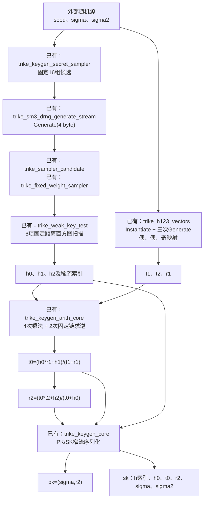
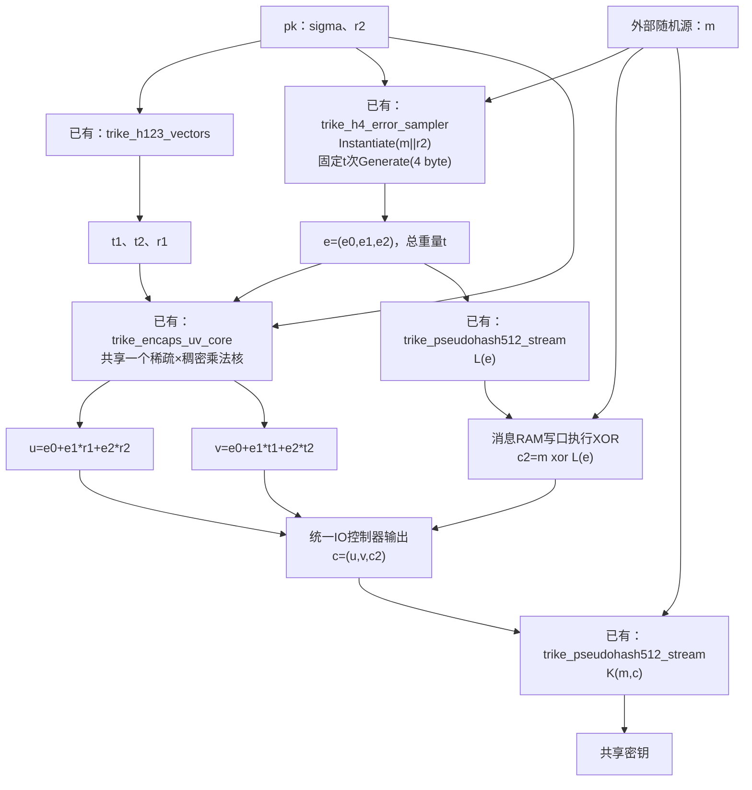
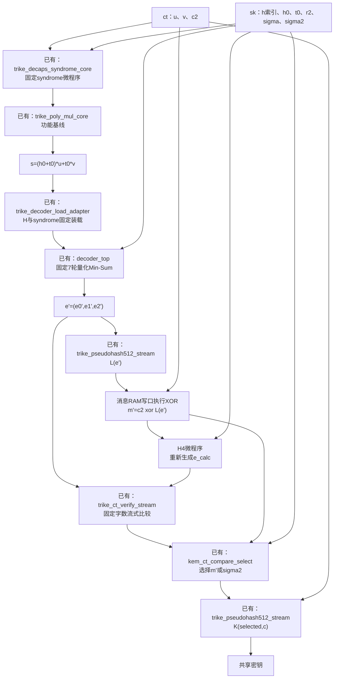
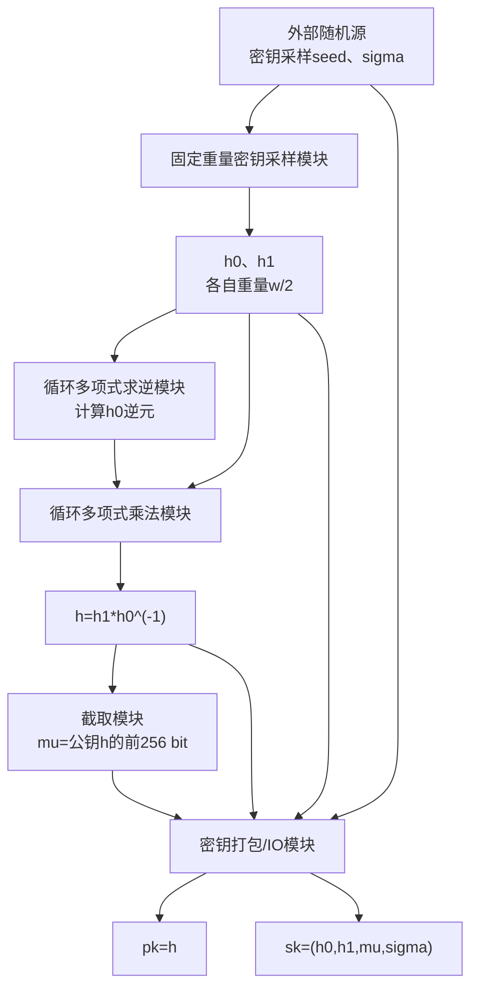
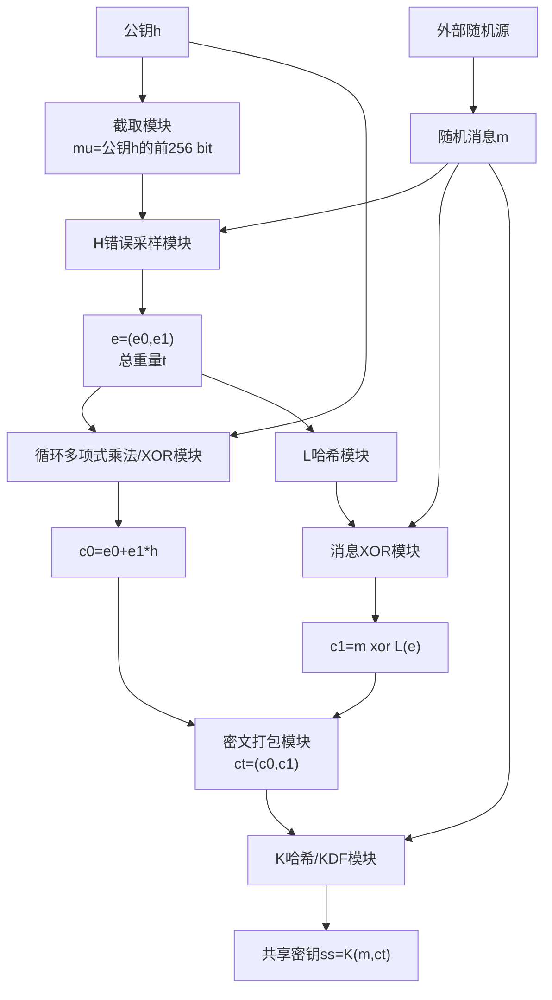
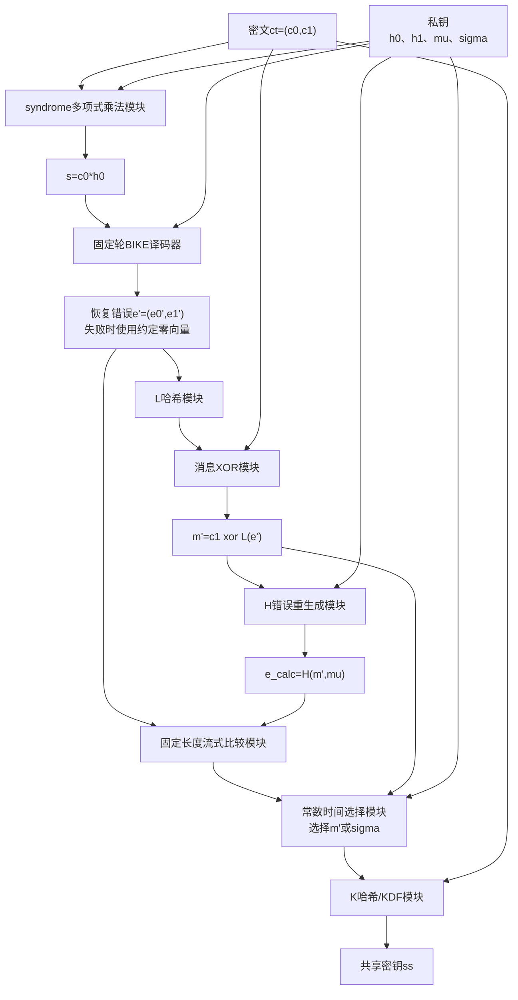
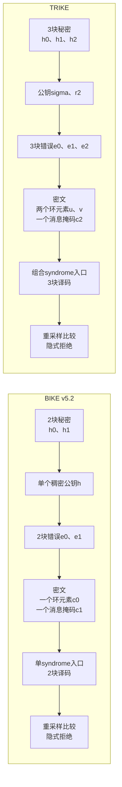
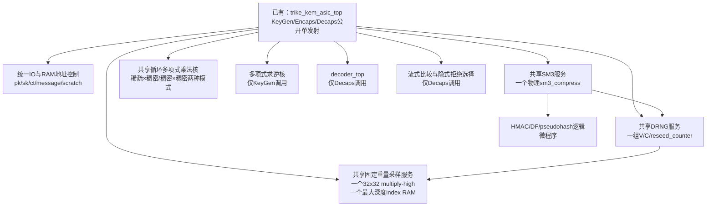

# TRIKE KEM硬件架构、公共核与复用设计

本文档记录`trike-电子版材料0629`对应的TRIKE KEM硬件依赖、已有实现复用边界，以及本仓库公共RTL核。
实现依据按以下顺序确定：随包KAT、随包Reference C、随包Optimized C、算法文档。KAT用于锁定字节序列化和
函数输出，C实现用于补充算法文档中未展开的SM3-DRNG、pseudohash和采样细节。

## KEM依赖

四个随包参数集（TRIKE-2/5/7/9 的 $r$、$d$、$t$、$\ell$、公钥/密文/共享密钥长度）见
[BIKE 与 TRIKE KEM 机制及硬件核分层指南](bike_trike_kem_hardware_mechanism.md)第8节的参数表。

KEM数据通路需要以下模块：

1. SM3压缩、任意byte长度SM3、HMAC-SM3；
2. ICCS SM3-DRNG实例化和Generate，包括`SM3_df`、55-byte大整数加一和加法；
3. `pseudohash512`的HMAC-SM3/SM3级联；
4. H1/H2/H3的三段DRNG输出、最高padding bit清零和偶/偶/奇校验映射；
5. H4的固定重量无重复位置采样；
6. 稀疏×稠密和稠密×稠密循环二元多项式乘法、稠密多项式求逆；
7. syndrome生成、固定7轮译码、重加密检查和共享密钥选择；
8. 公钥、私钥和密文的little-endian byte序列化控制器。

H1/H2/H3由同一个SM3-DRNG上下文连续输出`t1`、`t2`、`r1`。H4使用`m || r2`初始化SM3-DRNG，
每个候选消耗32 bit随机数并按multiply-high映射候选位置；碰撞时选择`pos`，循环边界由公开的
$t$确定。候选映射公式和固定调用粒度的完整说明见
[BIKE 与 TRIKE KEM 机制及硬件核分层指南](bike_trike_kem_hardware_mechanism.md)第11.1节。
硬件实现需要每次都执行固定次数的查重读取或采用固定深度的确定性bank调度。

Reference C对每个candidate分别调用一次4-byte DRNG Generate。每次Generate都会更新`V`和
`reseed_counter`，因此H4控制器需要执行恰好$t$次Generate(4 byte)，不能把它等价为一次
Generate(`4*t` byte)。每个32-bit随机数按Reference C运行平台的little-endian `uint32_t`组装：
DRNG的第一个byte进入`random[7:0]`。

`L`和`K`调用ICCS `pseudohash(512, ...)`。`L`的错误向量输入按三个
`ceil(r/512) * 64` byte块拼接；每块包含对齐padding。该布局与紧凑的`ceil(r/8)` byte表示不同。

## KEM流程与RTL模块

多项式属于$R=\mathbb{F}_2[x]/(x^r-1)$。加法是逐bit XOR，乘法是循环二元多项式乘法，除法通过
多项式求逆和乘法完成。模块名前的“已有”表示仓库中已有RTL和testbench；“待实现”表示完整KEM需要补充的
控制器或算术核。

### KeyGen



`trike_keygen_secret_sampler`从同一DRNG上下文连续生成16组候选，每组固定执行三次35-weight采样和
全部六项`trike_weak_key_test`。第一组合格候选用mask写入结果RAM，其是否合格不改变候选数、SM3调用数、
弱检测RAM地址或复制周期。16组均不合格时仍按相同周期完成，输出`success=0`和全零support；上层将该次
调用作为显式失败返回，不在核内执行数据相关重试。

`trike_keygen_arith_core`通过本地或外部只读视图取得三组support，并保存`t1/t2/r1`，用一个通用
`trike_poly_mul_core`顺序完成
`h0*r1`、`t0`、`t0*t2`和`r2`四次乘法，用一个`trike_poly_inv_core`顺序完成两个分母的固定链求逆。
分子加`h1/h2`与第二个分母加`h0`在RAM写入或读取边界直接XOR稀疏word mask。生产稠密路径使用
`WORD_W=64, DIGIT_W=16`；TRIKE-2连续握手固定10,066,537拍，逐word匹配官方`t0/r2`。该功能
边界包含两个物理乘法数据通路：外层通用乘法器一条，
求逆核内部复用的一条；收敛为单一乘法器需要给求逆核增加外部乘法服务接口并重新验证周期与时序。
第一次分母装载完成后，`t1`原多项式生命周期结束，同一bank依次保存第一次与第二次inverse；算术核
不配置独立inverse RAM。

外层`u_t0_output_mem`与`u_r2_output_mem`通过external result store接口直接服务算术核。前一组保存`t0`；
后一组保存两阶段numerator，并在最终`OP_MUL_R2`完整装载numerator和inverse后原位写入`r2`。固定结果
重放与后续PK/SK序列化继续读取这两组同步RAM。读写角色只由公开FSM选择，统一层次的算术核不展开本地
result store。算术逐word reference固定10,066,537拍；KeyGen core和窄I/O reference的完整固定周期
待短链集成门禁刷新。

`trike_keygen_core`的随机输入为96 byte，顺序是`key_seed || sigma2 || sigma`，对应Reference C向外部
随机源发出的三次32-byte请求。顶层顺序运行固定候选秘密采样、H1/H2/H3、KeyGen算术和密钥输出；秘密
采样与H123通过公开FSM复用一个`trike_sm3_service`。三组support保存在一份寄存视图中，供算术核稀疏
运算与`h0`稠密序列化读取；同一输入流写入32-bit顺序输出RAM，SK阶段按公开地址fetch每个support word。
PK按`r2 || sigma`输出1,980 byte，SK按三组32-bit
little-endian support、`h0 || t0 || r2 || sigma || sigma2`输出6,328 byte。官方候选0合格和候选0弱/
候选1合格两组输入均逐byte匹配软件golden，连续输入输出时固定17,607,119拍。`success`只报告16组候选
内是否找到合格support，不改变H123、算术或序列化调度。

`trike_keygen_synth_top`把完整核封装为可实现的窄物理边界。随机输入、PK和SK均为8-bit流，输入和两路
输出分别设置一项片内缓冲，外部输出使用IOB寄存器；多项式word、support数组和密钥RAM不进入物理端口。
官方向量连续握手固定17,614,690拍，完整PK/SK逐byte匹配，层次检查仍只有一个`sm3_compress`。

当前16-bit digit KeyGen的资源与时序为`待测`。8-bit digit历史参考在Vivado 2023.2、
`xc7k355tffg901-2L`、10 ns时钟、0.100 ns uncertainty和Fully Routed下，完整KeyGen
使用46,464 LUT、54,718 FF、22,392 Slice、21 RAMB36、2 RAMB18和5 DSP。support顺序输出RAM映射为
1个RAMB18。setup WNS/TNS为+0.025 ns/0，hold WHS/THS为+0.001 ns/0；同步数据路径WNS为+0.600 ns，
最差路径位于弱密钥距离RAM到弱标志寄存器。methodology保留49项DPIR-1和4项SYNTH-10，无未约束路径。
报告头未嵌入Git revision；wrapper未分配package pin，因此该结果只关联EXP-0085配置，不构成当前
16-bit digit物理证据或板级I/O签核。

### Encaps



`e0/e1/e2`生成时保留稀疏index流。Encaps的四次`e_i`乘法使用稀疏index驱动循环移位累加，避免先展开
为完整稠密向量再交给独立乘法器。`c2`的XOR合并到消息RAM写口，不设置单独的向量XOR模块。

### Decaps



完整错误向量宽度最大超过34万bit，不能把`kem_ct_compare_select`直接参数化成同样宽度形成单拍XOR树。
`trike_ct_verify_stream`按固定公开word数从错误RAM读取`e'`和`e_calc`，执行
`difference |= |(word_a xor word_b)`，最后把单bit比较结果交给`kem_ct_compare_select`完成
`m'/sigma2`全宽mask选择。

`trike_decaps_syndrome_core`先固定装载`h0` support、`t0/u/v`，再顺序复用一个
`trike_poly_mul_core`计算`h0*u`和`t0*(u+v)`。第一项写入syndrome RAM，第二项在同一RAM写回边界
执行XOR。官方TRIKE-2 Count=0的244个64-bit输出word全部匹配独立Python环乘模型，连续握手固定
311,976拍。`trike_decoder_load_adapter`接受block-major原始H support，经固定排序后写入三组H，
把little-endian syndrome word固定展开为恰好`r`次单bit写，等待H校验完成后只发一次decoder start；
13-bit toy接口回归通过。

官方KAT的TRIKE-2使用`r=15581,w=35,t=263`。当前K-sign译码参数表中相同`w/t`档位使用
`r=12589`，属于另一个经过FLS选择的公开参数集。syndrome核和装载桥均为参数化结构，但在新增明确的
`r=15581`译码profile并完成该profile功能/DFR验证前，不能把官方syndrome对拍与当前译码器回归合并为
端到端Decaps KAT结论。

完整KEM主线为四个项目Min-Sum profile建立独立`TRIKE_MINSUM_KAT_V1`向量，不把官方BF Decaps结果作为
Min-Sum golden。`scripts/gen_trike_minsum_kem_case.py`沿用官方SM3-DRNG、H123、H4和pseudohash字节语义，
SHAKE仅用于确定性产生外层64-byte测试seed，不进入KEM内部哈希。四档`r/w/t/C/alpha`取自统一decoder
参数表，weak-key阈值按35/55/83/111重量档配置。TRIKE160 seed 1得到候选0、weak score为
`19/28/30/51/57/60`，PK/SK/CT长度分别为1,606/5,206/3,180 byte。H4错误重量263，
syndrome重量4,741；固定7轮Min-Sum输出重量263、residual 0并准确恢复原始错误，正常Decaps SS与
Encaps SS一致。固定翻转`u`或`v`首bit后分别完整运行7轮，输出residual重量6,304和6,309；固定翻转
`c2`首bit保持原译码结果但重生成比较失败。三类密文均选择`sigma2`计算拒绝SS。

项目向量同时保存SK中的原始support顺序和供decoder使用的块内升序视图。DFR搜索与RTL的`low_index`
tie规则使用升序视图。`trike_fixed_support_sorter`逐块缓存活动`w`个坐标，每块固定执行
`w*(w-1)/2`次相邻compare-swap后顺序输出。support值只控制compare-swap数据mux，不改变排序轮数、
地址序列或decoder启动时刻。`trike_decoder_load_adapter`使用同一已锁存公开`r/w`，把三块排序输出和
恰好`r`个syndrome bit写入decoder；默认实例使用编译期几何。

`trike_decaps_support_prefetch`从最大输入存储单读口读取全部`3w`项。首块support在H0 syndrome装载与
完整H排序器同时ready时原子传输，另外两块只送排序器；因此每项只有一次同步RAM读取。
`trike_decaps_input_decoder_load_core`在完整输入装载后同时启动共享support预取、运行时syndrome和
运行时decoder装载桥。项目TRIKE160边界固定写入105项H与12,589个syndrome bit后产生一次decoder start。

`trike_decoder_error_vector`在start锁存公开`r`，清零活动的三块padded error RAM，再以一拍一个bit的
地址序列读取全部`3r`项判决并按块打包。每块活动跨度为`ceil(r/512)*64` byte，RAM容量由最大档确定。
固定预算为`3*padded_r_bytes+3r+2`拍；跨512-bit padding边界的逐byte布局已经验证。该存储服务
`L(e')`哈希输入和`e'/e_calc`流式比较。

项目参数后处理已经形成三个可串联边界：`trike_decaps_message_recover`固定重放`e'`两次并恢复`m'`；
`trike_decaps_reencrypt_verify`运行H4、完整比较4,800 byte并选择`m'/sigma2`；`trike_decaps_kdf`固定重放
`selected_message||ciphertext`并输出K的前32 byte。seed 1项目向量下三段分别固定28,431、209,659和
19,323拍；有效与拒绝输入的对应周期一致。当前各段在reference TB中各自使用一个SM3服务，统一Decaps
后处理由`trike_decaps_postprocess_core`串行调度，并通过已有external-compress接口共享同一个
`trike_sm3_service`。正常密文和`c2`首bit篡改密文均固定257,417拍，最终SS分别匹配正常与隐式拒绝
Python golden；Yosys层次检查确认复合顶层恰好一个`sm3_compress`。

SM3、HMAC-SM3和pseudohash控制器支持在start边界锁存公开活动byte数，活动长度共同约束末byte、padding
块数和消息bit长度域。Decaps消息恢复和KDF分别以活动error/ciphertext长度重放最大几何RAM。1、55、
56、64、65、127 byte的pseudohash digest与独立SM3 golden一致；项目TRIKE160的L/K参考结果保持逐byte
一致。H4在start边界锁存公开`r/t/padded_r_bytes`，由活动`M_BYTES+ceil(r/8)`确定seed长度；固定重量
采样、dense error store和完整比较均使用同一活动几何。

Min-Sum固定7轮结束与residual为零是两个独立信号。`trike_decoder_residual_check`保存同一份排序H和
原始syndrome，在start锁存公开`r/w`，每个固定support读数同时处理相邻两行并计算
`syndrome xor H*e'`。K-sign全局记录RAM在译码完成后提供两个不同bank的decision读数；support RAM仍按
最大`W`块跨度扫描活动`w`项。固定预算为`ceil(r/2)*(3+6w)+1`拍。项目TRIKE160有效判决得到0，
单bit syndrome扰动得到重量1，两条路径均为1,340,836拍。

`trike_decaps_decoder_postcheck_core`在事务start锁存一次`r/w`，先用decision lane 0生成error，再把两个
decision lane分配给residual checker。`r/w=7/1、13/3、521/5`的组合周期分别为255、384、10,566拍；
每档不同decision/support数据及residual结果不改变完成时刻。

固定profile Min-Sum Decaps控制由`trike_decaps_pipeline_core`形成。H输入首块在同一次valid/ready接受中送入H0
syndrome RAM和三块support排序器；排序输出与syndrome bit分别同时写入decoder和residual checker。
Min-Sum固定轮结束后，decision同步读口按公开FSM顺序分配给4,800-byte padded error writer和全residual
扫描，之后由单SM3 postprocess读取error、r2和完整ciphertext。`r=12589,w=35,t=263,L=32,K=4`的
seed 1正常与u/v/c2首bit篡改路径均固定2,785,269拍，RTL residual分别为0/6,233/6,314/0，正常路径
输出Encaps SS，三条篡改路径均输出对应`sigma2`隐式拒绝SS。非收敛u/v样本的C模型residual为
6,304/6,309，因此这里只对拍KEM接受/拒绝与最终byte结果，不声明失败判决bit-exact。该结果是Verilator
功能/周期证据；外部r2/ciphertext RAM的Vivado映射和完整顶层资源、时序均待测。

`trike_decaps_synth_top`把物理接口收窄为8-bit `SK || CT`输入和8-bit SS输出。输入生命周期依次为
420-byte原始support、H0、t0、r2、sigma、sigma2、u、v和c2；H0与sigma固定消费但不存储，其他字段写入
专用support/64-bit word/byte RAM或sigma2寄存器。连续输入和SS接收下，正常与u/v/c2篡改四条路径均
固定2,794,995拍。该wrapper每次复位执行一项事务，Vivado入口固定使用TRIKE160、L32、K4和256-column
tile；当前16-bit digit配置的资源映射、routed timing和Fmax均为`待测`。

四档输入事务边界由`trike_decaps_profile_config`和`trike_decaps_input_loader`定义。公开profile在
`i_start`锁存，随后产生固定的`r/w/t`、word数、padded error尺寸及SK/CT长度；外部profile端口在事务
期间的变化不改变接受字节数、RAM写次数或地址范围。最大几何存储接口按字段输出support、t0、r2、
sigma2、u、v和完整ciphertext写命令，H0与sigma保持固定消费。连续输入时四档loader的start/done周期
分别为8,387、19,752、40,953和68,169拍；每档两组不同payload的周期及写地址序列一致。

`trike_decaps_runtime_pipeline_core`把loader、最大几何输入RAM、syndrome与decoder装载、decoder后检查和
postprocess组成一个公开FSM。decoder完成后，同一decision同步读口先生成活动padded error，再完成
residual全扫描。单口ciphertext RAM在message阶段按`2*r_bytes+c2_index`预取32 byte，在KDF阶段重放
完整活动ciphertext；两个读窗口互斥。`trike_decaps_unified_core`接入运行时`decoder_top`，
`trike_decaps_runtime_synth_top`提供2-bit profile与8-bit输入/输出边界。
decoder H校验状态在复位时初始化，因此该物理边界每次复位接受一项事务。

四档seed-1有效路径均为candidate 0、decoder residual 0并精确恢复；u/v/c2首bit篡改的软件golden均进入
隐式拒绝。统一运行时RTL的TRIKE160/256有效与c2篡改路径分别固定2,289,634/8,397,566拍并逐byte匹配
对应SS；TRIKE384/512在局部优先验证策略下待复测。输入连续供给、SS持续ready，周期边界为start到done。
生成fixture使用逐byte hex文件承载最大68,168-byte输入。

`trike_decaps_input_store`承接运行时流水线的最大几何RAM生命周期。support以17-bit index保存，t0/u/v以
64-bit同步word保存，r2和完整ciphertext以byte RAM保存，sigma2保存在256-bit寄存器。活动写入范围和
后续读取上界由已锁存profile描述符确定，未通过复位清零大RAM。四档验证逐项读回全部有效地址，并检查
little-endian word组装与非64-bit对齐末word的高位清零。运行时综合入口包含该层；8-bit digit Decaps
routed结果不作为当前固定profile或运行时统一入口的物理结果。

syndrome环算术由公开运行时几何控制。`trike_poly_mul_core`和`trike_decaps_syndrome_core`在start边界
锁存`r`、word数和稀疏重量；这些值固定控制操作数接受数、清零范围、稠密归约、稀疏地址回卷、末word
mask和输出last。`trike_decaps_syndrome_prefetch`用同步读FETCH/DATA状态按`h0/t0/u/v`顺序访问输入
RAM；`trike_decaps_input_syndrome_core`在完整输入装载后启动预取与算术。小几何逐word结果匹配独立模型；
项目TRIKE160的8,386-byte输入到197-word syndrome独立边界待复测。TRIKE syndrome reference固定
311,976拍。较大三档syndrome逐word周期与Vivado物理结果属于后续验证边界。

## BIKE v5.2总体流程

BIKE官方在2024-10-10发布v5.2规范。以下流程以
[BIKE v5.2规范](https://bikesuite.org/files/v5.2/BIKE_Spec.2024.10.10.1.pdf)的KEM定义为准，
只展示KEM顶层阶段和对应硬件模块，不展开采样器、乘法器和译码器内部结构。

### BIKE KeyGen



### BIKE Encaps



### BIKE Decaps



BIKE的$H$使用SHAKE256驱动固定重量错误采样。规范第2.5节和
[官方参考实现说明](https://bikesuite.org/reference.html)将$K/L$实现为SHA2-384并截断到256 bit；
规范第4.3.8节仍保留“SHA3-384”的文字。硬件实现以参考实现和KAT为一致性边界，采用SHA2-384。

## BIKE与TRIKE顶层对比



| 对比项 | BIKE v5.2 | TRIKE | 硬件含义 |
| --- | --- | --- | --- |
| 环结构 | $\mathbb F_2[x]/(x^r-1)$ | $\mathbb F_2[x]/(x^r-1)$ | 循环移位、XOR和环乘法基础数据通路可采用相同结构 |
| QC块数 | 2块 | 3块 | TRIKE的错误、校验矩阵和译码RAM宽度增加一个$r$块 |
| KeyGen主运算 | 采样$h_0,h_1$，计算$h=h_1h_0^{-1}$ | 采样$h_0,h_1,h_2$，生成$t_1,t_2,r_1$并计算$t_0,r_2$ | TRIKE需要更多环乘法、两次求逆和弱密钥检查 |
| 公钥 | 一个稠密环元素$h$ | seed $\sigma$和一个稠密环元素$r_2$ | 两者都可复用稠密多项式RAM和序列化通道 |
| 错误生成 | $H(m,\operatorname{prefix}(h))$生成2块总重量$t$ | $H4(m,r_2)$生成3块总重量$t$ | 固定重量采样控制框架可复用，输入哈希和向量长度不同 |
| 密文 | $(c_0,c_1)$：1个环元素+消息掩码 | $(u,v,c_2)$：2个环元素+消息掩码 | TRIKE的Encaps多一条环元素生成和密文存储通道 |
| Decaps syndrome | $c_0h_0$ | $(h_0+t_0)u+t_0v$ | 可复用同一乘法器，TRIKE需要更多固定调度阶段和scratch RAM |
| 译码 | 2块BIKE固定轮bit-flipping译码 | 3块固定7轮量化Min-Sum目标实现 | 顶层接口可统一；内部RAM几何、校验连接和DFR验证必须分别参数化 |
| 哈希族 | SHAKE256用于$H$；SHA2-384用于$K/L$ | SM3-DRNG用于$H1$至$H4$；pseudohash512用于$K/L$ | 环算术核可直接复用；哈希压缩数据通路不能直接共用 |
| CCA检查 | 比较$e'$与$H(m',\mu)$，选择$m'$或$\sigma$ | 比较$e'$与$H4(m',r_2)$，选择$m'$或$\sigma_2$ | 固定长度比较、全宽mask选择和最终KDF控制可采用同一模块框架 |

两者的KEM骨架相同：固定重量错误采样、环上密文运算、固定轮译码、由$L(e')$恢复消息、重新生成错误、
固定长度比较以及隐式拒绝。完成态模块划分可共享多项式乘法器、求逆器框架、采样器框架、译码服务接口、
流式比较器、mask选择器和统一IO；哈希核与译码内部几何按算法分别实现。

## 完成态共享模块划分

三条KEM流程在一次操作内没有必须并行执行的哈希、采样或多项式任务。面积优先的完成态使用一个统一
`trike_kem_top`，由公开参数决定的固定微程序顺序调用共享引擎：



逻辑上的H1/H2/H3、H4、K和L保留独立函数边界，物理上不复制数据通路。建议完成态模块边界为：

| 层次 | 完成态模块 | 职责 |
| --- | --- | --- |
| 顶层调度 | `trike_kem_asic_top` | 锁存KeyGen/Encaps/Decaps公开operation，发出one-hot start并管理事务边界 |
| IO与存储 | `trike_kem_io_ctrl` | little-endian序列化、RAM地址、消息重放和生命周期分配 |
| 哈希服务 | `trike_sm3_service` | block构造、chaining context和唯一物理`sm3_compress`仲裁 |
| DRNG服务 | `trike_drng_service` | Instantiate、Generate和55-byte状态算术；H1/H2/H3/H4/秘密采样调用 |
| 采样服务 | `trike_weight_sampler_core` | 运行时公开`length/weight`、multiply-high、固定全扫描和index输出 |
| 多项式服务 | `trike_poly_mul_core` | 同一循环移位/XOR累加数据通路支持稀疏×稠密与稠密×稠密 |
| 求逆服务 | `trike_poly_inv_core` | 公开参数固定Frobenius加法链；核内复用一个稠密乘法器 |
| 译码服务 | `decoder_top` | Decaps固定7轮Min-Sum，不与KEM多项式运算并发 |
| 验证服务 | `trike_ct_verify_stream` | 固定word数比较、累计difference并调用`kem_ct_compare_select` |

`trike_kem_asic_top`实例化三个固定阶段控制器，三个阶段只在被选operation下接收start和输入流。SM3
压缩数据通路、H1/H2/H3向量生成及结果存储、固定重量采样、H4结果存储和普通多项式乘法数据通路为
芯片级共享资源；seed Instantiate控制、弱密钥检测和其他stage RAM位于各自层次，作为服务化与
生命周期分配边界。

## 跨流程复用矩阵

| 物理资源 | KeyGen | Encaps | Decaps | 建议实例数 | 复用条件 |
| --- | --- | --- | --- | ---: | --- |
| SM3压缩数据通路 | DF、DRNG、H1/H2/H3 | H1/H2/H3、H4、K、L | H1/H2/H3、L、H4、K | 1 | 所有哈希阶段按固定微程序串行 |
| DRNG状态与Generate | 秘密采样、H1/H2/H3 | H1/H2/H3、H4 | H1/H2/H3、H4检查 | 1 | 每个函数开始装载新context；不交叉执行两个context |
| parity mapper | t1、t2、r1 | t1、t2、r1 | t1、t2、r1 | 1 | 三个向量依次处理，目标parity为公开命令字段 |
| H123 vector RAM | 保存t1、t2、r1 | 保存t1、t2、r1 | stage本地运行时几何 | 1组共享+Decaps本地 | KeyGen/Encaps同为TRIKE-2且operation互斥；三个独立同步读口 |
| fixed-weight sampler | 三次`length=r, weight=d` | 一次`length=3r, weight=t` | H4检查一次 | 1 | 核按最大`t`配置，实际length/weight是公开运行参数 |
| sampler index RAM | 临时生成h0/h1/h2 | 临时生成e | 临时生成e_calc | 1 | 每组index输出后写入持久SK或错误RAM，临时RAM即可覆盖 |
| H4 support/error RAM | 不使用 | 保存e的index和dense error | 保存e_calc的index和dense error | 1 | 两个operation单发射，存储保留至各自事务完成 |
| 循环多项式乘法核 | t0、r2 | u、v | syndrome s | 1 | 面积基线按公开固定顺序串行；增加lane只用于固定延时/面积折中 |
| 多项式求逆核 | 两次求逆 | 不使用 | Reference C存储t0/r2后不使用 | 1 | 只服务KeyGen；固定轮调度 |
| `decoder_top` | 不使用 | 不使用 | 恢复e' | 1 | 保持译码器内部RAM和固定调度边界 |
| pseudohash sequencer | 不使用 | L和K | L和K | 1 | L完成后才构造K输入；共享SM3服务 |
| 流式比较/选择 | 不使用 | 不使用 | e比较和m/sigma2选择 | 1 | 大向量比较固定扫描，最终选择固定宽度 |
| IO/序列化控制 | pk/sk写出 | pk读入、ct/ss写出 | sk/ct读入、ss写出 | 1 | 操作码选择公开格式描述符 |

### SM3物理实例收敛

`sm3_hash_stream`保留消息block构造、padding和chaining state控制，并通过
`USE_EXTERNAL_COMPRESS`接口向`trike_sm3_service`提交压缩命令。`trike_sm3_service`封装唯一物理
`sm3_compress`，上层复合模块按公开FSM阶段选择请求和返回路径：

1. HMAC内层和外层两个hash context共享一个压缩服务；
2. DRNG Instantiate的seed DF和C DF共享一个压缩服务；
3. DRNG Generate的输出hash和状态更新hash共享一个压缩服务；
4. pseudohash的HMAC、suffix hash和最终hash共享一个压缩服务。
5. H4的Instantiate和全部Generate(4 byte)共享一个压缩服务，并可接到KEM顶层外部服务端口。
6. H1/H2/H3的Instantiate和三次Generate(`R_BYTES`)共享一个压缩服务。

选择逻辑只依赖公开微程序状态，不使用消息、摘要或秘密状态进行动态仲裁。各hash context在收到返回前
保持block和chaining state，复合模块不并发发起两个命令。面积优先基线为单lane，DF、DRNG
Instantiate、DRNG Generate和pseudohash的固定busy周期分别为314、916、708和1,128拍。
`make check-trike-sm3-sharing`使用Yosys检查各独立复合顶层，并使用Verilator完整层次JSON检查
`trike_kem_asic_top`恰好包含一个`sm3_compress`。KeyGen、Encaps和Decaps postprocess的外置SM3
reference路径分别保持逐byte golden与17,607,119、2,378,447和257,417固定周期。
是否增加第二个SM3 lane需要根据完整KEM周期与同条件Vivado的资源、Fmax和`cycles/Fmax`决定。

### 采样器物理实例收敛

KeyGen与Encaps的H1/H2/H3使用一个固定TRIKE-2 `trike_h123_vectors`服务。公开operation选择32-byte
sigma seed客户端和三路vector返回客户端；服务内部只有一组DRNG Instantiate/Generate状态与一个
`trike_parity_map_stream`。压缩命令进入全局SM3服务，KeyGen秘密采样与Encaps后续H4阶段均与H123按
各自公开FSM串行。结构门禁要求统一层次恰好一个H123服务和一个parity mapper。

共享vector byte流写入一个`trike_h123_vector_store`，按little-endian保存三组244x64-bit RAM。
三个独立同步读口保持KeyGen同周期读取`t1/r1`的带宽，并覆盖Encaps UV与L阶段的公开读序列。
KeyGen通过固定写口在`t1`最后一次原值读取后写入两次inverse，下一笔H123事务重新装载完整`t1`。
存储生命周期从H123首个vector byte延续至活动事务done，operation mux只选择活动stage地址；结构门禁
要求统一层次恰好一个H123 vector store。Decaps使用四档运行时几何，其H123存储保留在stage层次。

秘密多项式采样和H4使用同一`generate_random_idx`算法，只是公开`length/weight`不同。完成态采样器以
四档最大值`length=3*106781,weight=877`确定物理位宽和RAM深度，并在command中装载当前参数与DRNG
state。KeyGen、Encaps和Decaps通过锁存operation选择一个`trike_drng_weight_sampler`客户端；服务的
Generate压缩请求进入全局SM3。每次采样固定执行`weight`个候选和`weight^2`次index读取。三组秘密
索引写入持久SK RAM，H4索引写入共享`trike_error_support_store`；结构门禁要求完整层次恰好一个DRNG
sampler、一个fixed-weight sampler和一个H4 support/error store。三阶段外置reference保持17,607,119、
2,378,447和257,417拍。

H4 store按四档最大`r=106781,t=877`确定support深度与三块padded error容量。公开命令锁存
`r/t/padded_r_bytes`，生成阶段固定清零活动error范围并写入全部`t`个index；消费阶段通过同步support和
error读口服务Encaps UV/L与Decaps重加密比较。两阶段的store生命周期由锁存operation互斥，完整层次
结构门禁要求一个`trike_error_support_store`。

### 多项式数据通路收敛

统一ASIC的KeyGen直接乘法、Encaps `u/v`乘法和Decaps syndrome乘法通过公开operation mux连接一个
最大几何`trike_poly_mul_core`。命令携带公开`r_bits/words/sparse_weight`，服务反馈只送入活动stage。
KeyGen固定链求逆保留核内乘法器，因此完整统一层次包含两个`trike_poly_mul_core`。结构门禁检查该实例数，
三阶段外置服务reference分别保持17,607,119、2,378,447和311,976固定周期。

Encaps的`trike_encaps_uv_core`通过external store端口直接使用外层两组244x64-bit `u/v` RAM。
四次稀疏乘法依次把中间值和最终值写入这两组RAM，固定结果重放从同一同步读口取数；UV完成后，K与
密文状态接管读口。端口所有权只由公开FSM状态选择，UV单测的内部与外部store配置均固定424拍，官方
组件reference固定2,062,238拍。统一层次结构门禁要求UV核只展开external store分支。

`trike_poly_mul_core`输入和结果均为little-endian coefficient word流。A、B、双长度product、result和
稀疏index分别连接公共`ram_bram`同步读端口；综合分支使用`xpm_memory_sdpram`并请求Block RAM。乘法核
支持两种公开模式：

- 稀疏×稠密：保存公开`SPARSE_WEIGHT`个index，对每个index固定扫描全部B word；每个移位word按
  末word有效位和$x^r-1$回卷拆成三个result贡献，并固定执行三组同步RAM读改写；
- 稠密×稠密：可配置16/32/64x64 carry-less base按product-word对角线累加；A/B双RAM读在前一pair的末digit或对角
  写回拍预取，每个product word顺序写一次，再按$x^r-1$固定word数折返。

连续输入输出下，令$W=\lceil r/\mathrm{WORD\_W}\rceil$、$D=\mathrm{WORD\_W}/\mathrm{DIGIT\_W}$，
令$S=\mathrm{SPARSE\_WEIGHT}$，稠密模式busy周期为$10W+DW^2+1$，external dense模式为
$6W+DW^2+1$，稀疏模式为$4W+2S+8SW$。稠密模式固定执行$W^2$次A读、$W^2$次B读、$2W$次
product顺序写和$3W$次归约读。每个稀疏index和B word均执行一次同步读取、一次地址准备及三次result读改写；贡献为零、index越界或
移位不跨word时仍执行相同三组访问。两种模式的状态数和存储访问数均不依赖多项式系数或index值；
valid/ready外部空拍按公开接口预算延长总周期。实际Block RAM Tile、组合移位路径Fmax和
`cycles/Fmax`需要由统一器件、Vivado、XDC和报告阶段的实现结果确认。

Decaps syndrome可写成

$$
s=h_0u+t_0(u+v),
$$

从而使用一次稀疏×稠密和一次稠密×稠密操作。乘法核的accumulator、循环地址生成和scratch RAM在两种
模式间共享。

`trike_poly_inv_core`实现公开参数固定的加法链求逆。TRIKE-2使用17步低寄存器短链，其余支持档使用
Reference C二进制链；`trike_inv_schedule_pkg`保存对应的Frobenius置换步长和公开bank角色。控制器在三份
同步scratch RAM中维护`f/g/t`，对每个置换固定执行`2r`拍读取/捕获，再调用同一个稠密
`trike_poly_mul_core`。链长、置换步长、乘法次数和RAM地址数量只由公开$r$确定，不根据输入多项式次数、
系数或中间值分支。

求逆实例将`trike_poly_mul_core`配置为外部稠密RAM模式。乘法状态机通过同步读地址直接访问`f/t`和`g`，
所有word乘积完成后才进入归约，因此可以安全地将结果直接覆盖源`f/t`。该elaboration不生成乘法器内部
A、B、result和稀疏index RAM，只保留双长度product RAM；普通KEM乘法调用继续使用完整流式接口。
TRIKE-2求逆数据存储的RTL逻辑容量由七份word数组收敛为三份整环scratch加一份双长度product，即从
124,928 bit降至78,080 bit。该数字不是Vivado Block RAM Tile结论，具体RAMB36/RAMB18组合和地址mux
时序仍需目标器件综合与布局布线确认。

不建议把KEM乘法核并入`decoder_top`内部的`barrel_rotate`、`ram_m`或`ram_t`。译码器包含按lane复制的
并行路由和特定message宽度RAM，访问几何与KEM稠密多项式不一致；跨边界复用会扩大mux、破坏独立验证边界
并威胁固定7轮译码时序。KEM和译码器只在syndrome输入、错误向量输出及顶层start/done边界连接。

## RAM生命周期与复用

存储按生命周期分为三类：

| 存储类 | 内容 | 复用规则 |
| --- | --- | --- |
| 持久key/ct RAM | pk、sk、输入ct、输出ct | 在一次KEM操作期间保持，不能与scratch覆盖 |
| 多项式scratch RAM | H123共享t1/t2/r1、KeyGen持久t0与numerator/r2、h1/h2临时值、Encaps累加/持久u/v、s、乘法accumulator | 由固定微程序做静态生命周期分配；前一阶段最后一次读取后才能换名覆盖 |
| 临时采样/index RAM | 当前一组h索引或H4错误索引 | 输出写入持久SK/错误RAM后立即用于下一组采样 |
| message/hash RAM | m、sigma、sigma2、c2、K/L消息重放 | 统一byte地址控制；XOR合入写口 |
| decoder内部RAM | C2V/V2C、syndrome、accumulator、K-sign状态 | 由`decoder_top`独占，KEM顶层不改变其bank几何 |

Decaps中`s`写完后，`u/v/t1/t2/r1`不再参与译码，可以将对应scratch bank分配给后续`e_calc`和hash输入。
`e'`需要保留到L完成和固定流式比较结束。完成态RAM bank数量需要在`trike_poly_mul_core`接口和每周期读写
端口数确定后进行liveness分配；不能仅按逻辑总bit数推测BRAM节省。

## 复用策略结论

面积优先完成态采用：

1. 一个物理SM3压缩核；
2. 一个H1/H2/H3向量服务和parity mapper；
3. 一组KeyGen/Encaps H123向量结果RAM；
4. 一个运行时公开参数的固定重量采样核；
5. 一组Encaps/Decaps H4 support/error结果RAM；
6. 一个支持两种模式的循环多项式乘法核和一个KeyGen求逆核内乘法器；
7. 一个`decoder_top`；
8. 一个公开operation单发射控制器。

`trike_kem_asic_top`按以上实例数形成结构门禁。Decaps H123、算术、序列化和其他跨阶段scratch RAM保持
静态stage边界，生命周期合并属于后续资源收敛边界。统一入口资源收益、Fmax和端到端周期为待测；增加
SM3或乘法lane需要用完整KEM周期、同条件Vivado和`cycles/Fmax`与BRAM/LUT共同判断。

## 已有实现与论文

| 来源 | 可复用内容 | 本仓库采用方式 |
| --- | --- | --- |
| 随包Reference/Optimized C与四档KAT | SM3-DRNG、pseudohash、采样、序列化和端到端golden结果 | 算法语义和TB fixture来源；C代码不直接综合 |
| [AWS Labs bike-kem](https://github.com/awslabs/bike-kem) | Apache-2.0软件、常时间C组织、GF(2)多项式例程、KAT/API测试框架 | 软件对照和控制流参考；该仓库是CPU C/汇编实现，不含RTL；SHA3/SHAKE路径不用于随包TRIKE哈希链 |
| [Efficient BIKE Hardware Design with Constant-Time Decoder](https://eprint.iacr.org/2020/117.pdf) | 固定轮block-based UPC、syndrome更新乘法器、无数据相关存储访问 | 译码调度原则参考；本仓库Min-Sum译码器继续承担TRIKE译码 |
| [Racing BIKE](https://eprint.iacr.org/2021/1344.pdf) | 稀疏循环乘法器、divstep/extGCD求逆、统一KEM数据通路和资源/周期折中 | KeyGen与多项式核的主要架构参考；Keccak随机预言机替换为TRIKE的SM3链 |
| [SM3 FPGA architecture, ICICS 2012](https://link.springer.com/chapter/10.1007/978-3-642-34129-8_10) | compact与high-throughput架构、shift initialization和SRL映射 | 后续SM3吞吐/面积优化参考 |
| [ljgibbslf/SM3_core](https://github.com/ljgibbslf/SM3_core) | 32/64-bit流接口、65/33-cycle block架构、随机C对拍TB | 仅作接口与性能参考；页面未提供明确许可证声明，本仓库未复制其RTL |

BIKE硬件论文中的循环多项式乘法、求逆、存储bank和固定调度与TRIKE有直接复用价值。哈希/采样部分由
TRIKE随包SM3链定义，需要独立控制器。AWS实现的Apache-2.0许可适合软件移植，但其向量指令和CPU存储布局
不能作为FPGA资源或时序结论。

## SM3压缩核

`sm3_compress`实现GB/T 32905对应的512-bit block压缩：

- `i_block[511:480]`是第一个big-endian消息word；
- `i_state[255:224]`是第一个big-endian chaining word；
- 先用52个周期生成`W[16]..W[67]`，再用64个周期执行压缩轮；
- 每次接受`i_start`后`o_busy`固定覆盖116个周期；
- busy期间的额外启动请求不改变当前计算；
- `o_done`脉冲时给出feed-forward后的256-bit chaining state。

该结构保存68个32-bit schedule word，便于先建立可验证基线。资源与Fmax优化可以使用16-word循环schedule、
round展开或SRL映射，并通过同一block接口保持上层不变。

## 流式SM3

`sm3_hash_stream`在`sm3_compress`上实现固定公开输入长度的SM3：

- `INPUT_BYTES`为elaboration-time公开参数；
- 输入采用8-bit valid/ready流；
- 内部生成`0x80`和64-bit big-endian消息bit长度；
- 覆盖末块有效byte数`0..55`、`56..63`和整64-byte边界；
- 中间block和padding block复用同一压缩实例；
- 连续供数时，block数量和总计算周期只由`INPUT_BYTES`决定。

外部停顿会延长接口总周期。固定周期KEM顶层需要连续供数，或将公开的最大停顿预算写入上层调度。

## HMAC-SM3

`hmac_sm3_64byte_key_stream`实现64-byte密钥的固定长度HMAC-SM3：

- `i_key[511:504]`是第一个key byte；
- 内层输入为`(key xor 0x36) || message`；
- 外层输入为`(key xor 0x5c) || inner_digest`；
- `MESSAGE_BYTES`为公开参数；
- 内外层由两个独立hash context控制，并共享一个`trike_sm3_service`压缩数据通路。

公开状态机固定先执行内层、再执行外层；消息或摘要不参与分支。该结构的物理资源结果待Vivado测量。

TRIKE `pseudohash`使用固定64-byte ICCS密钥：

```text
5307f6d5eb6a3ced3d24c53cc9c82cce2f8936397023f0695c26c80c1ab182a7
1db02ba92f544018115a96e719662ca32b7c7efc0a6d2482150766ba6f655b8e
```

## SM3_df与SM3-DRNG

`sm3_df_stream`实现ICCS 55-byte derivation function：

- 每个pass的哈希输入为`counter || 0x000001b8 || input`；
- counter依次为`0x01`和`0x02`；
- 输出为第一个256-bit摘要和第二个摘要的前184 bit，共440 bit；
- 输入使用两遍可重放流，`o_input_pass`选择pass，避免在核内缓存H4所需的上万byte种子。

`trike_sm3_drng_instantiate_stream`依次执行：

1. `V = SM3_df(seed)`；
2. `C = SM3_df(0x00 || V)`；
3. `reseed_counter = 1`。

两个DF context按公开顺序共享一个`trike_sm3_service`。连续输入时Instantiate固定916个busy周期。

`trike_sm3_drng_generate_stream`实现byte-aligned Generate：

1. 从`data=V`开始，每个32-byte输出块计算`SM3(data)`，块间将55-byte大端`data`加一；
2. 计算`H = 0^184 || SM3(0x03 || V)`；
3. 更新`V = V + H + C + reseed_counter mod 2^440`；
4. 将55-byte大端`reseed_counter`加一。

`OUTPUT_BYTES`为公开参数。输出连续接收时，SM3调用次数和更新周期只由该参数决定。TRIKE当前调用均为
byte-aligned：32/64-byte消息、4-byte采样随机数和`R_SIZE_BYTES`多项式随机数。
输出hash和状态更新hash共享一个`trike_sm3_service`；64-byte配置固定708个busy周期。

## pseudohash512

`trike_pseudohash512_stream`实现K和L使用的ICCS级联：

```text
k1 = HMAC-SM3(ICCS_KEY, 0x02 || 0x00 || message)
h1 = SM3(message || 0x02 || 0x00)
h2 = SM3(k1 || h1)
output = h1 || h2
```

消息通过`o_input_pass`请求两遍。该接口允许顶层从KEM消息RAM重放数据，避免按最大密文长度复制寄存器。
HMAC、suffix hash和最终hash分别保留独立context控制，按固定HMAC、h1、h2顺序共享一个
`trike_sm3_service`；32-byte消息配置固定1,128个busy周期。

## BIKE兼容公共核

`keccak_f1600`和`shake256_stream`保留为BIKE兼容或其他KEM使用的公共核。本材料对应的TRIKE H1/H2/H3、
H4、K和L连接SM3、SM3-DRNG和pseudohash路径。

`kem_ct_compare_select`用于解封装重加密结果的完整XOR归约和全宽mask选择。它提供固定RTL结构和固定周期
边界；物理功耗侧信道防护需要在目标器件上单独定义。

## H1/H2/H3奇偶映射

`trike_parity_map_stream`按Reference C的little-endian多项式byte布局处理固定`R_BYTES=ceil(R/8)`：

1. 顺序写入`R_BYTES`个byte并累计全部低位系数的XOR；
2. 最后一个byte清除系数`R-1`及其上方的输入bit；
3. 重新写入系数`R-1`，使总奇偶性等于`i_target_parity`；
4. 从同一byte RAM顺序读出全部结果。

H1和H2连接`i_target_parity=0`，H3连接`i_target_parity=1`。连续输入输出时busy周期固定为
`2*R_BYTES+1`，对应四档参数分别为3,897、8,843、17,425和28,513拍。每次调用的RAM写入、读取和
奇偶累计次数只由公开参数`R`决定。

`trike_h123_vectors`把函数级流程组合为一次Instantiate(`sigma`)和三次顺序
Generate(`R_BYTES`)，三次输出共用一个`trike_parity_map_stream`并依次选择偶、偶、奇目标。每次
Generate完成后保存更新的`V/C/reseed_counter`再启动下一次，哈希请求通过外部压缩端口并入KEM共享
服务。Generate完成脉冲经12个本地寄存副本分别控制三份440-bit状态的四个110-bit分组，避免单个完成
信号跨层驱动全部状态CE。13-bit、4-byte seed toy由独立Python SM3模型生成fixture，逐byte得到
`2d00`、`7908`、`210d`，含3拍输出backpressure固定2,284拍。

## H4固定重量采样

`trike_sampler_candidate`组合计算32-bit multiply-high候选。`trike_fixed_weight_sampler`按
`pos=WEIGHT-1..0`处理候选，并为每个候选固定读取`WEIGHT`个index RAM槽位。只有`j>pos`的已写槽位
参与相等比较，其他读取作为固定dummy访问。碰撞结果只选择写入`pos`或candidate，不改变状态路径、
读取次数或随机数消耗量。

连续随机输入和index输出下busy周期为：

$$
\text{cycles}=\text{WEIGHT}\left(\text{WEIGHT}+3\right).
$$

括号内包含1拍随机数接收、`WEIGHT+1`拍同步RAM发起/返回扫描以及1拍index输出。H4四档`WEIGHT=t`
对应69,958、185,328、436,258和771,760拍；这些数字不包含上层执行$t$次Generate(4 byte)的周期。
index RAM逻辑容量为`WEIGHT*ceil(log2(LENGTH))` bit，实际BRAM/LUTRAM映射与Fmax需要Vivado测量。

`trike_drng_weight_sampler`连接一个DRNG Generate context和固定重量采样器。每个candidate严格执行一次
Generate(4 byte)，四个输出byte依次写入`random[7:0]`至`random[31:24]`，Generate完成的
`V/C/reseed_counter`作为下一个candidate的输入。调用次数固定为`WEIGHT`，碰撞不触发额外Generate。

`trike_h4_error_sampler`先用可重放的`m || r2` byte流完成Instantiate，再以`LENGTH=3r`、
`WEIGHT=t`运行上述组合。Instantiate和全部Generate的压缩请求按公开FSM阶段连接同一个
`trike_sm3_service`；外部压缩端口允许完整KEM把该请求并入全局SM3服务。默认独立层次检查恰好得到一个
`sm3_compress`。toy独立SM3 fixture检查三个错误位置和
最终DRNG状态，连续输入输出固定2,313拍；该数字用于模块回归，不代表真实参数H4周期。

`trike_error_support_store`先固定清零三个独立padding块，再为每个H4位置执行一次support RAM写入和一次
dense byte RAM读改写。两个公开边界比较把全局index映射到三个block，dense地址为
`{0,padded,2*padded} + (local_index >> 3)`，bit位置为`local_index[2:0]`，因此同一RAM可按5,952-byte
顺序流直接重放TRIKE-2的`L(e)`输入。`trike_h4_error_vector`并行启动H4与RAM清零，随后用ready/valid
把263个位置全部写入两种表示；TRIKE-2连续输入时固定207,018拍，仅比H4本体增加1拍完成汇合。

## Encaps u/v计算

`trike_encaps_uv_core`接收H4的`t`个全局位置，位置区间`[0,r)`、`[r,2r)`、`[2r,3r)`分别表示
`e0/e1/e2`。模块复用一个`trike_poly_mul_core`，固定执行：

1. `e1*r1`写入u accumulator；
2. `e2*r2`与u accumulator、e0逐word异或；
3. `e1*t1`写入v accumulator；
4. `e2*t2`与v accumulator、e0逐word异或。

每次乘法均从support RAM读取恰好`t`个位置。属于目标块的位置转换为块内index，其他位置转换为
`R_BITS` dummy；TRIKE的公开$r$不是2的幂，因此该越界值可由`ceil(log2(r))` bit表示。乘法核对dummy
仍执行相同的B扫描和三组result RAM读改写，只把贡献置零。该结构避免使用秘密的分块重量决定装载数量或
乘法深度。13-bit toy的`2/1/2`和`0/3/2`分块重量均为384拍，独立GF(2)循环乘法模型逐bit匹配；
3拍输出backpressure固定增加3拍。

稀疏乘法在每个B word开始时把三个循环折返贡献及对应result地址写入寄存器，后续三次同步RAM
读改写只使用这些寄存值。寄存级数量和访问次序由公开`WORDS`、`SPARSE_WEIGHT`决定，稀疏模式
固定周期公式保持不变。

## 固定周期与常数时间边界

给定公开参数、连续输入和连续接收时，各核的控制路径、哈希调用数和存储访问数不依赖seed、密钥、
syndrome、摘要值或H4碰撞模式：

| 模块类别 | 固定工作量 | 可能延长接口周期的信号 |
| --- | --- | --- |
| `sm3_compress`、`keccak_f1600` | 固定116/24个busy周期 | 无数据流停顿 |
| SM3/HMAC/DF/Instantiate/pseudohash | 公开消息长度决定block和pass数 | 输入`valid`空拍 |
| DRNG Generate、parity mapper、SHAKE | 公开输出长度决定block、RAM读写和输出数 | 输出`ready`低电平；输入`valid`空拍 |
| H1/H2/H3 vectors | 一次Instantiate、三次Generate(`R_BYTES`)和偶/偶/奇映射 | seed输入`valid`空拍；vector输出`ready`低电平 |
| fixed-weight sampler | 固定`WEIGHT`个随机数和`WEIGHT^2`次index RAM读取 | 随机输入`valid`空拍；index输出`ready`低电平 |
| H4 error sampler | 一次Instantiate和固定`t`次Generate(4 byte)/candidate扫描 | seed输入`valid`空拍；index输出`ready`低电平 |
| weak-key test | 固定6次直方图清零、pair更新与score扫描 | support装载与start由上层公开FSM驱动 |
| KeyGen secret sampler | 固定16组、每组三次Generate(4 byte)序列和一次完整weak-key test | seed输入`valid`空拍；support输出`ready`低电平 |
| H4 error vector/store | 固定清零`3*PADDED_R_BYTES`并对`t`个位置各执行一次RAM读改写 | seed输入`valid`空拍；完成后读取端口由公开地址驱动 |
| `trike_poly_mul_core` | 公开`WORDS/DIGITS/SPARSE_WEIGHT`决定装载、乘法、归约和输出访问数 | 输入`valid`空拍；输出`ready`低电平 |
| `trike_encaps_uv_core` | 固定4次稀疏乘法，每次回放全部`t`个support位置 | operand输入`valid`空拍；结果`ready`低电平 |
| `trike_encaps_core` | H123、H4、4次乘法、L、c2、K和固定长度序列化按公开FSM顺序执行 | 顶层输入`valid`空拍；密文或共享密钥输出`ready`低电平 |
| `trike_encaps_synth_top` | 公开2,012-byte输入缓冲及固定长度密文/共享密钥的两级寄存输出 | 外部输入`valid`空拍；外部输出`ready`低电平 |
| `trike_poly_inv_core` | 公开$r$的加法链决定Frobenius扫描、稠密乘法和scratch RAM访问数 | 输入`valid`空拍；输出`ready`低电平 |
| `trike_keygen_arith_core` | 固定4次环乘、2次公开加法链求逆及完整operand/result RAM扫描 | 输入装载在start前完成；结果`ready`低电平 |
| `trike_keygen_core` | 固定16组秘密候选、H123、4次环乘、2次求逆和固定PK/SK长度 | 96-byte随机输入`valid`空拍；PK/SK输出`ready`低电平 |
| `trike_keygen_synth_top` | 96-byte随机输入及固定1,980/6,328-byte PK/SK的寄存窄流边界 | 外部输入`valid`空拍；PK/SK输出`ready`低电平 |
| `trike_decaps_syndrome_core` | 固定装载H0/t0/u/v、一次稀疏乘法、一次稠密乘法和完整syndrome输出 | 输入`valid`空拍；输出`ready`低电平 |
| `trike_decoder_load_adapter` | 固定`3w`项H写入、恰好`r`次syndrome bit写入和一次decoder start | H/syndrome输入`valid`空拍；decoder完成由固定7轮边界产生 |
| `trike_ct_verify_stream` | 固定word数比较并累计单bit difference，再执行全宽mask选择 | 两路输入`valid`空拍 |
| compare/select | 固定组合XOR归约和全宽mask | 无握手 |

KEM顶层需要用公开地址调度的RAM连续驱动这些接口，或把固定数量的dummy/等待拍计入公开周期预算。
`valid`和`ready`不能由秘密数据、译码收敛、哈希结果或碰撞结果控制。模块保证的是固定控制流和固定存储
访问次数；普通CMOS/FPGA逻辑的翻转活动仍随数据变化，这些核没有加入masking、dual-rail或平衡功耗结构。

KeyGen秘密support阶段采用16组公开固定候选预算。官方Count=0在候选0合格；补充种子使候选0弱、候选1
合格，两组连续握手总周期均为4,778,975拍。10,000个确定性软件样本中出现22个首候选弱密钥，最长连续
弱候选为1；该结果只用于工程预算选择，不是16组失败概率的证明。完整KeyGen在候选0合格和候选1才合格
两种输入下均固定17,607,119拍。Encaps顶层在连续输入和连续接收条件下具有固定总周期；完整Decaps的
有效与拒绝路径按公开profile保持相同固定周期。

## 验证

`make test-kem-unit`运行以下自检：

| Testbench | 检查范围 |
| --- | --- |
| `tb_sm3_compress` | `SM3("abc")`单block标准向量；116个busy周期 |
| `tb_sm3_hash_stream` | `"abc"`以及55/56/64/65-byte顺序消息；覆盖所有byte-aligned padding边界 |
| `tb_hmac_sm3_64byte_key_stream` | ICCS固定key和`02 00 || "abc"`；对拍独立软件HMAC-SM3 |
| `tb_sm3_df_stream` | 32-byte顺序seed；对拍Reference C的55-byte输出；固定314个busy周期 |
| `tb_trike_sm3_drng_instantiate_stream` | 对拍Reference C的`V/C/reseed_counter`；固定916个busy周期 |
| `tb_trike_sm3_drng_generate_stream` | 64-byte输出和更新后的完整状态；固定708个busy周期 |
| `tb_trike_pseudohash512_stream` | 32-byte消息的完整512-bit输出；固定1,128个busy周期 |
| `tb_trike_pseudohash_synth_top` | 64-bit八拍摘要输出、result backpressure、last位置和完整512-bit摘要重组 |
| `tb_trike_parity_map_stream` | 13-bit toy向量的偶/奇映射、padding清零、固定5拍和backpressure稳定性 |
| `tb_trike_h123_vectors` | 独立SM3 fixture的Instantiate/三次Generate、偶偶奇映射、最终状态和固定2,284拍 |
| `tb_trike_sampler_candidate` | multiply-high边界和Reference C候选fixture |
| `tb_trike_fixed_weight_sampler` | 碰撞/无碰撞结果、两者固定40拍、全index输出和backpressure稳定性 |
| `tb_trike_drng_weight_sampler` | 独立SM3 fixture的三次Generate(4 byte)、little-endian候选、最终DRNG状态和固定1,448拍 |
| `tb_trike_h4_error_sampler` | Instantiate(`m||r2`)至三个错误位置的完整toy链、最终DRNG状态和固定2,313拍 |
| `tb_trike_weak_key_test` | 两组13-bit支持集的六项分数、弱键判定和相同330拍 |
| `tb_trike_keygen_secret_sampler_reference` | 官方TRIKE-2 Count=0的105个秘密索引、六项分数、最终DRNG状态和固定4,778,975拍 |
| `tb_trike_keygen_secret_sampler_schedule` | 候选0为弱、候选1合格时的首合格选择、完整support和相同4,778,975拍 |
| `tb_trike_keygen_arith_core` | 13-bit环的两组完整`t0/r2`计算、结果padding与相同603拍 |
| `tb_trike_keygen_arith_reference` | 官方TRIKE-2的`t1/t2/r1`和三组support输入，逐word检查`t0/r2`及固定10,066,537拍 |
| `tb_trike_keygen_core_reference` | 官方与弱首候选两组完整KeyGen，逐byte检查1,980-byte PK、6,328-byte SK；短链周期待复测 |
| `tb_trike_keygen_core_reference`，`USE_SYNTH_TOP=1` | 官方向量经输入/PK/SK寄存窄流wrapper，逐byte检查完整密钥；短链周期待复测 |
| `tb_trike_error_support_store_reference` | 官方TRIKE-2的263个support位置、5,952-byte padded error RAM和固定6,478拍 |
| `tb_trike_h4_error_vector_reference` | 官方TRIKE-2 H4至两种错误表示的组合服务，完整RAM逐byte/逐index对拍和固定207,018拍 |
| `tb_trike_poly_mul_core` | 13-bit非word对齐环的稠密/稀疏乘法、越界index dummy写回、数据无关周期和backpressure稳定性 |
| `tb_trike_encaps_uv_core` | 四次共享稀疏乘法、两种秘密分块重量相同424拍、独立u/v模型和backpressure |
| `tb_trike_encaps_core_reference` | 官方TRIKE-2 Count=0完整Encaps，逐byte检查3,928-byte CT、32-byte SS和固定2,378,447拍 |
| `tb_trike_encaps_core_reference`，`USE_SYNTH_TOP=1` | 同一官方向量经两级寄存输出wrapper，检查固定2,384,421拍及完整CT/SS |
| `tb_trike_poly_mul_reference` | 从官方TRIKE-2 KAT提取$t_0$、$r_2$与$h_0$支持集，在15581-bit环对拍两种输入 |
| `tb_trike_poly_inv_core` | 13-bit非word对齐环的两组可逆输入、乘积为一、相同272拍和输出backpressure |
| `tb_trike_poly_inv_reference` | 从官方TRIKE-2 KAT提取稠密$h_0$，逐word对拍独立Euclid逆元golden |
| `tb_trike_decoder_load_adapter` | 3组H support的block/diag/row坐标、13次syndrome bit写和单次decoder start |
| `tb_trike_ct_verify_stream` | 全相等、首/中/末word不等、decoder失败、固定接收数和输入停顿 |
| `tb_trike_decaps_syndrome_reference` | 官方TRIKE-2 SK/CT派生syndrome的244个word及固定311,976拍 |
| `tb_keccak_f1600` | 全零状态的25个标准输出lane；24轮固定延迟 |
| `tb_shake256_stream` | 多absorb/squeeze block和输出backpressure |
| `tb_kem_ct_compare_select` | 全相等、每个比较bit单独翻转和随机比较/选择 |

SM3边界预期结果由系统OpenSSL后端的`hashlib.new("sm3")`独立生成。HMAC预期结果由Python
`hmac`调用同一SM3后端生成。RTL压缩轮同时对拍随包ICCS C中的常量、word顺序和轮函数。

当前验证属于RTL功能和固定block周期验证。求逆核首轮Vivado实现已经完成，但工程存在重复clock XDC和
I/O delay未生效，结果只作为待复测的初步数据。pseudohash首轮综合因旧wrapper直接导出512-bit摘要而
需要516个输出IOB，超过目标器件300个Bonded IOB，未完成placement；实现wrapper使用64-bit八拍
result流后完成route，使用9,711 LUT、8,767 FF、4,029 Slice、0 BRAM、0 DSP和83 IOB。整体setup
WNS为-2.008 ns、TNS为-118.367 ns，70个失败端点全部落在70-bit顶层输出边界；hold WHS为0.051 ns。
内部寄存器路径WNS为0.883 ns，满足100 MHz；最差路径8.431 ns中8.072 ns为共享compress-done到
HMAC outer chaining-state CE的高扇出路由。顶层输出接口需要独立流水或作为片内模块边界约束。

层次资源中，`sm3_compress`为5,293 LUT/3,002逻辑FF；HMAC为2,061/2,627，H1为1,445/1,044，
H2为766/1,043，pseudohash本层控制与摘要状态为151/1,044。后续面积优化优先把四个顺序hash context
收敛为一套block builder/chaining-state控制，再评估将68×32-bit message schedule映射到同步RAM；
两项都保持一个物理SM3 lane和公开固定调度。

`make check-trike-sm3-sharing`对九个复合顶层运行Yosys层次检查，证明每个顶层的
`sm3_compress`实例数为1。该检查确认RTL层次实例收敛，不代替目标Vivado的LUT、FF、Slice和时序报告。

`make test-trike-reference-kat`直接编译最新材料中的TRIKE-2/5/7/9 Reference C，各生成10组完整
KeyGen/Encaps/Decaps向量，并在统一LF换行后逐byte比较随包官方KAT。四档PK、SK、CT和SS均完全匹配。
该入口是软件golden和后续RTL端到端对拍的权威边界；`software/trike_kem`中的四档SHAKE bring-up不作为
最新四档KAT结论。

`make test-trike-poly-reference`从TRIKE-2官方KAT第0组解析私钥中的$t_0$、$h_0$支持集以及公钥$r_2$，
独立计算环乘golden。`WORD_W=64, DIGIT_W=16`时，稠密$t_0r_2$输出固定240,585拍，稀疏
$h_0r_2$输出固定69,366拍，两组15581-bit结果均逐word匹配。13-bit toy回归的稠密/稀疏周期分别为
29/62拍；输出停顿3拍时总busy增加3拍。toy同时检查稠密A/B各$W^2$次读、product地址顺序、$2W$次写和
$3W$次归约读。

`make test-trike-poly-inv-reference`使用同一官方TRIKE-2 KAT中的稠密$h_0$。fixture生成器使用独立
Python多项式Euclid计算golden并额外验证$h_0h_0^{-1}=1$；RTL使用18次固定Frobenius置换和17次稠密
乘法，15581-bit结果逐word匹配。`DIGIT_W=16/32/64`的连续流busy周期固定为
4,635,018/2,610,794/1,598,682拍，其中64-bit点使用base Karatsuba depth 1。toy回归对两组不同可逆
输入均为272拍，并检查结果输出停顿期间payload保持稳定、busy只增加公开停顿拍数。

`make test-trike-encaps-components-reference`使用`gen_trike_encaps_fixture.py`恢复的官方Count=0中间量。
生成器首先独立重算并验证完整CT/SS，然后RTL逐byte/逐word检查H1/H2/H3、H4和u/v；连续流固定周期分别
为44,640、207,017和1,805,550拍。`make test-trike-encaps-hash-reference`对拍完整512-bit L/K摘要，
固定34,916和23,616拍。fixture明确保留三个错误块各自补齐到1,984 byte的L输入布局。

`make test-trike-encaps-core-reference`从8-bit输入流加载官方序列化`r2 || sigma || m`，顶层内部使用
64-bit同步word RAM保存多项式、byte RAM保存padded error，并由公开地址计数器驱动所有预取和双pass
重放。连续输入和连续接收时总busy周期固定为2,378,447拍，输出3,928-byte密文与32-byte共享密钥逐byte
匹配官方Count=0。该周期包含输入加载、全部密码阶段和输出串行化，不包含外部主动施加的valid空拍或ready
停顿。

`make test-trike-encaps-synth-reference`对同一官方向量运行Vivado用寄存I/O wrapper。输入使用单项寄存
缓冲；密文和共享密钥分别经片内暂存寄存器及IOB输出寄存器，切开内部RAM/byte mux到芯片边缘的长路径。
连续流固定2,384,421拍，完整CT/SS匹配。wrapper包含5,974拍固定接口开销。

Vivado 2023.2、`xc7k355tffg901-2L`、10 ns时钟、0.100 ns uncertainty和Fully Routed下，完整Encaps
使用47,349 LUT、61,308 FF、24,349 Slice、15 RAMB36、3 RAMB18和4 DSP。H4错误存储映射为
2 RAMB36/1 RAMB18，UV与乘法存储映射为7 RAMB36/2 RAMB18，其余六个多项式RAM各使用1个RAMB36。
setup WNS/TNS为+0.025 ns/0，hold WHS/THS为+0.014 ns/0，无未约束路径。

同步数据路径WNS为+0.441 ns；最差路径从共享SM3状态寄存器到L的H1摘要寄存器，9.409 ns数据路径中
9.186 ns为布线且无组合逻辑级。methodology保留49项DPIR-1和4项SYNTH-10，分别对应采样器异步复位DSP
输入和宽乘法分解。报告头未嵌入Git revision；wrapper未分配package pin，因此该结果是关联到EXP-0086
的核心实现基线，不构成板级I/O签核。

## 优化与后续验证

KEM优化的当前推进状态、依赖、近期执行队列和EXP证据地图统一维护在
[TRIKE KEM优化路线图](trike_kem_optimization_roadmap.md)。本文件只保留公共核的成品接口、数据流、
RAM生命周期和已验证边界，避免形成第二套容易过时的计划。
