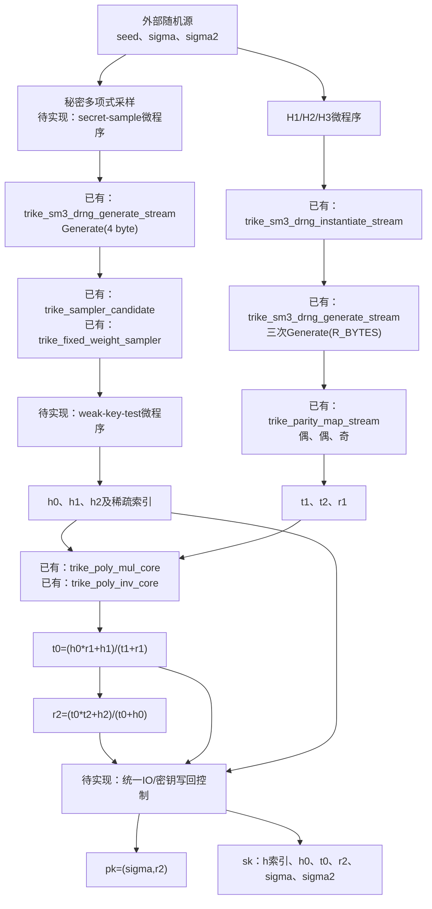
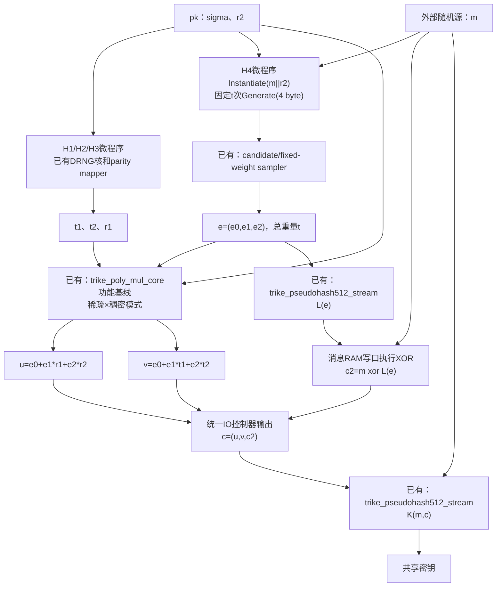
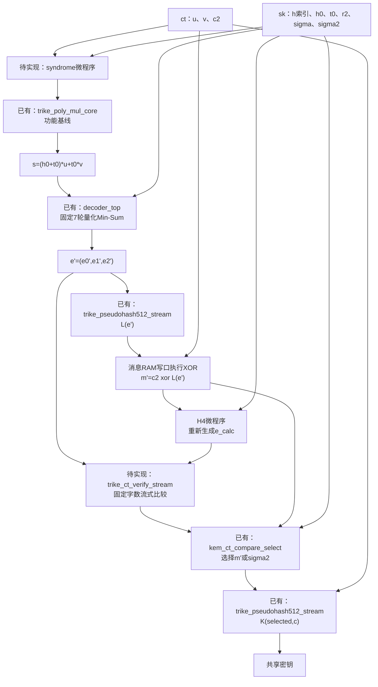
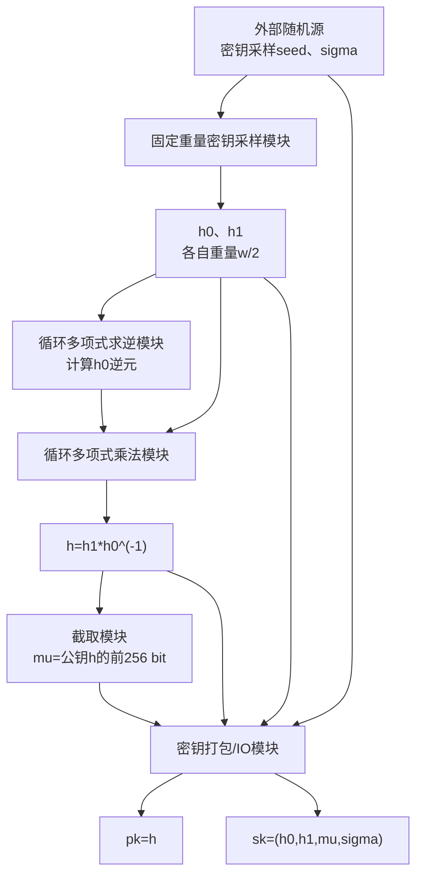
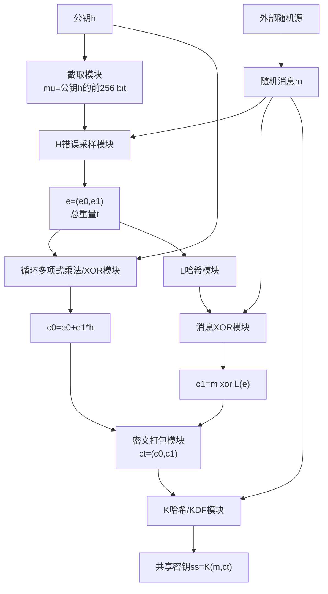
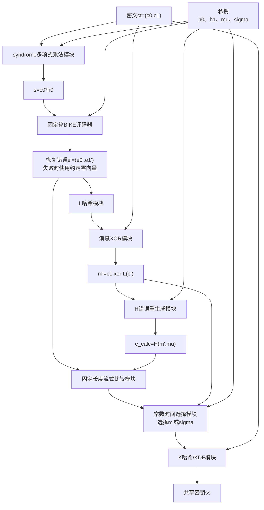
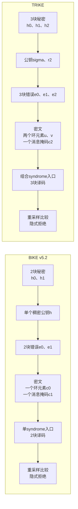

# TRIKE KEM硬件架构、公共核与复用设计

本文档记录`trike-电子版材料0629`对应的TRIKE KEM硬件依赖、已有实现复用边界，以及本仓库公共RTL核。
实现依据按以下顺序确定：随包KAT、随包Reference C、随包Optimized C、算法文档。KAT用于锁定字节序列化和
函数输出，C实现用于补充算法文档中未展开的SM3-DRNG、pseudohash和采样细节。

## KEM依赖

四个随包参数集为：

| 参数集 | $r$ | $d$ | $t$ | $M$ | 公钥byte | 密文byte | 共享密钥byte |
| --- | ---: | ---: | ---: | ---: | ---: | ---: | ---: |
| TRIKE-2 | 15,581 | 35 | 263 | 256 | 1,980 | 3,928 | 32 |
| TRIKE-5 | 35,363 | 55 | 429 | 256 | 4,453 | 8,874 | 32 |
| TRIKE-7 | 69,691 | 83 | 659 | 512 | 8,776 | 17,488 | 64 |
| TRIKE-9 | 114,043 | 111 | 877 | 512 | 14,320 | 28,576 | 64 |

KEM数据通路需要以下模块：

1. SM3压缩、任意byte长度SM3、HMAC-SM3；
2. ICCS SM3-DRNG实例化和Generate，包括`SM3_df`、55-byte大整数加一和加法；
3. `pseudohash512`的HMAC-SM3/SM3级联；
4. H1/H2/H3的三段DRNG输出、最高padding bit清零和偶/偶/奇校验映射；
5. H4的固定重量无重复位置采样；
6. 稀疏×稠密和稠密×稠密循环二元多项式乘法、稠密多项式求逆；
7. syndrome生成、固定7轮译码、重加密检查和共享密钥选择；
8. 公钥、私钥和密文的little-endian byte序列化控制器。

H1/H2/H3由同一个SM3-DRNG上下文连续输出`t1`、`t2`、`r1`。H4使用`m || r2`初始化SM3-DRNG，
每个候选消耗32 bit随机数，并计算

$$
\text{candidate}=\text{pos}+
\operatorname{high}_{32}\left(\text{random}\cdot(\text{len}-\text{pos})\right).
$$

检测到candidate与已选位置重复时选择`pos`。循环边界由公开的$t$确定，硬件实现需要每次都执行固定次数的
查重读取或采用固定深度的确定性bank调度。

Reference C对每个candidate分别调用一次4-byte DRNG Generate。每次Generate都会更新`V`和
`reseed_counter`，因此H4控制器需要执行恰好$t$次Generate(4 byte)，不能把它等价为一次
Generate(`4*t` byte)。每个32-bit随机数按Reference C运行平台的little-endian `uint32_t`组装：
DRNG的第一个byte进入`random[7:0]`。

`L`和`K`调用ICCS `pseudohash(512, ...)`。`L`的错误向量输入按三个
`ceil(r/512) * 64` byte块拼接；每块包含对齐padding。该布局与紧凑的`ceil(r/8)` byte表示不同。

## KEM流程与RTL模块

多项式属于$R=\mathbb{F}_2[x]/(x^r-1)$。加法是逐bit XOR，乘法是循环二元多项式乘法，除法通过
多项式求逆和乘法完成。模块名前的“已有”表示仓库中已有RTL和testbench；“待实现”表示完整KEM需要补充的
控制器或算术核。

### KeyGen



Reference C的弱密钥测试失败后继续从同一DRNG上下文生成三组候选。该循环次数由候选密钥决定。固定周期
KeyGen需要采用公开固定候选批次、全量测试和无分支首个合格候选选择，并定义批次内没有合格候选时的结果。

### Encaps



`e0/e1/e2`生成时保留稀疏index流。Encaps的四次`e_i`乘法使用稀疏index驱动循环移位累加，避免先展开
为完整稠密向量再交给独立乘法器。`c2`的XOR合并到消息RAM写口，不设置单独的向量XOR模块。

### Decaps



完整错误向量宽度最大超过34万bit，不能把`kem_ct_compare_select`直接参数化成同样宽度形成单拍XOR树。
`trike_ct_verify_stream`按固定公开word数从错误RAM读取`e'`和`e_calc`，执行
`difference |= |(word_a xor word_b)`，最后把单bit比较结果交给`kem_ct_compare_select`完成
`m'/sigma2`全宽mask选择。

## BIKE v5.2总体流程

BIKE官方在2024-10-10发布v5.2规范。以下流程以
[BIKE v5.2规范](https://bikesuite.org/files/v5.2/BIKE_Spec.2024.10.10.1.pdf)的KEM定义为准，
只展示KEM顶层阶段和对应硬件模块，不展开采样器、乘法器和译码器内部结构。

### BIKE KeyGen



### BIKE Encaps



### BIKE Decaps



BIKE的$H$使用SHAKE256驱动固定重量错误采样。规范第2.5节和
[官方参考实现说明](https://bikesuite.org/reference.html)将$K/L$实现为SHA2-384并截断到256 bit；
规范第4.3.8节仍保留“SHA3-384”的文字。硬件实现以参考实现和KAT为一致性边界，采用SHA2-384。

## BIKE与TRIKE顶层对比



| 对比项 | BIKE v5.2 | TRIKE | 硬件含义 |
| --- | --- | --- | --- |
| 环结构 | $\mathbb F_2[x]/(x^r-1)$ | $\mathbb F_2[x]/(x^r-1)$ | 循环移位、XOR和环乘法基础数据通路可采用相同结构 |
| QC块数 | 2块 | 3块 | TRIKE的错误、校验矩阵和译码RAM宽度增加一个$r$块 |
| KeyGen主运算 | 采样$h_0,h_1$，计算$h=h_1h_0^{-1}$ | 采样$h_0,h_1,h_2$，生成$t_1,t_2,r_1$并计算$t_0,r_2$ | TRIKE需要更多环乘法、两次求逆和弱密钥检查 |
| 公钥 | 一个稠密环元素$h$ | seed $\sigma$和一个稠密环元素$r_2$ | 两者都可复用稠密多项式RAM和序列化通道 |
| 错误生成 | $H(m,\operatorname{prefix}(h))$生成2块总重量$t$ | $H4(m,r_2)$生成3块总重量$t$ | 固定重量采样控制框架可复用，输入哈希和向量长度不同 |
| 密文 | $(c_0,c_1)$：1个环元素+消息掩码 | $(u,v,c_2)$：2个环元素+消息掩码 | TRIKE的Encaps多一条环元素生成和密文存储通道 |
| Decaps syndrome | $c_0h_0$ | $(h_0+t_0)u+t_0v$ | 可复用同一乘法器，TRIKE需要更多固定调度阶段和scratch RAM |
| 译码 | 2块BIKE固定轮bit-flipping译码 | 3块固定7轮量化Min-Sum目标实现 | 顶层接口可统一；内部RAM几何、校验连接和DFR验证必须分别参数化 |
| 哈希族 | SHAKE256用于$H$；SHA2-384用于$K/L$ | SM3-DRNG用于$H1$至$H4$；pseudohash512用于$K/L$ | 环算术核可直接复用；哈希压缩数据通路不能直接共用 |
| CCA检查 | 比较$e'$与$H(m',\mu)$，选择$m'$或$\sigma$ | 比较$e'$与$H4(m',r_2)$，选择$m'$或$\sigma_2$ | 固定长度比较、全宽mask选择和最终KDF控制可采用同一模块框架 |

两者的KEM骨架相同：固定重量错误采样、环上密文运算、固定轮译码、由$L(e')$恢复消息、重新生成错误、
固定长度比较以及隐式拒绝。完成态模块划分可共享多项式乘法器、求逆器框架、采样器框架、译码服务接口、
流式比较器、mask选择器和统一IO；哈希核与译码内部几何按算法分别实现。

## 完成态共享模块划分

三条KEM流程在一次操作内没有必须并行执行的哈希、采样或多项式任务。面积优先的完成态使用一个统一
`trike_kem_top`，由公开参数决定的固定微程序顺序调用共享引擎：


逻辑上的H1/H2/H3、H4、K和L保留独立函数边界，物理上不复制数据通路。建议完成态模块边界为：

| 层次 | 完成态模块 | 职责 |
| --- | --- | --- |
| 顶层调度 | `trike_kem_top` | 选择KeyGen/Encaps/Decaps固定微程序，发出共享引擎command并管理公开周期预算 |
| IO与存储 | `trike_kem_io_ctrl` | little-endian序列化、RAM地址、消息重放和生命周期分配 |
| 哈希服务 | `trike_sm3_service` | block构造、chaining context和唯一物理`sm3_compress`仲裁 |
| DRNG服务 | `trike_drng_service` | Instantiate、Generate和55-byte状态算术；H1/H2/H3/H4/秘密采样调用 |
| 采样服务 | `trike_weight_sampler_core` | 运行时公开`length/weight`、multiply-high、固定全扫描和index输出 |
| 多项式服务 | `trike_poly_mul_core` | 同一循环移位/XOR累加数据通路支持稀疏×稠密与稠密×稠密 |
| 求逆服务 | `trike_poly_inv_core` | 公开参数固定Frobenius加法链；核内复用一个稠密乘法器 |
| 译码服务 | `decoder_top` | Decaps固定7轮Min-Sum，不与KEM多项式运算并发 |
| 验证服务 | `trike_ct_verify_stream` | 固定word数比较、累计difference并调用`kem_ct_compare_select` |

H1/H2/H3控制器、H4控制器、KeyGen控制器和Encaps/Decaps控制器不分别拥有算术实例。它们作为
`trike_kem_top`内部微程序段或小型sequencer存在，只保存公开计数器、源/目的RAM描述符和完成状态。

## 跨流程复用矩阵

| 物理资源 | KeyGen | Encaps | Decaps | 建议实例数 | 复用条件 |
| --- | --- | --- | --- | ---: | --- |
| SM3压缩数据通路 | DF、DRNG、H1/H2/H3 | H1/H2/H3、H4、K、L | H1/H2/H3、L、H4、K | 1 | 所有哈希阶段按固定微程序串行 |
| DRNG状态与Generate | 秘密采样、H1/H2/H3 | H1/H2/H3、H4 | H1/H2/H3、H4检查 | 1 | 每个函数开始装载新context；不交叉执行两个context |
| parity mapper | t1、t2、r1 | t1、t2、r1 | t1、t2、r1 | 1 | 三个向量依次处理，目标parity为公开命令字段 |
| fixed-weight sampler | 三次`length=r, weight=d` | 一次`length=3r, weight=t` | H4检查一次 | 1 | 核按最大`t`配置，实际length/weight是公开运行参数 |
| sampler index RAM | 临时生成h0/h1/h2 | 临时生成e | 临时生成e_calc | 1 | 每组index输出后写入持久SK或错误RAM，临时RAM即可覆盖 |
| 循环多项式乘法核 | t0、r2 | u、v | syndrome s | 1 | 面积基线按公开固定顺序串行；增加lane只用于固定延时/面积折中 |
| 多项式求逆核 | 两次求逆 | 不使用 | Reference C存储t0/r2后不使用 | 1 | 只服务KeyGen；固定轮调度 |
| `decoder_top` | 不使用 | 不使用 | 恢复e' | 1 | 保持译码器内部RAM和固定调度边界 |
| pseudohash sequencer | 不使用 | L和K | L和K | 1 | L完成后才构造K输入；共享SM3服务 |
| 流式比较/选择 | 不使用 | 不使用 | e比较和m/sigma2选择 | 1 | 大向量比较固定扫描，最终选择固定宽度 |
| IO/序列化控制 | pk/sk写出 | pk读入、ct/ss写出 | sk/ct读入、ss写出 | 1 | 操作码选择公开格式描述符 |

### SM3物理实例收敛

`sm3_hash_stream`保留消息block构造、padding和chaining state控制，并通过
`USE_EXTERNAL_COMPRESS`接口向`trike_sm3_service`提交压缩命令。`trike_sm3_service`封装唯一物理
`sm3_compress`，上层复合模块按公开FSM阶段选择请求和返回路径：

1. HMAC内层和外层两个hash context共享一个压缩服务；
2. DRNG Instantiate的seed DF和C DF共享一个压缩服务；
3. DRNG Generate的输出hash和状态更新hash共享一个压缩服务；
4. pseudohash的HMAC、suffix hash和最终hash共享一个压缩服务。

选择逻辑只依赖公开微程序状态，不使用消息、摘要或秘密状态进行动态仲裁。各hash context在收到返回前
保持block和chaining state，复合模块不并发发起两个命令。面积优先基线为单lane，DF、DRNG
Instantiate、DRNG Generate和pseudohash的固定busy周期分别为314、916、708和1,128拍。
`make check-trike-sm3-sharing`使用Yosys层次统计检查
HMAC、DRNG Instantiate、DRNG Generate和pseudohash每个复合顶层恰好包含一个`sm3_compress`。
是否增加第二个SM3 lane需要根据完整KEM周期与同条件Vivado的资源、Fmax和`cycles/Fmax`决定。

### 采样器物理实例收敛

秘密多项式采样和H4使用同一`generate_random_idx`算法，只是公开`length/weight`不同。完成态采样器以
四档最大值确定物理位宽和RAM深度，并在command中装载当前参数。每次采样固定执行`weight`个候选和
`weight^2`次index读取。三组秘密索引写入持久SK RAM后覆盖临时index RAM；H4索引写入错误RAM后同样
覆盖，因此不需要为h0、h1、h2和e分别配置临时RAM。

### 多项式数据通路收敛

`trike_poly_mul_core`输入和结果均为little-endian coefficient word流。A、B、双长度product、result和
稀疏index分别连接公共`ram_bram`同步读端口；综合分支使用`xpm_memory_sdpram`并请求Block RAM。乘法核
支持两种公开模式：

- 稀疏×稠密：保存公开`SPARSE_WEIGHT`个index，对每个index固定扫描全部B word；每个移位word按
  末word有效位和$x^r-1$回卷拆成三个result贡献，并固定执行三组同步RAM读改写；
- 稠密×稠密：使用digit-serial carryless数据通路生成双长度普通多项式乘积，再按$x^r-1$固定word数
  折返。

连续输入输出下，令$W=\lceil r/\mathrm{WORD\_W}\rceil$、$D=\mathrm{WORD\_W}/\mathrm{DIGIT\_W}$，
令$S=\mathrm{SPARSE\_WEIGHT}$，稠密模式busy周期为$11W+W^2(1+4D)$，稀疏模式为
$4W+2S+7SW$。每个稀疏index和B word均执行一次同步读取及三次result读改写；贡献为零、index越界或
移位不跨word时仍执行相同三组访问。两种模式的状态数和存储访问数均不依赖多项式系数或index值；
valid/ready外部空拍按公开接口预算延长总周期。实际Block RAM Tile、组合移位路径Fmax和
`cycles/Fmax`需要由统一器件、Vivado、XDC和报告阶段的实现结果确认。

Decaps syndrome可写成

$$
s=h_0u+t_0(u+v),
$$

从而使用一次稀疏×稠密和一次稠密×稠密操作。乘法核的accumulator、循环地址生成和scratch RAM在两种
模式间共享。

`trike_poly_inv_core`实现最新四档Reference C的固定加法链求逆。`trike_inv_schedule_pkg`保存每档公开
$r$对应的Frobenius置换步长；控制器在三份同步scratch RAM中维护`f/g/t`，对每个置换固定执行
`2r`拍读取/捕获，再调用同一个稠密`trike_poly_mul_core`。链长、置换步长、乘法次数和RAM地址数量只由
公开$r$确定，不根据输入多项式次数、系数或中间值分支。

求逆实例将`trike_poly_mul_core`配置为外部稠密RAM模式。乘法状态机通过同步读地址直接访问`f/t`和`g`，
所有word乘积完成后才进入归约，因此可以安全地将结果直接覆盖源`f/t`。该elaboration不生成乘法器内部
A、B、result和稀疏index RAM，只保留双长度product RAM；普通KEM乘法调用继续使用完整流式接口。
TRIKE-2求逆数据存储的RTL逻辑容量由七份word数组收敛为三份整环scratch加一份双长度product，即从
124,928 bit降至78,080 bit。该数字不是Vivado Block RAM Tile结论，具体RAMB36/RAMB18组合和地址mux
时序仍需目标器件综合与布局布线确认。

不建议把KEM乘法核并入`decoder_top`内部的`barrel_rotate`、`ram_m`或`ram_t`。译码器包含按lane复制的
并行路由和特定message宽度RAM，访问几何与KEM稠密多项式不一致；跨边界复用会扩大mux、破坏独立验证边界
并威胁固定7轮译码时序。KEM和译码器只在syndrome输入、错误向量输出及顶层start/done边界连接。

## RAM生命周期与复用

存储按生命周期分为三类：

| 存储类 | 内容 | 复用规则 |
| --- | --- | --- |
| 持久key/ct RAM | pk、sk、输入ct、输出ct | 在一次KEM操作期间保持，不能与scratch覆盖 |
| 多项式scratch RAM | t1、t2、r1、h1/h2临时值、u、v、s、乘法accumulator | 由固定微程序做静态生命周期分配；前一阶段最后一次读取后才能换名覆盖 |
| 临时采样/index RAM | 当前一组h索引或H4错误索引 | 输出写入持久SK/错误RAM后立即用于下一组采样 |
| message/hash RAM | m、sigma、sigma2、c2、K/L消息重放 | 统一byte地址控制；XOR合入写口 |
| decoder内部RAM | C2V/V2C、syndrome、accumulator、K-sign状态 | 由`decoder_top`独占，KEM顶层不改变其bank几何 |

Decaps中`s`写完后，`u/v/t1/t2/r1`不再参与译码，可以将对应scratch bank分配给后续`e_calc`和hash输入。
`e'`需要保留到L完成和固定流式比较结束。完成态RAM bank数量需要在`trike_poly_mul_core`接口和每周期读写
端口数确定后进行liveness分配；不能仅按逻辑总bit数推测BRAM节省。

## 复用策略结论

面积优先基线采用：

1. 一个物理SM3压缩核；
2. 一组DRNG状态寄存器；
3. 一个运行时公开参数的固定重量采样核和临时index RAM；
4. 一个支持两种模式的循环多项式乘法核；
5. 一个KeyGen求逆核；
6. 一个`decoder_top`；
7. 一个统一KEM微程序控制器、IO控制器和静态scratch RAM分配表。

该划分优先去除不会并发工作的数据通路副本，同时保留SM3、采样、多项式、译码四个清晰验证边界。资源收益、
Fmax和端到端周期均为待测。完整KAT通过前不复制第二个SM3或乘法lane；若端到端结果表明某共享核成为主要
固定延时瓶颈，再保持接口不变增加公开参数控制的lane数，并用`cycles/Fmax`与BRAM/LUT共同判断。

## 已有实现与论文

| 来源 | 可复用内容 | 本仓库采用方式 |
| --- | --- | --- |
| 随包Reference/Optimized C与四档KAT | SM3-DRNG、pseudohash、采样、序列化和端到端golden结果 | 算法语义和TB fixture来源；C代码不直接综合 |
| [AWS Labs bike-kem](https://github.com/awslabs/bike-kem) | Apache-2.0软件、常时间C组织、GF(2)多项式例程、KAT/API测试框架 | 软件对照和控制流参考；该仓库是CPU C/汇编实现，不含RTL；SHA3/SHAKE路径不用于随包TRIKE哈希链 |
| [Efficient BIKE Hardware Design with Constant-Time Decoder](https://eprint.iacr.org/2020/117.pdf) | 固定轮block-based UPC、syndrome更新乘法器、无数据相关存储访问 | 译码调度原则参考；本仓库Min-Sum译码器继续承担TRIKE译码 |
| [Racing BIKE](https://eprint.iacr.org/2021/1344.pdf) | 稀疏循环乘法器、divstep/extGCD求逆、统一KEM数据通路和资源/周期折中 | KeyGen与多项式核的主要架构参考；Keccak随机预言机替换为TRIKE的SM3链 |
| [SM3 FPGA architecture, ICICS 2012](https://link.springer.com/chapter/10.1007/978-3-642-34129-8_10) | compact与high-throughput架构、shift initialization和SRL映射 | 后续SM3吞吐/面积优化参考 |
| [ljgibbslf/SM3_core](https://github.com/ljgibbslf/SM3_core) | 32/64-bit流接口、65/33-cycle block架构、随机C对拍TB | 仅作接口与性能参考；页面未提供明确许可证声明，本仓库未复制其RTL |

BIKE硬件论文中的循环多项式乘法、求逆、存储bank和固定调度与TRIKE有直接复用价值。哈希/采样部分由
TRIKE随包SM3链定义，需要独立控制器。AWS实现的Apache-2.0许可适合软件移植，但其向量指令和CPU存储布局
不能作为FPGA资源或时序结论。

## SM3压缩核

`sm3_compress`实现GB/T 32905对应的512-bit block压缩：

- `i_block[511:480]`是第一个big-endian消息word；
- `i_state[255:224]`是第一个big-endian chaining word；
- 先用52个周期生成`W[16]..W[67]`，再用64个周期执行压缩轮；
- 每次接受`i_start`后`o_busy`固定覆盖116个周期；
- busy期间的额外启动请求不改变当前计算；
- `o_done`脉冲时给出feed-forward后的256-bit chaining state。

该结构保存68个32-bit schedule word，便于先建立可验证基线。资源与Fmax优化可以使用16-word循环schedule、
round展开或SRL映射，并通过同一block接口保持上层不变。

## 流式SM3

`sm3_hash_stream`在`sm3_compress`上实现固定公开输入长度的SM3：

- `INPUT_BYTES`为elaboration-time公开参数；
- 输入采用8-bit valid/ready流；
- 内部生成`0x80`和64-bit big-endian消息bit长度；
- 覆盖末块有效byte数`0..55`、`56..63`和整64-byte边界；
- 中间block和padding block复用同一压缩实例；
- 连续供数时，block数量和总计算周期只由`INPUT_BYTES`决定。

外部停顿会延长接口总周期。固定周期KEM顶层需要连续供数，或将公开的最大停顿预算写入上层调度。

## HMAC-SM3

`hmac_sm3_64byte_key_stream`实现64-byte密钥的固定长度HMAC-SM3：

- `i_key[511:504]`是第一个key byte；
- 内层输入为`(key xor 0x36) || message`；
- 外层输入为`(key xor 0x5c) || inner_digest`；
- `MESSAGE_BYTES`为公开参数；
- 内外层由两个独立hash context控制，并共享一个`trike_sm3_service`压缩数据通路。

公开状态机固定先执行内层、再执行外层；消息或摘要不参与分支。该结构的物理资源结果待Vivado测量。

TRIKE `pseudohash`使用固定64-byte ICCS密钥：

```text
5307f6d5eb6a3ced3d24c53cc9c82cce2f8936397023f0695c26c80c1ab182a7
1db02ba92f544018115a96e719662ca32b7c7efc0a6d2482150766ba6f655b8e
```

## SM3_df与SM3-DRNG

`sm3_df_stream`实现ICCS 55-byte derivation function：

- 每个pass的哈希输入为`counter || 0x000001b8 || input`；
- counter依次为`0x01`和`0x02`；
- 输出为第一个256-bit摘要和第二个摘要的前184 bit，共440 bit；
- 输入使用两遍可重放流，`o_input_pass`选择pass，避免在核内缓存H4所需的上万byte种子。

`trike_sm3_drng_instantiate_stream`依次执行：

1. `V = SM3_df(seed)`；
2. `C = SM3_df(0x00 || V)`；
3. `reseed_counter = 1`。

两个DF context按公开顺序共享一个`trike_sm3_service`。连续输入时Instantiate固定916个busy周期。

`trike_sm3_drng_generate_stream`实现byte-aligned Generate：

1. 从`data=V`开始，每个32-byte输出块计算`SM3(data)`，块间将55-byte大端`data`加一；
2. 计算`H = 0^184 || SM3(0x03 || V)`；
3. 更新`V = V + H + C + reseed_counter mod 2^440`；
4. 将55-byte大端`reseed_counter`加一。

`OUTPUT_BYTES`为公开参数。输出连续接收时，SM3调用次数和更新周期只由该参数决定。TRIKE当前调用均为
byte-aligned：32/64-byte消息、4-byte采样随机数和`R_SIZE_BYTES`多项式随机数。
输出hash和状态更新hash共享一个`trike_sm3_service`；64-byte配置固定708个busy周期。

## pseudohash512

`trike_pseudohash512_stream`实现K和L使用的ICCS级联：

```text
k1 = HMAC-SM3(ICCS_KEY, 0x02 || 0x00 || message)
h1 = SM3(message || 0x02 || 0x00)
h2 = SM3(k1 || h1)
output = h1 || h2
```

消息通过`o_input_pass`请求两遍。该接口允许顶层从KEM消息RAM重放数据，避免按最大密文长度复制寄存器。
HMAC、suffix hash和最终hash分别保留独立context控制，按固定HMAC、h1、h2顺序共享一个
`trike_sm3_service`；32-byte消息配置固定1,128个busy周期。

## BIKE兼容公共核

`keccak_f1600`和`shake256_stream`保留为BIKE兼容或其他KEM使用的公共核。本材料对应的TRIKE H1/H2/H3、
H4、K和L连接SM3、SM3-DRNG和pseudohash路径。

`kem_ct_compare_select`用于解封装重加密结果的完整XOR归约和全宽mask选择。它提供固定RTL结构和固定周期
边界；物理功耗侧信道防护需要在目标器件上单独定义。

## H1/H2/H3奇偶映射

`trike_parity_map_stream`按Reference C的little-endian多项式byte布局处理固定`R_BYTES=ceil(R/8)`：

1. 顺序写入`R_BYTES`个byte并累计全部低位系数的XOR；
2. 最后一个byte清除系数`R-1`及其上方的输入bit；
3. 重新写入系数`R-1`，使总奇偶性等于`i_target_parity`；
4. 从同一byte RAM顺序读出全部结果。

H1和H2连接`i_target_parity=0`，H3连接`i_target_parity=1`。连续输入输出时busy周期固定为
`2*R_BYTES+1`，对应四档参数分别为3,897、8,843、17,425和28,513拍。每次调用的RAM写入、读取和
奇偶累计次数只由公开参数`R`决定。

## H4固定重量采样

`trike_sampler_candidate`组合计算32-bit multiply-high候选。`trike_fixed_weight_sampler`按
`pos=WEIGHT-1..0`处理候选，并为每个候选固定读取`WEIGHT`个index RAM槽位。只有`j>pos`的已写槽位
参与相等比较，其他读取作为固定dummy访问。碰撞结果只选择写入`pos`或candidate，不改变状态路径、
读取次数或随机数消耗量。

连续随机输入和index输出下busy周期为：

$$
\text{cycles}=\text{WEIGHT}\left(\text{WEIGHT}+3\right).
$$

括号内包含1拍随机数接收、`WEIGHT+1`拍同步RAM发起/返回扫描以及1拍index输出。H4四档`WEIGHT=t`
对应69,958、185,328、436,258和771,760拍；这些数字不包含上层执行$t$次Generate(4 byte)的周期。
index RAM逻辑容量为`WEIGHT*ceil(log2(LENGTH))` bit，实际BRAM/LUTRAM映射与Fmax需要Vivado测量。

## 固定周期与常数时间边界

给定公开参数、连续输入和连续接收时，各核的控制路径、哈希调用数和存储访问数不依赖seed、密钥、
syndrome、摘要值或H4碰撞模式：

| 模块类别 | 固定工作量 | 可能延长接口周期的信号 |
| --- | --- | --- |
| `sm3_compress`、`keccak_f1600` | 固定116/24个busy周期 | 无数据流停顿 |
| SM3/HMAC/DF/Instantiate/pseudohash | 公开消息长度决定block和pass数 | 输入`valid`空拍 |
| DRNG Generate、parity mapper、SHAKE | 公开输出长度决定block、RAM读写和输出数 | 输出`ready`低电平；输入`valid`空拍 |
| fixed-weight sampler | 固定`WEIGHT`个随机数和`WEIGHT^2`次index RAM读取 | 随机输入`valid`空拍；index输出`ready`低电平 |
| `trike_poly_mul_core` | 公开`WORDS/DIGITS/SPARSE_WEIGHT`决定装载、乘法、归约和输出访问数 | 输入`valid`空拍；输出`ready`低电平 |
| `trike_poly_inv_core` | 公开$r$的加法链决定Frobenius扫描、稠密乘法和scratch RAM访问数 | 输入`valid`空拍；输出`ready`低电平 |
| compare/select | 固定组合XOR归约和全宽mask | 无握手 |

KEM顶层需要用公开地址调度的RAM连续驱动这些接口，或把固定数量的dummy/等待拍计入公开周期预算。
`valid`和`ready`不能由秘密数据、译码收敛、哈希结果或碰撞结果控制。模块保证的是固定控制流和固定存储
访问次数；普通CMOS/FPGA逻辑的翻转活动仍随数据变化，这些核没有加入masking、dual-rail或平衡功耗结构。

Reference C的`generate_secret_key`在`weak_key_test`失败时重复生成三组秘密多项式。该重采样次数由候选
密钥决定，因此完整KeyGen当前不具备固定总周期。硬件KeyGen需要单独确定公开的固定候选预算、全量执行和
无分支首个合格候选选择策略，并定义固定预算内没有合格候选时的行为；该策略需要与KAT和失败概率一起验证。
Encaps/Decaps顶层的固定周期仍需在序列化、多项式核、固定7轮译码和重加密检查接通后整体证明。

## 验证

`make test-kem-unit`运行以下自检：

| Testbench | 检查范围 |
| --- | --- |
| `tb_sm3_compress` | `SM3("abc")`单block标准向量；116个busy周期 |
| `tb_sm3_hash_stream` | `"abc"`以及55/56/64/65-byte顺序消息；覆盖所有byte-aligned padding边界 |
| `tb_hmac_sm3_64byte_key_stream` | ICCS固定key和`02 00 || "abc"`；对拍独立软件HMAC-SM3 |
| `tb_sm3_df_stream` | 32-byte顺序seed；对拍Reference C的55-byte输出；固定314个busy周期 |
| `tb_trike_sm3_drng_instantiate_stream` | 对拍Reference C的`V/C/reseed_counter`；固定916个busy周期 |
| `tb_trike_sm3_drng_generate_stream` | 64-byte输出和更新后的完整状态；固定708个busy周期 |
| `tb_trike_pseudohash512_stream` | 32-byte消息的完整512-bit输出；固定1,128个busy周期 |
| `tb_trike_parity_map_stream` | 13-bit toy向量的偶/奇映射、padding清零、固定5拍和backpressure稳定性 |
| `tb_trike_sampler_candidate` | multiply-high边界和Reference C候选fixture |
| `tb_trike_fixed_weight_sampler` | 碰撞/无碰撞结果、两者固定40拍、全index输出和backpressure稳定性 |
| `tb_trike_poly_mul_core` | 13-bit非word对齐环的稠密/稀疏乘法、越界index dummy写回、数据无关周期和backpressure稳定性 |
| `tb_trike_poly_mul_reference` | 从官方TRIKE-2 KAT提取$t_0$、$r_2$与$h_0$支持集，在15581-bit环对拍两种输入 |
| `tb_trike_poly_inv_core` | 13-bit非word对齐环的两组可逆输入、乘积为一、相同417拍和输出backpressure |
| `tb_trike_poly_inv_reference` | 从官方TRIKE-2 KAT提取稠密$h_0$，逐word对拍独立Euclid逆元golden |
| `tb_keccak_f1600` | 全零状态的25个标准输出lane；24轮固定延迟 |
| `tb_shake256_stream` | 多absorb/squeeze block和输出backpressure |
| `tb_kem_ct_compare_select` | 全相等、每个比较bit单独翻转和随机比较/选择 |

SM3边界预期结果由系统OpenSSL后端的`hashlib.new("sm3")`独立生成。HMAC预期结果由Python
`hmac`调用同一SM3后端生成。RTL压缩轮同时对拍随包ICCS C中的常量、word顺序和轮函数。

当前验证属于RTL功能和固定block周期验证。LUT、FF、Slice、BRAM、DSP、setup WNS/TNS和hold WHS
均为待测；尚未形成Vivado综合或布局布线结论。

`make check-trike-sm3-sharing`对四个复合顶层运行Yosys层次检查，证明每个顶层的
`sm3_compress`实例数为1。该检查确认RTL层次实例收敛，不代替目标Vivado的LUT、FF、Slice和时序报告。

`make test-trike-reference-kat`直接编译最新材料中的TRIKE-2/5/7/9 Reference C，各生成10组完整
KeyGen/Encaps/Decaps向量，并在统一LF换行后逐byte比较随包官方KAT。四档PK、SK、CT和SS均完全匹配。
该入口是软件golden和后续RTL端到端对拍的权威边界；`software/trike_kem`中的五档SHAKE bring-up不作为
最新四档KAT结论。

`make test-trike-poly-reference`从TRIKE-2官方KAT第0组解析私钥中的$t_0$、$h_0$支持集以及公钥$r_2$，
独立计算环乘golden。`WORD_W=64, DIGIT_W=8`时，稠密$t_0r_2$输出固定1,967,372拍，稀疏
$h_0r_2$输出固定60,826拍，两组15581-bit结果均逐word匹配。13-bit toy回归的稠密/稀疏周期分别为
58/56拍；输出停顿3拍时总busy增加3拍。

`make test-trike-poly-inv-reference`使用同一官方TRIKE-2 KAT中的稠密$h_0$。fixture生成器使用独立
Python多项式Euclid计算golden并额外验证$h_0h_0^{-1}=1$；RTL使用Reference C固定Frobenius加法链，
15581-bit结果逐word匹配，连续流busy周期固定为43,978,192拍。toy回归对两组不同可逆输入均为417拍，
并检查结果输出停顿期间payload保持稳定、busy只增加公开停顿拍数。

## 后续实现顺序

1. 对求逆外部RAM模式和单SM3压缩服务运行目标Vivado实现，记录资源、Fmax和`cycles/Fmax`；
2. 实现运行时公开参数`trike_weight_sampler_core`以及H1/H2/H3/H4微程序；
3. 实现统一IO、`trike_kem_top`、Min-Sum Decaps连接和四档KAT端到端固定周期对拍。
